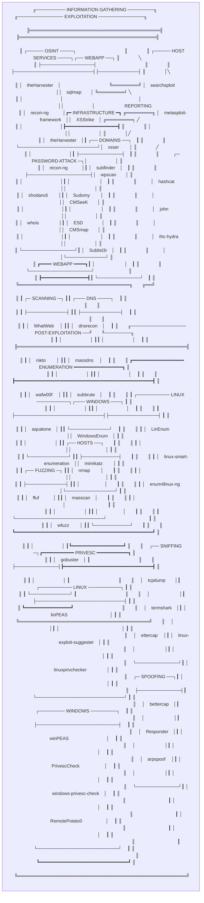

```mermaid
graph TD
main[
⠀╓───────── INFORMATION GATHERING ────────╖ ⠀ ⠀ ⠀ ⠀╓────────────── EXPLOITATION ──────────────╖ ⠀ ⠀ ⠀ ⠀ ⠀ ⠀ ⠀ ⠀ ⠀ ⠀
⠀╠════════════════════════════════════════╣ ⠀ ⠀ ⠀ ⠀╠══════════════════════════════════════════╣ ⠀ ⠀ ⠀ ⠀ ⠀ ⠀ ⠀ ⠀ ⠀ ⠀
⠀║ ┌───── OSINT ────┐ ⠀ ⠀ ⠀ ⠀ ⠀ ⠀ ⠀ ⠀ ⠀ ⠀ ║ ⠀ ⠀ ⠀ ⠀║ ┌───── HOST SERVICES ────┐┌── WEBAPP ──┐ ║ ⠀ ⠀ ⠀ ⠀╲⠀ ⠀ ⠀ ⠀ ⠀ ⠀
⠀║ ├────────────────┤ ⠀ ⠀ ⠀ ⠀ ⠀ ⠀ ⠀ ⠀ ⠀ ⠀ ║ ⠀ ⠀ ⠀ ⠀║ ├────────────────────────┤├────────────┤ ║ ⠀ ⠀ ⠀ ⠀│╲ ⠀ ⠀ ⠀ ⠀ ⠀
⠀║ │ ⠀theHarvester ⠀│ ⠀ ⠀ ⠀ ⠀ ⠀ ⠀ ⠀ ⠀ ⠀ ⠀ ╚════════╝ │ ⠀searchsploit ⠀ ⠀ ⠀ ⠀ ⠀││ ⠀sqlmap ⠀ ⠀│ ╚════════╛ ╲⠀ ⠀ ⠀ ⠀ ⠀
⠀║ │ ⠀ ⠀ ⠀ ⠀ ⠀ ⠀ ⠀ ⠀│ ⠀ ⠀ ⠀ ⠀ ⠀ ⠀ ⠀ ⠀ ⠀ ⠀ ⠀ ⠀ ⠀ ⠀ ⠀ ⠀│ ⠀ ⠀ ⠀ ⠀ ⠀ ⠀ ⠀ ⠀ ⠀ ⠀ ⠀ ⠀││ ⠀ ⠀ ⠀ ⠀ ⠀ ⠀│ ⠀ ⠀ ⠀ ⠀ ⠀ ⠀ REPORTING
⠀║ │ ⠀recon-ng ⠀ ⠀ ⠀│┏━ INFRASTRUCTURE ━┓ ╔════════╗ │ ⠀metasploit-framework ⠀││ ⠀XSStrike ⠀│ ╔════════╕ ╱⠀ ⠀ ⠀ ⠀ ⠀
⠀║ │ ⠀ ⠀ ⠀ ⠀ ⠀ ⠀ ⠀ ⠀│┣━━━━━━━━━━━━━━━━━━┫ ║ ⠀ ⠀ ⠀ ⠀║ │ ⠀ ⠀ ⠀ ⠀ ⠀ ⠀ ⠀ ⠀ ⠀ ⠀ ⠀ ⠀││ ⠀ ⠀ ⠀ ⠀ ⠀ ⠀│ ║ ⠀ ⠀ ⠀ ⠀│╱ ⠀ ⠀ ⠀ ⠀ ⠀
⠀║ │ ⠀theHarvester ⠀│┃ ┌── DOMAINS ──┐ ⠀┃ ║ ⠀ ⠀ ⠀ ⠀║ └────────────────────────┘│ ⠀xsser ⠀ ⠀ │ ║ ⠀ ⠀ ⠀ ⠀╱⠀ ⠀ ⠀ ⠀ ⠀ ⠀
⠀║ │ ⠀ ⠀ ⠀ ⠀ ⠀ ⠀ ⠀ ⠀│┃ ├─────────────┤ ⠀┃ ║ ⠀ ⠀ ⠀ ⠀║ ⠀ ⠀ ⠀┌─ PASSWORD ATTACK ─┐│ ⠀ ⠀ ⠀ ⠀ ⠀ ⠀│ ║ ⠀ ⠀ ⠀ ⠀ ⠀ ⠀ ⠀ ⠀ ⠀ ⠀
⠀║ │ ⠀recon-ng ⠀ ⠀ ⠀│┃ │ ⠀subfinder ⠀│ ⠀┃ ║ ⠀ ⠀ ⠀ ⠀║ ⠀ ⠀ ⠀├───────────────────┤│ ⠀wpscan ⠀ ⠀│ ║ ⠀ ⠀ ⠀ ⠀ ⠀ ⠀ ⠀ ⠀ ⠀ ⠀
⠀║ │ ⠀ ⠀ ⠀ ⠀ ⠀ ⠀ ⠀ ⠀│┃ │ ⠀ ⠀ ⠀ ⠀ ⠀ ⠀ │ ⠀┃ ║ ⠀ ⠀ ⠀ ⠀║ ⠀ ⠀ ⠀│ ⠀hashcat ⠀ ⠀ ⠀ ⠀ ⠀││ ⠀ ⠀ ⠀ ⠀ ⠀ ⠀│ ║ ⠀ ⠀ ⠀ ⠀ ⠀ ⠀ ⠀ ⠀ ⠀ ⠀
⠀║ │ ⠀shodancli ⠀ ⠀ │┃ │ ⠀Sudomy ⠀ ⠀ │ ⠀┃ ║ ⠀ ⠀ ⠀ ⠀║ ⠀ ⠀ ⠀│ ⠀ ⠀ ⠀ ⠀ ⠀ ⠀ ⠀ ⠀ ⠀ ││ ⠀CMSeeK ⠀ ⠀│ ║ ⠀ ⠀ ⠀ ⠀ ⠀ ⠀ ⠀ ⠀ ⠀ ⠀
⠀║ │ ⠀ ⠀ ⠀ ⠀ ⠀ ⠀ ⠀ ⠀│┃ │ ⠀ ⠀ ⠀ ⠀ ⠀ ⠀ │ ⠀┃ ║ ⠀ ⠀ ⠀ ⠀║ ⠀ ⠀ ⠀│ ⠀john ⠀ ⠀ ⠀ ⠀ ⠀ ⠀ ││ ⠀ ⠀ ⠀ ⠀ ⠀ ⠀│ ║ ⠀ ⠀ ⠀ ⠀ ⠀ ⠀ ⠀ ⠀ ⠀ ⠀
⠀║ │ ⠀whois ⠀ ⠀ ⠀ ⠀ │┃ │ ⠀ESD ⠀ ⠀ ⠀ ⠀│ ⠀┃ ║ ⠀ ⠀ ⠀ ⠀║ ⠀ ⠀ ⠀│ ⠀ ⠀ ⠀ ⠀ ⠀ ⠀ ⠀ ⠀ ⠀ ││ ⠀CMSmap ⠀ ⠀│ ║ ⠀ ⠀ ⠀ ⠀ ⠀ ⠀ ⠀ ⠀ ⠀ ⠀
⠀║ │ ⠀ ⠀ ⠀ ⠀ ⠀ ⠀ ⠀ ⠀│┃ │ ⠀ ⠀ ⠀ ⠀ ⠀ ⠀ │ ⠀┃ ║ ⠀ ⠀ ⠀ ⠀║ ⠀ ⠀ ⠀│ ⠀thc-hydra ⠀ ⠀ ⠀ ⠀││ ⠀ ⠀ ⠀ ⠀ ⠀ ⠀│ ║ ⠀ ⠀ ⠀ ⠀ ⠀ ⠀ ⠀ ⠀ ⠀ ⠀
⠀║ └────────────────┘┃ │ ⠀Sublist3r ⠀│ ⠀┃ ║ ⠀ ⠀ ⠀ ⠀║ ⠀ ⠀ ⠀│ ⠀ ⠀ ⠀ ⠀ ⠀ ⠀ ⠀ ⠀ ⠀ │└────────────┘ ║ ⠀ ⠀ ⠀ ⠀ ⠀ ⠀ ⠀ ⠀ ⠀ ⠀
⠀║ ┏━━━━ WEBAPP ━━━━┓┃ │ ⠀ ⠀ ⠀ ⠀ ⠀ ⠀ │ ⠀┃ ║ ⠀ ⠀ ⠀ ⠀║ ⠀ ⠀ ⠀└───────────────────┘ ⠀ ⠀ ⠀ ⠀ ⠀ ⠀ ⠀ ║ ⠀ ⠀ ⠀ ⠀ ⠀ ⠀ ⠀ ⠀ ⠀ ⠀
⠀║ ┣━━━━━━━━━━━━━━━━┫┃ └─────────────┘ ⠀┃ ║ ⠀ ⠀ ⠀ ⠀╚══════════════════════════════════╗ ⠀ ⠀╔══╝ ⠀ ⠀ ⠀ ⠀ ⠀ ⠀ ⠀ ⠀ ⠀ ⠀
⠀║ ┃ ┌─ SCANNING ─┐ ┃┃ ┌─── DNS ────┐ ⠀ ┃ ║ ⠀ ⠀ ⠀ ⠀ ⠀ ⠀ ⠀ ⠀ ⠀ ⠀ ⠀ ⠀ ⠀ ⠀ ⠀ ⠀ ⠀ ⠀ ⠀ ⠀ ⠀ ║ ⠀ ⠀║⠀ ⠀ ⠀ ⠀ ⠀ ⠀ ⠀ ⠀ ⠀ ⠀ ⠀ ⠀
⠀║ ┃ ├────────────┤ ┃┃ ├────────────┤ ⠀ ┃ ║ ⠀ ⠀ ⠀ ⠀ ⠀ ⠀ ⠀ ⠀ ⠀ ⠀ ⠀ ⠀ ⠀ ⠀ ⠀ ⠀ ⠀ ⠀ ⠀ ⠀ ⠀ ║ ⠀ ⠀║⠀ ⠀ ⠀ ⠀ ⠀ ⠀ ⠀ ⠀ ⠀ ⠀ ⠀ ⠀
⠀║ ┃ │ ⠀WhatWeb ⠀ │ ┃┃ │ ⠀dnsrecon ⠀│ ⠀ ┃ ║ ⠀ ⠀╓───────────────── POST-EXPLOITATION ──╜ ⠀ ⠀╙────────╖ ⠀ ⠀ ⠀ ⠀ ⠀ ⠀ ⠀
⠀║ ┃ │ ⠀ ⠀ ⠀ ⠀ ⠀ ⠀│ ┃┃ │ ⠀ ⠀ ⠀ ⠀ ⠀ ⠀│ ⠀ ┃ ║ ⠀ ⠀╠════════════════════════════════════════════════════╣ ⠀ ⠀ ⠀ ⠀ ⠀ ⠀ ⠀
⠀║ ┃ │ ⠀nikto ⠀ ⠀ │ ┃┃ │ ⠀massdns ⠀ │ ⠀ ┃ ║ ⠀ ⠀║ ┏━━━━━━━━━━━━━━━━━━ ENUMERATION ━━━━━━━━━━━━━━━━━┓ ║ ⠀ ⠀ ⠀ ⠀ ⠀ ⠀ ⠀
⠀║ ┃ │ ⠀ ⠀ ⠀ ⠀ ⠀ ⠀│ ┃┃ │ ⠀ ⠀ ⠀ ⠀ ⠀ ⠀│ ⠀ ┃ ║ ⠀ ⠀║ ┣━━━━━━━━━━━━━━━━━━━━━━━━━━━━━━━━━━━━━━━━━━━━━━━━┫ ║ ⠀ ⠀ ⠀ ⠀ ⠀ ⠀ ⠀
⠀║ ┃ │ ⠀wafw00f ⠀ │ ┃┃ │ ⠀subbrute ⠀│ ⠀ ┃ ║ ⠀ ⠀║ ┃ ┌────────── LINUX ──────────┐┌─── WINDOWS ───┐ ┃ ║ ⠀ ⠀ ⠀ ⠀ ⠀ ⠀ ⠀
⠀║ ┃ │ ⠀ ⠀ ⠀ ⠀ ⠀ ⠀│ ┃┃ │ ⠀ ⠀ ⠀ ⠀ ⠀ ⠀│ ⠀ ┃ ║ ⠀ ⠀║ ┃ ├───────────────────────────┤├───────────────┤ ┃ ║ ⠀ ⠀ ⠀ ⠀ ⠀ ⠀ ⠀
⠀║ ┃ │ ⠀aquatone ⠀│ ┃┃ └────────────┘ ⠀ ┃ ║ ⠀ ⠀║ ┃ │ ⠀LinEnum ⠀ ⠀ ⠀ ⠀ ⠀ ⠀ ⠀ ⠀ ⠀││ ⠀WindowsEnum ⠀│ ┃ ║ ⠀ ⠀ ⠀ ⠀ ⠀ ⠀ ⠀
⠀║ ┃ │ ⠀ ⠀ ⠀ ⠀ ⠀ ⠀│ ┃┃ ┌── HOSTS ──┐ ⠀ ⠀┃ ║ ⠀ ⠀║ ┃ │ ⠀ ⠀ ⠀ ⠀ ⠀ ⠀ ⠀ ⠀ ⠀ ⠀ ⠀ ⠀ ⠀ ││ ⠀ ⠀ ⠀ ⠀ ⠀ ⠀ ⠀ │ ┃ ║ ⠀ ⠀ ⠀ ⠀ ⠀ ⠀ ⠀
⠀║ ┃ └────────────┘ ┃┃ ├───────────┤ ⠀ ⠀┃ ║ ⠀ ⠀║ ┃ │ ⠀linux-smart-enumeration ⠀││ ⠀mimikatz ⠀ ⠀ │ ┃ ║ ⠀ ⠀ ⠀ ⠀ ⠀ ⠀ ⠀
⠀║ ┃ ┌── FUZZING ─┐ ┃┃ │ ⠀nmap ⠀ ⠀ │ ⠀ ⠀┃ ║ ⠀ ⠀║ ┃ │ ⠀ ⠀ ⠀ ⠀ ⠀ ⠀ ⠀ ⠀ ⠀ ⠀ ⠀ ⠀ ⠀ ││ ⠀ ⠀ ⠀ ⠀ ⠀ ⠀ ⠀ │ ┃ ║ ⠀ ⠀ ⠀ ⠀ ⠀ ⠀ ⠀
⠀║ ┃ ├────────────┤ ┃┃ │ ⠀ ⠀ ⠀ ⠀ ⠀ │ ⠀ ⠀┃ ║ ⠀ ⠀║ ┃ │ ⠀enum4linux-ng ⠀ ⠀ ⠀ ⠀ ⠀ ⠀│└───────────────┘ ┃ ║ ⠀ ⠀ ⠀ ⠀ ⠀ ⠀ ⠀
⠀║ ┃ │ ⠀ffuf ⠀ ⠀ ⠀│ ┃┃ │ ⠀masscan ⠀│ ⠀ ⠀┃ ║ ⠀ ⠀║ ┃ │ ⠀ ⠀ ⠀ ⠀ ⠀ ⠀ ⠀ ⠀ ⠀ ⠀ ⠀ ⠀ ⠀ │ ⠀ ⠀ ⠀ ⠀ ⠀ ⠀ ⠀ ⠀ ⠀┃ ║ ⠀ ⠀ ⠀ ⠀ ⠀ ⠀ ⠀
⠀║ ┃ │ ⠀ ⠀ ⠀ ⠀ ⠀ ⠀│ ┃┃ │ ⠀ ⠀ ⠀ ⠀ ⠀ │ ⠀ ⠀┃ ║ ⠀ ⠀║ ┃ └───────────────────────────┘ ⠀ ⠀ ⠀ ⠀ ⠀ ⠀ ⠀ ⠀ ⠀┃ ║ ⠀ ⠀ ⠀ ⠀ ⠀ ⠀ ⠀
⠀║ ┃ │ ⠀wfuzz ⠀ ⠀ │ ┃┃ └───────────┘ ⠀ ⠀┃ ║ ⠀ ⠀║ ┗━━━━━━━━━━━━━━━━━━━━━━━━━━━━━━━━━━━━━━━━━━━━━━━━┛ ║ ⠀ ⠀ ⠀ ⠀ ⠀ ⠀ ⠀
⠀║ ┃ │ ⠀ ⠀ ⠀ ⠀ ⠀ ⠀│ ┃┗━━━━━━━━━━━━━━━━━━┛ ║ ⠀ ⠀║ ⠀ ┌── SNIFFING ─┐┏━━━━━━━━━━━ PRIVESC ━━━━━━━━━━━┓ ║ ⠀ ⠀ ⠀ ⠀ ⠀ ⠀ ⠀
⠀║ ┃ │ ⠀gobuster ⠀│ ┃ ⠀ ⠀ ⠀ ⠀ ⠀ ⠀ ⠀ ⠀ ⠀ ⠀ ║ ⠀ ⠀║ ⠀ ├─────────────┤┣━━━━━━━━━━━━━━━━━━━━━━━━━━━━━━━┫ ║ ⠀ ⠀ ⠀ ⠀ ⠀ ⠀ ⠀
⠀║ ┃ │ ⠀ ⠀ ⠀ ⠀ ⠀ ⠀│ ┃ ⠀ ⠀ ⠀ ⠀ ⠀ ⠀ ⠀ ⠀ ⠀ ⠀ ║ ⠀ ⠀║ ⠀ │ ⠀tcpdump ⠀ ⠀│┃ ┌────────── LINUX ──────────┐ ┃ ║ ⠀ ⠀ ⠀ ⠀ ⠀ ⠀ ⠀
⠀║ ┃ └────────────┘ ┃ ⠀ ⠀ ⠀ ⠀ ⠀ ⠀ ⠀ ⠀ ⠀ ⠀ ║ ⠀ ⠀║ ⠀ │ ⠀ ⠀ ⠀ ⠀ ⠀ ⠀ │┃ ├───────────────────────────┤ ┃ ║ ⠀ ⠀ ⠀ ⠀ ⠀ ⠀ ⠀
⠀║ ┗━━━━━━━━━━━━━━━━┛ ⠀ ⠀ ⠀ ⠀ ⠀ ⠀ ⠀ ⠀ ⠀ ⠀ ║ ⠀ ⠀║ ⠀ │ ⠀termshark ⠀│┃ │ ⠀linPEAS ⠀ ⠀ ⠀ ⠀ ⠀ ⠀ ⠀ ⠀ ⠀│ ┃ ║ ⠀ ⠀ ⠀ ⠀ ⠀ ⠀ ⠀
⠀╚════════════════════════════════════════╝ ⠀ ⠀║ ⠀ │ ⠀ ⠀ ⠀ ⠀ ⠀ ⠀ │┃ │ ⠀ ⠀ ⠀ ⠀ ⠀ ⠀ ⠀ ⠀ ⠀ ⠀ ⠀ ⠀ ⠀ │ ┃ ║ ⠀ ⠀ ⠀ ⠀ ⠀ ⠀ ⠀
⠀ ⠀ ⠀ ⠀ ⠀ ⠀ ⠀ ⠀ ⠀ ⠀ ⠀ ⠀ ⠀ ⠀ ⠀ ⠀ ⠀ ⠀ ⠀ ⠀ ⠀ ⠀ ⠀ ⠀║ ⠀ │ ⠀ettercap ⠀ │┃ │ ⠀linux-exploit-suggester ⠀│ ┃ ║ ⠀ ⠀ ⠀ ⠀ ⠀ ⠀ ⠀
⠀ ⠀ ⠀ ⠀ ⠀ ⠀ ⠀ ⠀ ⠀ ⠀ ⠀ ⠀ ⠀ ⠀ ⠀ ⠀ ⠀ ⠀ ⠀ ⠀ ⠀ ⠀ ⠀ ⠀║ ⠀ │ ⠀ ⠀ ⠀ ⠀ ⠀ ⠀ │┃ │ ⠀ ⠀ ⠀ ⠀ ⠀ ⠀ ⠀ ⠀ ⠀ ⠀ ⠀ ⠀ ⠀ │ ┃ ║ ⠀ ⠀ ⠀ ⠀ ⠀ ⠀ ⠀
⠀ ⠀ ⠀ ⠀ ⠀ ⠀ ⠀ ⠀ ⠀ ⠀ ⠀ ⠀ ⠀ ⠀ ⠀ ⠀ ⠀ ⠀ ⠀ ⠀ ⠀ ⠀ ⠀ ⠀║ ⠀ └─────────────┘┃ │ ⠀linuxprivchecker ⠀ ⠀ ⠀ ⠀ │ ┃ ║ ⠀ ⠀ ⠀ ⠀ ⠀ ⠀ ⠀
⠀ ⠀ ⠀ ⠀ ⠀ ⠀ ⠀ ⠀ ⠀ ⠀ ⠀ ⠀ ⠀ ⠀ ⠀ ⠀ ⠀ ⠀ ⠀ ⠀ ⠀ ⠀ ⠀ ⠀║ ⠀ ┌─ SPOOFING ──┐┃ │ ⠀ ⠀ ⠀ ⠀ ⠀ ⠀ ⠀ ⠀ ⠀ ⠀ ⠀ ⠀ ⠀ │ ┃ ║ ⠀ ⠀ ⠀ ⠀ ⠀ ⠀ ⠀
⠀ ⠀ ⠀ ⠀ ⠀ ⠀ ⠀ ⠀ ⠀ ⠀ ⠀ ⠀ ⠀ ⠀ ⠀ ⠀ ⠀ ⠀ ⠀ ⠀ ⠀ ⠀ ⠀ ⠀║ ⠀ ├─────────────┤┃ └───────────────────────────┘ ┃ ║ ⠀ ⠀ ⠀ ⠀ ⠀ ⠀ ⠀
⠀ ⠀ ⠀ ⠀ ⠀ ⠀ ⠀ ⠀ ⠀ ⠀ ⠀ ⠀ ⠀ ⠀ ⠀ ⠀ ⠀ ⠀ ⠀ ⠀ ⠀ ⠀ ⠀ ⠀║ ⠀ │ ⠀bettercap ⠀│┃ ┌──────── WINDOWS ────────┐ ⠀ ┃ ║ ⠀ ⠀ ⠀ ⠀ ⠀ ⠀ ⠀
⠀ ⠀ ⠀ ⠀ ⠀ ⠀ ⠀ ⠀ ⠀ ⠀ ⠀ ⠀ ⠀ ⠀ ⠀ ⠀ ⠀ ⠀ ⠀ ⠀ ⠀ ⠀ ⠀ ⠀║ ⠀ │ ⠀ ⠀ ⠀ ⠀ ⠀ ⠀ │┃ ├─────────────────────────┤ ⠀ ┃ ║ ⠀ ⠀ ⠀ ⠀ ⠀ ⠀ ⠀
⠀ ⠀ ⠀ ⠀ ⠀ ⠀ ⠀ ⠀ ⠀ ⠀ ⠀ ⠀ ⠀ ⠀ ⠀ ⠀ ⠀ ⠀ ⠀ ⠀ ⠀ ⠀ ⠀ ⠀║ ⠀ │ ⠀Responder ⠀│┃ │ ⠀winPEAS ⠀ ⠀ ⠀ ⠀ ⠀ ⠀ ⠀ ⠀│ ⠀ ┃ ║ ⠀ ⠀ ⠀ ⠀ ⠀ ⠀ ⠀
⠀ ⠀ ⠀ ⠀ ⠀ ⠀ ⠀ ⠀ ⠀ ⠀ ⠀ ⠀ ⠀ ⠀ ⠀ ⠀ ⠀ ⠀ ⠀ ⠀ ⠀ ⠀ ⠀ ⠀║ ⠀ │ ⠀ ⠀ ⠀ ⠀ ⠀ ⠀ │┃ │ ⠀ ⠀ ⠀ ⠀ ⠀ ⠀ ⠀ ⠀ ⠀ ⠀ ⠀ ⠀ │ ⠀ ┃ ║ ⠀ ⠀ ⠀ ⠀ ⠀ ⠀ ⠀
⠀ ⠀ ⠀ ⠀ ⠀ ⠀ ⠀ ⠀ ⠀ ⠀ ⠀ ⠀ ⠀ ⠀ ⠀ ⠀ ⠀ ⠀ ⠀ ⠀ ⠀ ⠀ ⠀ ⠀║ ⠀ │ ⠀arpspoof ⠀ │┃ │ ⠀PrivescCheck ⠀ ⠀ ⠀ ⠀ ⠀ │ ⠀ ┃ ║ ⠀ ⠀ ⠀ ⠀ ⠀ ⠀ ⠀
⠀ ⠀ ⠀ ⠀ ⠀ ⠀ ⠀ ⠀ ⠀ ⠀ ⠀ ⠀ ⠀ ⠀ ⠀ ⠀ ⠀ ⠀ ⠀ ⠀ ⠀ ⠀ ⠀ ⠀║ ⠀ │ ⠀ ⠀ ⠀ ⠀ ⠀ ⠀ │┃ │ ⠀ ⠀ ⠀ ⠀ ⠀ ⠀ ⠀ ⠀ ⠀ ⠀ ⠀ ⠀ │ ⠀ ┃ ║ ⠀ ⠀ ⠀ ⠀ ⠀ ⠀ ⠀
⠀ ⠀ ⠀ ⠀ ⠀ ⠀ ⠀ ⠀ ⠀ ⠀ ⠀ ⠀ ⠀ ⠀ ⠀ ⠀ ⠀ ⠀ ⠀ ⠀ ⠀ ⠀ ⠀ ⠀║ ⠀ └─────────────┘┃ │ ⠀windows-privesc-check ⠀│ ⠀ ┃ ║ ⠀ ⠀ ⠀ ⠀ ⠀ ⠀ ⠀
⠀ ⠀ ⠀ ⠀ ⠀ ⠀ ⠀ ⠀ ⠀ ⠀ ⠀ ⠀ ⠀ ⠀ ⠀ ⠀ ⠀ ⠀ ⠀ ⠀ ⠀ ⠀ ⠀ ⠀║ ⠀ ⠀ ⠀ ⠀ ⠀ ⠀ ⠀ ⠀ ⠀┃ │ ⠀ ⠀ ⠀ ⠀ ⠀ ⠀ ⠀ ⠀ ⠀ ⠀ ⠀ ⠀ │ ⠀ ┃ ║ ⠀ ⠀ ⠀ ⠀ ⠀ ⠀ ⠀
⠀ ⠀ ⠀ ⠀ ⠀ ⠀ ⠀ ⠀ ⠀ ⠀ ⠀ ⠀ ⠀ ⠀ ⠀ ⠀ ⠀ ⠀ ⠀ ⠀ ⠀ ⠀ ⠀ ⠀║ ⠀ ⠀ ⠀ ⠀ ⠀ ⠀ ⠀ ⠀ ⠀┃ │ ⠀RemotePotato0 ⠀ ⠀ ⠀ ⠀ ⠀│ ⠀ ┃ ║ ⠀ ⠀ ⠀ ⠀ ⠀ ⠀ ⠀
⠀ ⠀ ⠀ ⠀ ⠀ ⠀ ⠀ ⠀ ⠀ ⠀ ⠀ ⠀ ⠀ ⠀ ⠀ ⠀ ⠀ ⠀ ⠀ ⠀ ⠀ ⠀ ⠀ ⠀║ ⠀ ⠀ ⠀ ⠀ ⠀ ⠀ ⠀ ⠀ ⠀┃ │ ⠀ ⠀ ⠀ ⠀ ⠀ ⠀ ⠀ ⠀ ⠀ ⠀ ⠀ ⠀ │ ⠀ ┃ ║ ⠀ ⠀ ⠀ ⠀ ⠀ ⠀ ⠀
⠀ ⠀ ⠀ ⠀ ⠀ ⠀ ⠀ ⠀ ⠀ ⠀ ⠀ ⠀ ⠀ ⠀ ⠀ ⠀ ⠀ ⠀ ⠀ ⠀ ⠀ ⠀ ⠀ ⠀║ ⠀ ⠀ ⠀ ⠀ ⠀ ⠀ ⠀ ⠀ ⠀┃ └─────────────────────────┘ ⠀ ┃ ║ ⠀ ⠀ ⠀ ⠀ ⠀ ⠀ ⠀
⠀ ⠀ ⠀ ⠀ ⠀ ⠀ ⠀ ⠀ ⠀ ⠀ ⠀ ⠀ ⠀ ⠀ ⠀ ⠀ ⠀ ⠀ ⠀ ⠀ ⠀ ⠀ ⠀ ⠀║ ⠀ ⠀ ⠀ ⠀ ⠀ ⠀ ⠀ ⠀ ⠀┗━━━━━━━━━━━━━━━━━━━━━━━━━━━━━━━┛ ║ ⠀ ⠀ ⠀ ⠀ ⠀ ⠀ ⠀
⠀ ⠀ ⠀ ⠀ ⠀ ⠀ ⠀ ⠀ ⠀ ⠀ ⠀ ⠀ ⠀ ⠀ ⠀ ⠀ ⠀ ⠀ ⠀ ⠀ ⠀ ⠀ ⠀ ⠀╚════════════════════════════════════════════════════╝ ⠀ ⠀ ⠀ ⠀ ⠀ ⠀ ⠀
]
```
