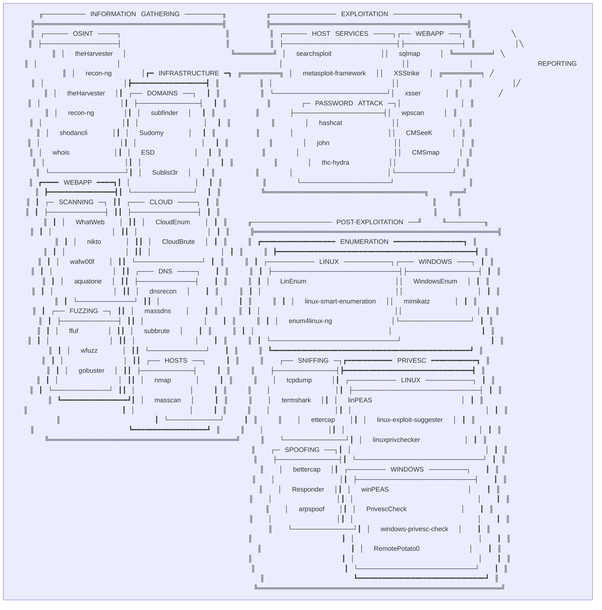

```mermaid
graph TD
main[
⠀╓─────────⠀INFORMATION⠀GATHERING⠀────────╖⠀⠀⠀⠀⠀⠀⠀⠀╓──────────────⠀EXPLOITATION⠀──────────────╖⠀⠀⠀⠀⠀⠀⠀⠀⠀⠀⠀⠀⠀⠀⠀⠀⠀⠀⠀⠀
⠀╠════════════════════════════════════════╣⠀⠀⠀⠀⠀⠀⠀⠀╠══════════════════════════════════════════╣⠀⠀⠀⠀⠀⠀⠀⠀⠀⠀⠀⠀⠀⠀⠀⠀⠀⠀⠀⠀
⠀║⠀┌─────⠀OSINT⠀────┐⠀⠀⠀⠀⠀⠀⠀⠀⠀⠀⠀⠀⠀⠀⠀⠀⠀⠀⠀⠀⠀║⠀⠀⠀⠀⠀⠀⠀⠀║⠀┌─────⠀HOST⠀SERVICES⠀────┐┌──⠀WEBAPP⠀──┐⠀║⠀⠀⠀⠀⠀⠀⠀⠀╲⠀⠀⠀⠀⠀⠀⠀⠀⠀⠀⠀
⠀║⠀├────────────────┤⠀⠀⠀⠀⠀⠀⠀⠀⠀⠀⠀⠀⠀⠀⠀⠀⠀⠀⠀⠀⠀║⠀⠀⠀⠀⠀⠀⠀⠀║⠀├────────────────────────┤├────────────┤⠀║⠀⠀⠀⠀⠀⠀⠀⠀│╲⠀⠀⠀⠀⠀⠀⠀⠀⠀⠀
⠀║⠀│⠀⠀theHarvester⠀⠀│⠀⠀⠀⠀⠀⠀⠀⠀⠀⠀⠀⠀⠀⠀⠀⠀⠀⠀⠀⠀⠀╚════════╝⠀│⠀⠀searchsploit⠀⠀⠀⠀⠀⠀⠀⠀⠀⠀││⠀⠀sqlmap⠀⠀⠀⠀│⠀╚════════╛⠀╲⠀⠀⠀⠀⠀⠀⠀⠀⠀
⠀║⠀│⠀⠀⠀⠀⠀⠀⠀⠀⠀⠀⠀⠀⠀⠀⠀⠀│⠀⠀⠀⠀⠀⠀⠀⠀⠀⠀⠀⠀⠀⠀⠀⠀⠀⠀⠀⠀⠀⠀⠀⠀⠀⠀⠀⠀⠀⠀⠀⠀│⠀⠀⠀⠀⠀⠀⠀⠀⠀⠀⠀⠀⠀⠀⠀⠀⠀⠀⠀⠀⠀⠀⠀⠀││⠀⠀⠀⠀⠀⠀⠀⠀⠀⠀⠀⠀│⠀⠀⠀⠀⠀⠀⠀⠀⠀⠀⠀⠀⠀REPORTING
⠀║⠀│⠀⠀recon-ng⠀⠀⠀⠀⠀⠀│┏━⠀INFRASTRUCTURE⠀━┓⠀╔════════╗⠀│⠀⠀metasploit-framework⠀⠀││⠀⠀XSStrike⠀⠀│⠀╔════════╕⠀╱⠀⠀⠀⠀⠀⠀⠀⠀⠀
⠀║⠀│⠀⠀⠀⠀⠀⠀⠀⠀⠀⠀⠀⠀⠀⠀⠀⠀│┣━━━━━━━━━━━━━━━━━━┫⠀║⠀⠀⠀⠀⠀⠀⠀⠀║⠀│⠀⠀⠀⠀⠀⠀⠀⠀⠀⠀⠀⠀⠀⠀⠀⠀⠀⠀⠀⠀⠀⠀⠀⠀││⠀⠀⠀⠀⠀⠀⠀⠀⠀⠀⠀⠀│⠀║⠀⠀⠀⠀⠀⠀⠀⠀│╱⠀⠀⠀⠀⠀⠀⠀⠀⠀⠀
⠀║⠀│⠀⠀theHarvester⠀⠀│┃⠀┌──⠀DOMAINS⠀──┐⠀⠀┃⠀║⠀⠀⠀⠀⠀⠀⠀⠀║⠀└────────────────────────┘│⠀⠀xsser⠀⠀⠀⠀⠀│⠀║⠀⠀⠀⠀⠀⠀⠀⠀╱⠀⠀⠀⠀⠀⠀⠀⠀⠀⠀⠀
⠀║⠀│⠀⠀⠀⠀⠀⠀⠀⠀⠀⠀⠀⠀⠀⠀⠀⠀│┃⠀├─────────────┤⠀⠀┃⠀║⠀⠀⠀⠀⠀⠀⠀⠀║⠀⠀⠀⠀⠀⠀┌─⠀PASSWORD⠀ATTACK⠀─┐│⠀⠀⠀⠀⠀⠀⠀⠀⠀⠀⠀⠀│⠀║⠀⠀⠀⠀⠀⠀⠀⠀⠀⠀⠀⠀⠀⠀⠀⠀⠀⠀⠀⠀
⠀║⠀│⠀⠀recon-ng⠀⠀⠀⠀⠀⠀│┃⠀│⠀⠀subfinder⠀⠀│⠀⠀┃⠀║⠀⠀⠀⠀⠀⠀⠀⠀║⠀⠀⠀⠀⠀⠀├───────────────────┤│⠀⠀wpscan⠀⠀⠀⠀│⠀║⠀⠀⠀⠀⠀⠀⠀⠀⠀⠀⠀⠀⠀⠀⠀⠀⠀⠀⠀⠀
⠀║⠀│⠀⠀⠀⠀⠀⠀⠀⠀⠀⠀⠀⠀⠀⠀⠀⠀│┃⠀│⠀⠀⠀⠀⠀⠀⠀⠀⠀⠀⠀⠀⠀│⠀⠀┃⠀║⠀⠀⠀⠀⠀⠀⠀⠀║⠀⠀⠀⠀⠀⠀│⠀⠀hashcat⠀⠀⠀⠀⠀⠀⠀⠀⠀⠀││⠀⠀⠀⠀⠀⠀⠀⠀⠀⠀⠀⠀│⠀║⠀⠀⠀⠀⠀⠀⠀⠀⠀⠀⠀⠀⠀⠀⠀⠀⠀⠀⠀⠀
⠀║⠀│⠀⠀shodancli⠀⠀⠀⠀⠀│┃⠀│⠀⠀Sudomy⠀⠀⠀⠀⠀│⠀⠀┃⠀║⠀⠀⠀⠀⠀⠀⠀⠀║⠀⠀⠀⠀⠀⠀│⠀⠀⠀⠀⠀⠀⠀⠀⠀⠀⠀⠀⠀⠀⠀⠀⠀⠀⠀││⠀⠀CMSeeK⠀⠀⠀⠀│⠀║⠀⠀⠀⠀⠀⠀⠀⠀⠀⠀⠀⠀⠀⠀⠀⠀⠀⠀⠀⠀
⠀║⠀│⠀⠀⠀⠀⠀⠀⠀⠀⠀⠀⠀⠀⠀⠀⠀⠀│┃⠀│⠀⠀⠀⠀⠀⠀⠀⠀⠀⠀⠀⠀⠀│⠀⠀┃⠀║⠀⠀⠀⠀⠀⠀⠀⠀║⠀⠀⠀⠀⠀⠀│⠀⠀john⠀⠀⠀⠀⠀⠀⠀⠀⠀⠀⠀⠀⠀││⠀⠀⠀⠀⠀⠀⠀⠀⠀⠀⠀⠀│⠀║⠀⠀⠀⠀⠀⠀⠀⠀⠀⠀⠀⠀⠀⠀⠀⠀⠀⠀⠀⠀
⠀║⠀│⠀⠀whois⠀⠀⠀⠀⠀⠀⠀⠀⠀│┃⠀│⠀⠀ESD⠀⠀⠀⠀⠀⠀⠀⠀│⠀⠀┃⠀║⠀⠀⠀⠀⠀⠀⠀⠀║⠀⠀⠀⠀⠀⠀│⠀⠀⠀⠀⠀⠀⠀⠀⠀⠀⠀⠀⠀⠀⠀⠀⠀⠀⠀││⠀⠀CMSmap⠀⠀⠀⠀│⠀║⠀⠀⠀⠀⠀⠀⠀⠀⠀⠀⠀⠀⠀⠀⠀⠀⠀⠀⠀⠀
⠀║⠀│⠀⠀⠀⠀⠀⠀⠀⠀⠀⠀⠀⠀⠀⠀⠀⠀│┃⠀│⠀⠀⠀⠀⠀⠀⠀⠀⠀⠀⠀⠀⠀│⠀⠀┃⠀║⠀⠀⠀⠀⠀⠀⠀⠀║⠀⠀⠀⠀⠀⠀│⠀⠀thc-hydra⠀⠀⠀⠀⠀⠀⠀⠀││⠀⠀⠀⠀⠀⠀⠀⠀⠀⠀⠀⠀│⠀║⠀⠀⠀⠀⠀⠀⠀⠀⠀⠀⠀⠀⠀⠀⠀⠀⠀⠀⠀⠀
⠀║⠀└────────────────┘┃⠀│⠀⠀Sublist3r⠀⠀│⠀⠀┃⠀║⠀⠀⠀⠀⠀⠀⠀⠀║⠀⠀⠀⠀⠀⠀│⠀⠀⠀⠀⠀⠀⠀⠀⠀⠀⠀⠀⠀⠀⠀⠀⠀⠀⠀│└────────────┘⠀║⠀⠀⠀⠀⠀⠀⠀⠀⠀⠀⠀⠀⠀⠀⠀⠀⠀⠀⠀⠀
⠀║⠀┏━━━━⠀WEBAPP⠀━━━━┓┃⠀│⠀⠀⠀⠀⠀⠀⠀⠀⠀⠀⠀⠀⠀│⠀⠀┃⠀║⠀⠀⠀⠀⠀⠀⠀⠀║⠀⠀⠀⠀⠀⠀└───────────────────┘⠀⠀⠀⠀⠀⠀⠀⠀⠀⠀⠀⠀⠀⠀⠀║⠀⠀⠀⠀⠀⠀⠀⠀⠀⠀⠀⠀⠀⠀⠀⠀⠀⠀⠀⠀
⠀║⠀┣━━━━━━━━━━━━━━━━┫┃⠀└─────────────┘⠀⠀┃⠀║⠀⠀⠀⠀⠀⠀⠀⠀╚══════════════════════════════════╗⠀⠀⠀⠀╔══╝⠀⠀⠀⠀⠀⠀⠀⠀⠀⠀⠀⠀⠀⠀⠀⠀⠀⠀⠀⠀
⠀║⠀┃⠀┌─⠀SCANNING⠀─┐⠀┃┃⠀┌───⠀CLOUD⠀────┐⠀┃⠀║⠀⠀⠀⠀⠀⠀⠀⠀⠀⠀⠀⠀⠀⠀⠀⠀⠀⠀⠀⠀⠀⠀⠀⠀⠀⠀⠀⠀⠀⠀⠀⠀⠀⠀⠀⠀⠀⠀⠀⠀⠀⠀⠀║⠀⠀⠀⠀║⠀⠀⠀⠀⠀⠀⠀⠀⠀⠀⠀⠀⠀⠀⠀⠀⠀⠀⠀⠀⠀⠀⠀
⠀║⠀┃⠀├────────────┤⠀┃┃⠀├──────────────┤⠀┃⠀║⠀⠀⠀⠀⠀⠀⠀⠀⠀⠀⠀⠀⠀⠀⠀⠀⠀⠀⠀⠀⠀⠀⠀⠀⠀⠀⠀⠀⠀⠀⠀⠀⠀⠀⠀⠀⠀⠀⠀⠀⠀⠀⠀║⠀⠀⠀⠀║⠀⠀⠀⠀⠀⠀⠀⠀⠀⠀⠀⠀⠀⠀⠀⠀⠀⠀⠀⠀⠀⠀⠀
⠀║⠀┃⠀│⠀⠀WhatWeb⠀⠀⠀│⠀┃┃⠀│⠀⠀CloudEnum⠀⠀⠀│⠀┃⠀║⠀⠀⠀⠀╓─────────────────⠀POST-EXPLOITATION⠀──╜⠀⠀⠀⠀╙────────╖⠀⠀⠀⠀⠀⠀⠀⠀⠀⠀⠀⠀⠀⠀
⠀║⠀┃⠀│⠀⠀⠀⠀⠀⠀⠀⠀⠀⠀⠀⠀│⠀┃┃⠀│⠀⠀⠀⠀⠀⠀⠀⠀⠀⠀⠀⠀⠀⠀│⠀┃⠀║⠀⠀⠀⠀╠════════════════════════════════════════════════════╣⠀⠀⠀⠀⠀⠀⠀⠀⠀⠀⠀⠀⠀⠀
⠀║⠀┃⠀│⠀⠀nikto⠀⠀⠀⠀⠀│⠀┃┃⠀│⠀⠀CloudBrute⠀⠀│⠀┃⠀║⠀⠀⠀⠀║⠀┏━━━━━━━━━━━━━━━━━━⠀ENUMERATION⠀━━━━━━━━━━━━━━━━━┓⠀║⠀⠀⠀⠀⠀⠀⠀⠀⠀⠀⠀⠀⠀⠀
⠀║⠀┃⠀│⠀⠀⠀⠀⠀⠀⠀⠀⠀⠀⠀⠀│⠀┃┃⠀│⠀⠀⠀⠀⠀⠀⠀⠀⠀⠀⠀⠀⠀⠀│⠀┃⠀║⠀⠀⠀⠀║⠀┣━━━━━━━━━━━━━━━━━━━━━━━━━━━━━━━━━━━━━━━━━━━━━━━━┫⠀║⠀⠀⠀⠀⠀⠀⠀⠀⠀⠀⠀⠀⠀⠀
⠀║⠀┃⠀│⠀⠀wafw00f⠀⠀⠀│⠀┃┃⠀└──────────────┘⠀┃⠀║⠀⠀⠀⠀║⠀┃⠀┌──────────⠀LINUX⠀──────────┐┌───⠀WINDOWS⠀───┐⠀┃⠀║⠀⠀⠀⠀⠀⠀⠀⠀⠀⠀⠀⠀⠀⠀
⠀║⠀┃⠀│⠀⠀⠀⠀⠀⠀⠀⠀⠀⠀⠀⠀│⠀┃┃⠀┌───⠀DNS⠀────┐⠀⠀⠀┃⠀║⠀⠀⠀⠀║⠀┃⠀├───────────────────────────┤├───────────────┤⠀┃⠀║⠀⠀⠀⠀⠀⠀⠀⠀⠀⠀⠀⠀⠀⠀
⠀║⠀┃⠀│⠀⠀aquatone⠀⠀│⠀┃┃⠀├────────────┤⠀⠀⠀┃⠀║⠀⠀⠀⠀║⠀┃⠀│⠀⠀LinEnum⠀⠀⠀⠀⠀⠀⠀⠀⠀⠀⠀⠀⠀⠀⠀⠀⠀⠀││⠀⠀WindowsEnum⠀⠀│⠀┃⠀║⠀⠀⠀⠀⠀⠀⠀⠀⠀⠀⠀⠀⠀⠀
⠀║⠀┃⠀│⠀⠀⠀⠀⠀⠀⠀⠀⠀⠀⠀⠀│⠀┃┃⠀│⠀⠀dnsrecon⠀⠀│⠀⠀⠀┃⠀║⠀⠀⠀⠀║⠀┃⠀│⠀⠀⠀⠀⠀⠀⠀⠀⠀⠀⠀⠀⠀⠀⠀⠀⠀⠀⠀⠀⠀⠀⠀⠀⠀⠀⠀││⠀⠀⠀⠀⠀⠀⠀⠀⠀⠀⠀⠀⠀⠀⠀│⠀┃⠀║⠀⠀⠀⠀⠀⠀⠀⠀⠀⠀⠀⠀⠀⠀
⠀║⠀┃⠀└────────────┘⠀┃┃⠀│⠀⠀⠀⠀⠀⠀⠀⠀⠀⠀⠀⠀│⠀⠀⠀┃⠀║⠀⠀⠀⠀║⠀┃⠀│⠀⠀linux-smart-enumeration⠀⠀││⠀⠀mimikatz⠀⠀⠀⠀⠀│⠀┃⠀║⠀⠀⠀⠀⠀⠀⠀⠀⠀⠀⠀⠀⠀⠀
⠀║⠀┃⠀┌──⠀FUZZING⠀─┐⠀┃┃⠀│⠀⠀massdns⠀⠀⠀│⠀⠀⠀┃⠀║⠀⠀⠀⠀║⠀┃⠀│⠀⠀⠀⠀⠀⠀⠀⠀⠀⠀⠀⠀⠀⠀⠀⠀⠀⠀⠀⠀⠀⠀⠀⠀⠀⠀⠀││⠀⠀⠀⠀⠀⠀⠀⠀⠀⠀⠀⠀⠀⠀⠀│⠀┃⠀║⠀⠀⠀⠀⠀⠀⠀⠀⠀⠀⠀⠀⠀⠀
⠀║⠀┃⠀├────────────┤⠀┃┃⠀│⠀⠀⠀⠀⠀⠀⠀⠀⠀⠀⠀⠀│⠀⠀⠀┃⠀║⠀⠀⠀⠀║⠀┃⠀│⠀⠀enum4linux-ng⠀⠀⠀⠀⠀⠀⠀⠀⠀⠀⠀⠀│└───────────────┘⠀┃⠀║⠀⠀⠀⠀⠀⠀⠀⠀⠀⠀⠀⠀⠀⠀
⠀║⠀┃⠀│⠀⠀ffuf⠀⠀⠀⠀⠀⠀│⠀┃┃⠀│⠀⠀subbrute⠀⠀│⠀⠀⠀┃⠀║⠀⠀⠀⠀║⠀┃⠀│⠀⠀⠀⠀⠀⠀⠀⠀⠀⠀⠀⠀⠀⠀⠀⠀⠀⠀⠀⠀⠀⠀⠀⠀⠀⠀⠀│⠀⠀⠀⠀⠀⠀⠀⠀⠀⠀⠀⠀⠀⠀⠀⠀⠀⠀┃⠀║⠀⠀⠀⠀⠀⠀⠀⠀⠀⠀⠀⠀⠀⠀
⠀║⠀┃⠀│⠀⠀⠀⠀⠀⠀⠀⠀⠀⠀⠀⠀│⠀┃┃⠀│⠀⠀⠀⠀⠀⠀⠀⠀⠀⠀⠀⠀│⠀⠀⠀┃⠀║⠀⠀⠀⠀║⠀┃⠀└───────────────────────────┘⠀⠀⠀⠀⠀⠀⠀⠀⠀⠀⠀⠀⠀⠀⠀⠀⠀⠀┃⠀║⠀⠀⠀⠀⠀⠀⠀⠀⠀⠀⠀⠀⠀⠀
⠀║⠀┃⠀│⠀⠀wfuzz⠀⠀⠀⠀⠀│⠀┃┃⠀└────────────┘⠀⠀⠀┃⠀║⠀⠀⠀⠀║⠀┗━━━━━━━━━━━━━━━━━━━━━━━━━━━━━━━━━━━━━━━━━━━━━━━━┛⠀║⠀⠀⠀⠀⠀⠀⠀⠀⠀⠀⠀⠀⠀⠀
⠀║⠀┃⠀│⠀⠀⠀⠀⠀⠀⠀⠀⠀⠀⠀⠀│⠀┃┃⠀┌──⠀HOSTS⠀──┐⠀⠀⠀⠀┃⠀║⠀⠀⠀⠀║⠀⠀⠀┌──⠀SNIFFING⠀─┐┏━━━━━━━━━━━⠀PRIVESC⠀━━━━━━━━━━━┓⠀║⠀⠀⠀⠀⠀⠀⠀⠀⠀⠀⠀⠀⠀⠀
⠀║⠀┃⠀│⠀⠀gobuster⠀⠀│⠀┃┃⠀├───────────┤⠀⠀⠀⠀┃⠀║⠀⠀⠀⠀║⠀⠀⠀├─────────────┤┣━━━━━━━━━━━━━━━━━━━━━━━━━━━━━━━┫⠀║⠀⠀⠀⠀⠀⠀⠀⠀⠀⠀⠀⠀⠀⠀
⠀║⠀┃⠀│⠀⠀⠀⠀⠀⠀⠀⠀⠀⠀⠀⠀│⠀┃┃⠀│⠀⠀nmap⠀⠀⠀⠀⠀│⠀⠀⠀⠀┃⠀║⠀⠀⠀⠀║⠀⠀⠀│⠀⠀tcpdump⠀⠀⠀⠀│┃⠀┌──────────⠀LINUX⠀──────────┐⠀┃⠀║⠀⠀⠀⠀⠀⠀⠀⠀⠀⠀⠀⠀⠀⠀
⠀║⠀┃⠀└────────────┘⠀┃┃⠀│⠀⠀⠀⠀⠀⠀⠀⠀⠀⠀⠀│⠀⠀⠀⠀┃⠀║⠀⠀⠀⠀║⠀⠀⠀│⠀⠀⠀⠀⠀⠀⠀⠀⠀⠀⠀⠀⠀│┃⠀├───────────────────────────┤⠀┃⠀║⠀⠀⠀⠀⠀⠀⠀⠀⠀⠀⠀⠀⠀⠀
⠀║⠀┗━━━━━━━━━━━━━━━━┛┃⠀│⠀⠀masscan⠀⠀│⠀⠀⠀⠀┃⠀║⠀⠀⠀⠀║⠀⠀⠀│⠀⠀termshark⠀⠀│┃⠀│⠀⠀linPEAS⠀⠀⠀⠀⠀⠀⠀⠀⠀⠀⠀⠀⠀⠀⠀⠀⠀⠀│⠀┃⠀║⠀⠀⠀⠀⠀⠀⠀⠀⠀⠀⠀⠀⠀⠀
⠀║⠀⠀⠀⠀⠀⠀⠀⠀⠀⠀⠀⠀⠀⠀⠀⠀⠀⠀⠀┃⠀│⠀⠀⠀⠀⠀⠀⠀⠀⠀⠀⠀│⠀⠀⠀⠀┃⠀║⠀⠀⠀⠀║⠀⠀⠀│⠀⠀⠀⠀⠀⠀⠀⠀⠀⠀⠀⠀⠀│┃⠀│⠀⠀⠀⠀⠀⠀⠀⠀⠀⠀⠀⠀⠀⠀⠀⠀⠀⠀⠀⠀⠀⠀⠀⠀⠀⠀⠀│⠀┃⠀║⠀⠀⠀⠀⠀⠀⠀⠀⠀⠀⠀⠀⠀⠀
⠀║⠀⠀⠀⠀⠀⠀⠀⠀⠀⠀⠀⠀⠀⠀⠀⠀⠀⠀⠀┃⠀└───────────┘⠀⠀⠀⠀┃⠀║⠀⠀⠀⠀║⠀⠀⠀│⠀⠀ettercap⠀⠀⠀│┃⠀│⠀⠀linux-exploit-suggester⠀⠀│⠀┃⠀║⠀⠀⠀⠀⠀⠀⠀⠀⠀⠀⠀⠀⠀⠀
⠀║⠀⠀⠀⠀⠀⠀⠀⠀⠀⠀⠀⠀⠀⠀⠀⠀⠀⠀⠀┗━━━━━━━━━━━━━━━━━━┛⠀║⠀⠀⠀⠀║⠀⠀⠀│⠀⠀⠀⠀⠀⠀⠀⠀⠀⠀⠀⠀⠀│┃⠀│⠀⠀⠀⠀⠀⠀⠀⠀⠀⠀⠀⠀⠀⠀⠀⠀⠀⠀⠀⠀⠀⠀⠀⠀⠀⠀⠀│⠀┃⠀║⠀⠀⠀⠀⠀⠀⠀⠀⠀⠀⠀⠀⠀⠀
⠀╚════════════════════════════════════════╝⠀⠀⠀⠀║⠀⠀⠀└─────────────┘┃⠀│⠀⠀linuxprivchecker⠀⠀⠀⠀⠀⠀⠀⠀⠀│⠀┃⠀║⠀⠀⠀⠀⠀⠀⠀⠀⠀⠀⠀⠀⠀⠀
⠀⠀⠀⠀⠀⠀⠀⠀⠀⠀⠀⠀⠀⠀⠀⠀⠀⠀⠀⠀⠀⠀⠀⠀⠀⠀⠀⠀⠀⠀⠀⠀⠀⠀⠀⠀⠀⠀⠀⠀⠀⠀⠀⠀⠀⠀⠀║⠀⠀⠀┌─⠀SPOOFING⠀──┐┃⠀│⠀⠀⠀⠀⠀⠀⠀⠀⠀⠀⠀⠀⠀⠀⠀⠀⠀⠀⠀⠀⠀⠀⠀⠀⠀⠀⠀│⠀┃⠀║⠀⠀⠀⠀⠀⠀⠀⠀⠀⠀⠀⠀⠀⠀
⠀⠀⠀⠀⠀⠀⠀⠀⠀⠀⠀⠀⠀⠀⠀⠀⠀⠀⠀⠀⠀⠀⠀⠀⠀⠀⠀⠀⠀⠀⠀⠀⠀⠀⠀⠀⠀⠀⠀⠀⠀⠀⠀⠀⠀⠀⠀║⠀⠀⠀├─────────────┤┃⠀└───────────────────────────┘⠀┃⠀║⠀⠀⠀⠀⠀⠀⠀⠀⠀⠀⠀⠀⠀⠀
⠀⠀⠀⠀⠀⠀⠀⠀⠀⠀⠀⠀⠀⠀⠀⠀⠀⠀⠀⠀⠀⠀⠀⠀⠀⠀⠀⠀⠀⠀⠀⠀⠀⠀⠀⠀⠀⠀⠀⠀⠀⠀⠀⠀⠀⠀⠀║⠀⠀⠀│⠀⠀bettercap⠀⠀│┃⠀┌────────⠀WINDOWS⠀────────┐⠀⠀⠀┃⠀║⠀⠀⠀⠀⠀⠀⠀⠀⠀⠀⠀⠀⠀⠀
⠀⠀⠀⠀⠀⠀⠀⠀⠀⠀⠀⠀⠀⠀⠀⠀⠀⠀⠀⠀⠀⠀⠀⠀⠀⠀⠀⠀⠀⠀⠀⠀⠀⠀⠀⠀⠀⠀⠀⠀⠀⠀⠀⠀⠀⠀⠀║⠀⠀⠀│⠀⠀⠀⠀⠀⠀⠀⠀⠀⠀⠀⠀⠀│┃⠀├─────────────────────────┤⠀⠀⠀┃⠀║⠀⠀⠀⠀⠀⠀⠀⠀⠀⠀⠀⠀⠀⠀
⠀⠀⠀⠀⠀⠀⠀⠀⠀⠀⠀⠀⠀⠀⠀⠀⠀⠀⠀⠀⠀⠀⠀⠀⠀⠀⠀⠀⠀⠀⠀⠀⠀⠀⠀⠀⠀⠀⠀⠀⠀⠀⠀⠀⠀⠀⠀║⠀⠀⠀│⠀⠀Responder⠀⠀│┃⠀│⠀⠀winPEAS⠀⠀⠀⠀⠀⠀⠀⠀⠀⠀⠀⠀⠀⠀⠀⠀│⠀⠀⠀┃⠀║⠀⠀⠀⠀⠀⠀⠀⠀⠀⠀⠀⠀⠀⠀
⠀⠀⠀⠀⠀⠀⠀⠀⠀⠀⠀⠀⠀⠀⠀⠀⠀⠀⠀⠀⠀⠀⠀⠀⠀⠀⠀⠀⠀⠀⠀⠀⠀⠀⠀⠀⠀⠀⠀⠀⠀⠀⠀⠀⠀⠀⠀║⠀⠀⠀│⠀⠀⠀⠀⠀⠀⠀⠀⠀⠀⠀⠀⠀│┃⠀│⠀⠀⠀⠀⠀⠀⠀⠀⠀⠀⠀⠀⠀⠀⠀⠀⠀⠀⠀⠀⠀⠀⠀⠀⠀│⠀⠀⠀┃⠀║⠀⠀⠀⠀⠀⠀⠀⠀⠀⠀⠀⠀⠀⠀
⠀⠀⠀⠀⠀⠀⠀⠀⠀⠀⠀⠀⠀⠀⠀⠀⠀⠀⠀⠀⠀⠀⠀⠀⠀⠀⠀⠀⠀⠀⠀⠀⠀⠀⠀⠀⠀⠀⠀⠀⠀⠀⠀⠀⠀⠀⠀║⠀⠀⠀│⠀⠀arpspoof⠀⠀⠀│┃⠀│⠀⠀PrivescCheck⠀⠀⠀⠀⠀⠀⠀⠀⠀⠀⠀│⠀⠀⠀┃⠀║⠀⠀⠀⠀⠀⠀⠀⠀⠀⠀⠀⠀⠀⠀
⠀⠀⠀⠀⠀⠀⠀⠀⠀⠀⠀⠀⠀⠀⠀⠀⠀⠀⠀⠀⠀⠀⠀⠀⠀⠀⠀⠀⠀⠀⠀⠀⠀⠀⠀⠀⠀⠀⠀⠀⠀⠀⠀⠀⠀⠀⠀║⠀⠀⠀│⠀⠀⠀⠀⠀⠀⠀⠀⠀⠀⠀⠀⠀│┃⠀│⠀⠀⠀⠀⠀⠀⠀⠀⠀⠀⠀⠀⠀⠀⠀⠀⠀⠀⠀⠀⠀⠀⠀⠀⠀│⠀⠀⠀┃⠀║⠀⠀⠀⠀⠀⠀⠀⠀⠀⠀⠀⠀⠀⠀
⠀⠀⠀⠀⠀⠀⠀⠀⠀⠀⠀⠀⠀⠀⠀⠀⠀⠀⠀⠀⠀⠀⠀⠀⠀⠀⠀⠀⠀⠀⠀⠀⠀⠀⠀⠀⠀⠀⠀⠀⠀⠀⠀⠀⠀⠀⠀║⠀⠀⠀└─────────────┘┃⠀│⠀⠀windows-privesc-check⠀⠀│⠀⠀⠀┃⠀║⠀⠀⠀⠀⠀⠀⠀⠀⠀⠀⠀⠀⠀⠀
⠀⠀⠀⠀⠀⠀⠀⠀⠀⠀⠀⠀⠀⠀⠀⠀⠀⠀⠀⠀⠀⠀⠀⠀⠀⠀⠀⠀⠀⠀⠀⠀⠀⠀⠀⠀⠀⠀⠀⠀⠀⠀⠀⠀⠀⠀⠀║⠀⠀⠀⠀⠀⠀⠀⠀⠀⠀⠀⠀⠀⠀⠀⠀⠀⠀┃⠀│⠀⠀⠀⠀⠀⠀⠀⠀⠀⠀⠀⠀⠀⠀⠀⠀⠀⠀⠀⠀⠀⠀⠀⠀⠀│⠀⠀⠀┃⠀║⠀⠀⠀⠀⠀⠀⠀⠀⠀⠀⠀⠀⠀⠀
⠀⠀⠀⠀⠀⠀⠀⠀⠀⠀⠀⠀⠀⠀⠀⠀⠀⠀⠀⠀⠀⠀⠀⠀⠀⠀⠀⠀⠀⠀⠀⠀⠀⠀⠀⠀⠀⠀⠀⠀⠀⠀⠀⠀⠀⠀⠀║⠀⠀⠀⠀⠀⠀⠀⠀⠀⠀⠀⠀⠀⠀⠀⠀⠀⠀┃⠀│⠀⠀RemotePotato0⠀⠀⠀⠀⠀⠀⠀⠀⠀⠀│⠀⠀⠀┃⠀║⠀⠀⠀⠀⠀⠀⠀⠀⠀⠀⠀⠀⠀⠀
⠀⠀⠀⠀⠀⠀⠀⠀⠀⠀⠀⠀⠀⠀⠀⠀⠀⠀⠀⠀⠀⠀⠀⠀⠀⠀⠀⠀⠀⠀⠀⠀⠀⠀⠀⠀⠀⠀⠀⠀⠀⠀⠀⠀⠀⠀⠀║⠀⠀⠀⠀⠀⠀⠀⠀⠀⠀⠀⠀⠀⠀⠀⠀⠀⠀┃⠀│⠀⠀⠀⠀⠀⠀⠀⠀⠀⠀⠀⠀⠀⠀⠀⠀⠀⠀⠀⠀⠀⠀⠀⠀⠀│⠀⠀⠀┃⠀║⠀⠀⠀⠀⠀⠀⠀⠀⠀⠀⠀⠀⠀⠀
⠀⠀⠀⠀⠀⠀⠀⠀⠀⠀⠀⠀⠀⠀⠀⠀⠀⠀⠀⠀⠀⠀⠀⠀⠀⠀⠀⠀⠀⠀⠀⠀⠀⠀⠀⠀⠀⠀⠀⠀⠀⠀⠀⠀⠀⠀⠀║⠀⠀⠀⠀⠀⠀⠀⠀⠀⠀⠀⠀⠀⠀⠀⠀⠀⠀┃⠀└─────────────────────────┘⠀⠀⠀┃⠀║⠀⠀⠀⠀⠀⠀⠀⠀⠀⠀⠀⠀⠀⠀
⠀⠀⠀⠀⠀⠀⠀⠀⠀⠀⠀⠀⠀⠀⠀⠀⠀⠀⠀⠀⠀⠀⠀⠀⠀⠀⠀⠀⠀⠀⠀⠀⠀⠀⠀⠀⠀⠀⠀⠀⠀⠀⠀⠀⠀⠀⠀║⠀⠀⠀⠀⠀⠀⠀⠀⠀⠀⠀⠀⠀⠀⠀⠀⠀⠀┗━━━━━━━━━━━━━━━━━━━━━━━━━━━━━━━┛⠀║⠀⠀⠀⠀⠀⠀⠀⠀⠀⠀⠀⠀⠀⠀
⠀⠀⠀⠀⠀⠀⠀⠀⠀⠀⠀⠀⠀⠀⠀⠀⠀⠀⠀⠀⠀⠀⠀⠀⠀⠀⠀⠀⠀⠀⠀⠀⠀⠀⠀⠀⠀⠀⠀⠀⠀⠀⠀⠀⠀⠀⠀╚════════════════════════════════════════════════════╝⠀⠀⠀⠀⠀⠀⠀⠀⠀⠀⠀⠀⠀⠀
]
```
style main fill:#121212
