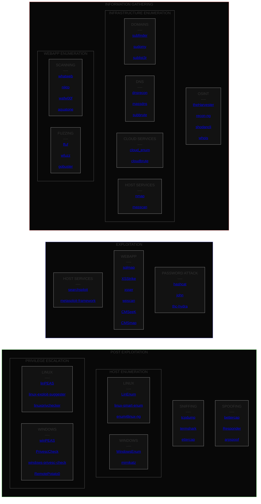

```mermaid
flowchart LR
    subgraph post-exploitation[POST EXPLOITATION]
    direction TB
        subgraph host-enumeration[HOST ENUMERATION]
        direction LR
            linux-en[
                LINUX
                ----
                <a href='https://github.com/rebootuser/LinEnum'>LinEnum</a>

                <a href='https://github.com/diego-treitos/linux-smart-enumeration'>linux-smart-enum</a>

                <a href='https://github.com/cddmp/enum4linux-ng'>enum4linux-ng</a>
            ]
            windows-en[
                WINDOWS
                ----
                <a href='https://github.com/absolomb/WindowsEnum'>WindowsEnum</a>

                <a href='https://github.com/gentilkiwi/mimikatz'>mimikatz</a>
            ]
        end
        subgraph privilege-escalation[PRIVILEGE ESCALATION]
        direction LR
            linux-pe[
                LINUX
                ----
                <a href='https://github.com/peass-ng/PEASS-ng/tree/master/linPEAS'>linPEAS</a>

                <a href='https://github.com/The-Z-Labs/linux-exploit-suggester'>linux-exploit-suggester</a>

                <a href='https://github.com/sleventyeleven/linuxprivchecker'>linuxprivchecker</a>
            ]
            windows-pe[
                WINDOWS
                ----
                <a href='https://github.com/peass-ng/PEASS-ng/tree/master/winPEAS'>winPEAS</a>

                <a href='https://github.com/itm4n/PrivescCheck'>PrivescCheck</a>

                <a href='https://github.com/pentestmonkey/windows-privesc-check'>windows-privesc-check</a>

                <a href='https://github.com/antonioCoco/RemotePotato0'>RemotePotato0</a>
            ]
        end
        sniffing[
            SNIFFING
            ----
            <a href='https://github.com/the-tcpdump-group/tcpdump'>tcpdump</a>

            <a href='https://github.com/gcla/termshark'>termshark</a>

            <a href='https://github.com/Ettercap/ettercap'>ettercap</a>
        ]
        spoofing[
            SPOOFING
            ----
            <a href='https://github.com/bettercap/bettercap'>bettercap</a>

            <a href='https://github.com/SpiderLabs/Responder'>Responder</a>

            <a href='https://github.com/alandau/arpspoof'>arpspoof</a>
        ]
    end
    subgraph exploitation[EXPLOITATION]
    direction TB
        host-services[
            HOST SERVICES
            ----
            <a href='https://gitlab.com/exploit-database/exploitdb'>searchsploit</a>

            <a href='https://github.com/rapid7/metasploit-framework'>metasploit-framework</a>
        ]
        webapp[
            WEBAPP
            ----
            <a href='https://github.com/sqlmapproject/sqlmap'>sqlmap

            <a href='https://github.com/s0md3v/XSStrike'>XSStrike</a>

            <a href='https://github.com/epsylon/xsser'>xsser</a>

            <a href='https://github.com/wpscanteam/wpscan'>wpscan</a>

            <a href='https://github.com/Tuhinshubhra/CMSeeK'>CMSeeK</a>

            <a href='https://github.com/dionach/CMSmap'>CMSmap</a>
        ]
        password-attack[
            PASSWORD ATTACK
            ----
            <a href='https://github.com/hashcat/hashcat'>hashcat</a>

            <a href='https://github.com/openwall/john'>john</a>

            <a href='https://github.com/vanhauser-thc/thc-hydra'>thc-hydra</a>
        ]
    end
    subgraph information-gathering[INFORMATION GATHERING]
    direction TB
        osint[
            OSINT
            ----
            <a href='https://github.com/laramies/theHarvester'>theHarvester</a>

            <a href='https://github.com/lanmaster53/recon-ng'>recon-ng</a>

            <a href='https://github.com/malinkinsa/shodancli'>shodancli</a>

            <a href='https://github.com/weppos/whois'>whois</a>
        ]
        subgraph infrastructure-enumeration[INFRASTRUCTURE ENUMERATION]
        direction LR
            domains[
                DOMAINS
                ----
                <a href='https://github.com/projectdiscovery/subfinder'>subfinder</a>

                <a href='https://github.com/screetsec/Sudomy'>sudomy</a>

                <a href='https://github.com/aboul3la/Sublist3r'>sublist3r</a>
            ]
            dns[
                DNS
                ----
                <a href='https://github.com/darkoperator/dnsrecon'>dnsrecon</a>

                <a href='https://github.com/blechschmidt/massdns'>massdns</a>

                <a href='https://github.com/TheRook/subbrute'>subbrute</a>
            ]
            cloud[
                CLOUD SERVICES
                ----
                <a href='https://github.com/initstring/cloud_enum'>cloud_enum</a>

                <a href='https://github.com/0xsha/CloudBrute'>cloudbrute</a>
            ]
            host[
                HOST SERVICES
                ----
                <a href='https://github.com/nmap/nmap'>nmap</a>

                <a href='https://github.com/robertdavidgraham/masscan'>masscan</a>
            ]
        end
        subgraph webapp-enumeration[WEBAPP ENUMERATION]
        direction LR
            scanning[
                SCANNING
                ----
                <a href='https://github.com/urbanadventurer/WhatWeb'>whatweb</a>

                <a href='https://github.com/sullo/nikto'>nikto</a>

                <a href='https://github.com/EnableSecurity/wafw00f'>wafw00f</a>

                <a href='https://github.com/michenriksen/aquatone'>aquatone</a>
            ]
            fuzzing[
                FUZZING
                ----
                <a href='https://github.com/ffuf/ffuf'>ffuf</a>

                <a href='https://github.com/xmendez/wfuzz'>wfuzz</a>

                <a href='https://github.com/OJ/gobuster'>gobuster</a>
            ]
        end
    end
style information-gathering fill:#080808,stroke:#ff8080
style osint fill:#121212,stroke:#a0a0a0
style infrastructure-enumeration fill:#080808,stroke:#606060
style domains fill:#121212,stroke:#a0a0a0
style dns fill:#121212,stroke:#a0a0a0
style cloud fill:#121212,stroke:#a0a0a0
style host fill:#121212,stroke:#a0a0a0
style webapp-enumeration fill:#080808,stroke:#606060
style scanning fill:#121212,stroke:#a0a0a0
style fuzzing fill:#121212,stroke:#a0a0a0

style exploitation fill:#080808,stroke:#8080ff
style host-services fill:#121212,stroke:#a0a0a0
style webapp fill:#121212,stroke:#a0a0a0
style password-attack fill:#121212,stroke:#a0a0a0

style post-exploitation fill:#080808,stroke:#80ff80
style host-enumeration fill:#080808,stroke:#606060
style linux-en fill:#121212,stroke:#a0a0a0
style windows-en fill:#121212,stroke:#a0a0a0
style privilege-escalation fill:#080808,stroke:#606060
style linux-pe fill:#121212,stroke:#a0a0a0
style windows-pe fill:#121212,stroke:#a0a0a0
style sniffing fill:#121212,stroke:#a0a0a0
style spoofing fill:#121212,stroke:#a0a0a0
```
