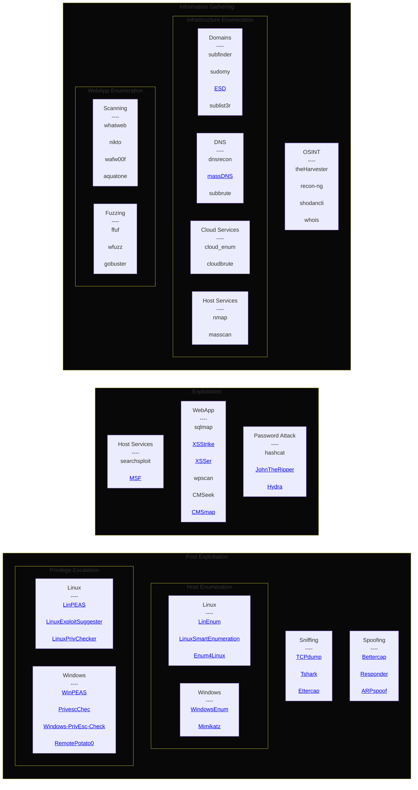

```mermaid
flowchart LR
    subgraph post-exploitation[Post Exploitation]
    direction TB
        subgraph host-enumeration[Host Enumeration]
        direction LR
            linux-en[
                Linux
                ----
                <a href='https://github.com/rebootuser/LinEnum'>LinEnum</a>

                <a href='https://github.com/diego-treitos/linux-smart-enumeration'>LinuxSmartEnumeration</a>

                <a href='https://github.com/cddmp/enum4linux-ng'>Enum4Linux</a>
            ]
            windows-en[
                Windows
                ----
                <a href='https://github.com/absolomb/WindowsEnum'>WindowsEnum</a>

                <a href='https://github.com/gentilkiwi/mimikatz/wiki'>Mimikatz</a>
            ]
        end
        subgraph privilege-escalation[Privilege Escalation]
        direction LR
            linux-pe[
                Linux
                ----
                <a href='https://github.com/peass-ng/PEASS-ng/tree/master/linPEAS'>LinPEAS</a>

                <a href='https://github.com/The-Z-Labs/linux-exploit-suggester'>LinuxExploitSuggester</a>

                <a href='https://github.com/sleventyeleven/linuxprivchecker'>LinuxPrivChecker</a>
            ]
            windows-pe[
                Windows
                ----
                <a href='https://github.com/peass-ng/PEASS-ng/tree/master/winPEAS'>WinPEAS</a>

                <a href='https://github.com/itm4n/PrivescCheck'>PrivescChec</a>

                <a href='https://github.com/pentestmonkey/windows-privesc-check'>Windows-PrivEsc-Check</a>

                <a href='https://github.com/antonioCoco/RemotePotato0'>RemotePotato0</a>
            ]
        end
        sniffing[
            Sniffing
            ----
            <a href='https://github.com/the-tcpdump-group/tcpdump'>TCPdump</a>

            <a href='https://github.com/gcla/termshark'>Tshark</a>

            <a href='https://github.com/Ettercap/ettercap'>Ettercap</a>
        ]
        spoofing[
            Spoofing
            ----
            <a href='https://github.com/bettercap/bettercap'>Bettercap</a>

            <a href='https://github.com/SpiderLabs/Responder'>Responder</a>

            <a href='https://github.com/alandau/arpspoof'>ARPspoof</a>
        ]
    end
    subgraph exploitation[Exploitation]
    direction TB
        host-services[
            Host Services
            ----
            searchsploit

            <a href='https://github.com/rapid7/metasploit-framework'>MSF</a>
        ]
        webapp[
            WebApp
            ----
            sqlmap

            <a href='https://github.com/s0md3v/XSStrike'>XSStrike</a>

            <a href='https://github.com/epsylon/xsser'>XSSer</a>

            wpscan

            CMSeek

            <a href='https://github.com/dionach/CMSmap'>CMSmap</a>
        ]
        password-attack[
            Password Attack
            ----
            hashcat

            <a href='https://github.com/openwall/john'>JohnTheRipper</a>

            <a href='https://github.com/vanhauser-thc/thc-hydra'>Hydra</a>
        ]
    end
    subgraph information-gathering[Information Gathering]
    direction TB
        osint[
            OSINT
            ----
            theHarvester

            recon-ng

            shodancli

            whois
        ]
        subgraph infrastructure-enumeration[Infrastructure Enumeration]
        direction LR
            domains[
                Domains
                ----
                subfinder

                sudomy

                <a href='https://github.com/FeeiCN/ESD?tab=readme-ov-file'>ESD</a>

                sublist3r
            ]
            dns[
                DNS
                ----
                dnsrecon

                <a href='https://github.com/blechschmidt/massdns'>massDNS</a>

                subbrute
            ]
            cloud[
                Cloud Services
                ----
                cloud_enum

                cloudbrute
            ]
            host[
                Host Services
                ----
                nmap

                masscan
            ]
        end
        subgraph webapp-enumeration[WebApp Enumeration]
        direction LR
            scanning[
                Scanning
                ----
                whatweb

                nikto

                wafw00f

                aquatone
            ]
            fuzzing[
                Fuzzing
                ----
                ffuf

                wfuzz

                gobuster
            ]
        end
    end
style information-gathering fill:#080808
style infrastructure-enumeration fill:#080808
style webapp-enumeration fill:#080808
style exploitation fill:#080808
style post-exploitation fill:#080808
style host-enumeration fill:#080808
style privilege-escalation fill:#080808
```
