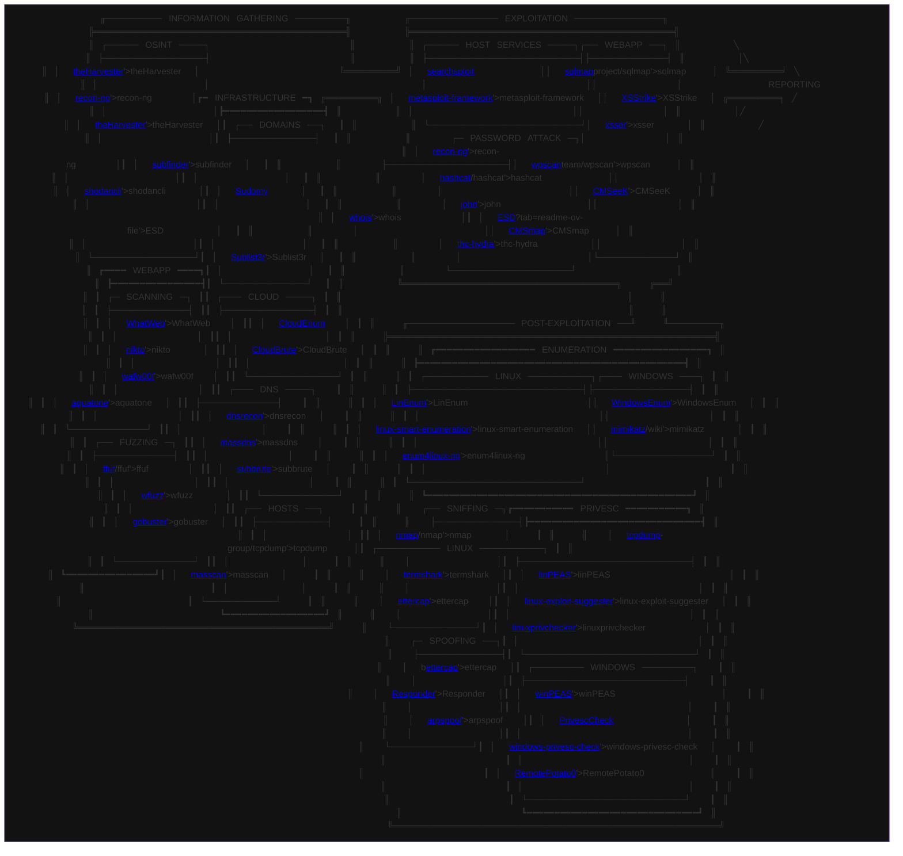

```mermaid
graph TD
main[
⠀╓─────────⠀INFORMATION⠀GATHERING⠀────────╖⠀⠀⠀⠀⠀⠀⠀⠀╓──────────────⠀EXPLOITATION⠀──────────────╖⠀⠀⠀⠀⠀⠀⠀⠀⠀⠀⠀⠀⠀⠀⠀⠀⠀⠀⠀⠀
⠀╠════════════════════════════════════════╣⠀⠀⠀⠀⠀⠀⠀⠀╠══════════════════════════════════════════╣⠀⠀⠀⠀⠀⠀⠀⠀⠀⠀⠀⠀⠀⠀⠀⠀⠀⠀⠀⠀
⠀║⠀┌─────⠀OSINT⠀────┐⠀⠀⠀⠀⠀⠀⠀⠀⠀⠀⠀⠀⠀⠀⠀⠀⠀⠀⠀⠀⠀║⠀⠀⠀⠀⠀⠀⠀⠀║⠀┌─────⠀HOST⠀SERVICES⠀────┐┌──⠀WEBAPP⠀──┐⠀║⠀⠀⠀⠀⠀⠀⠀⠀╲⠀⠀⠀⠀⠀⠀⠀⠀⠀⠀⠀
⠀║⠀├────────────────┤⠀⠀⠀⠀⠀⠀⠀⠀⠀⠀⠀⠀⠀⠀⠀⠀⠀⠀⠀⠀⠀║⠀⠀⠀⠀⠀⠀⠀⠀║⠀├────────────────────────┤├────────────┤⠀║⠀⠀⠀⠀⠀⠀⠀⠀│╲⠀⠀⠀⠀⠀⠀⠀⠀⠀⠀
⠀║⠀│⠀⠀<a href='https://github.com/laramies/<a href='https://github.com/laramies/theHarvester'>theHarvester</a>'>theHarvester</a>⠀⠀│⠀⠀⠀⠀⠀⠀⠀⠀⠀⠀⠀⠀⠀⠀⠀⠀⠀⠀⠀⠀⠀╚════════╝⠀│⠀⠀<a href='https://gitlab.com/exploit-database/exploitdb'><a href='https://gitlab.com/exploit-database/exploitdb'>searchsploit</a></a>⠀⠀⠀⠀⠀⠀⠀⠀⠀⠀││⠀⠀<a href='https://github.com/<a href='https://github.com/sqlmapproject/sqlmap'>sqlmap</a>project/sqlmap'>sqlmap</a>⠀⠀⠀⠀│⠀╚════════╛⠀╲⠀⠀⠀⠀⠀⠀⠀⠀⠀
⠀║⠀│⠀⠀⠀⠀⠀⠀⠀⠀⠀⠀⠀⠀⠀⠀⠀⠀│⠀⠀⠀⠀⠀⠀⠀⠀⠀⠀⠀⠀⠀⠀⠀⠀⠀⠀⠀⠀⠀⠀⠀⠀⠀⠀⠀⠀⠀⠀⠀⠀│⠀⠀⠀⠀⠀⠀⠀⠀⠀⠀⠀⠀⠀⠀⠀⠀⠀⠀⠀⠀⠀⠀⠀⠀││⠀⠀⠀⠀⠀⠀⠀⠀⠀⠀⠀⠀│⠀⠀⠀⠀⠀⠀⠀⠀⠀⠀⠀⠀⠀REPORTING
⠀║⠀│⠀⠀<a href='https://github.com/lanmaster53/<a href='https://github.com/lanmaster53/recon-ng'>recon-ng</a>'>recon-ng</a>⠀⠀⠀⠀⠀⠀│┏━⠀INFRASTRUCTURE⠀━┓⠀╔════════╗⠀│⠀⠀<a href='https://github.com/rapid7/<a href='https://github.com/rapid7/metasploit-framework'>metasploit-framework</a>'>metasploit-framework</a>⠀⠀││⠀⠀<a href='https://github.com/s0md3v/<a href='https://github.com/s0md3v/XSStrike'>XSStrike</a>'>XSStrike</a>⠀⠀│⠀╔════════╕⠀╱⠀⠀⠀⠀⠀⠀⠀⠀⠀
⠀║⠀│⠀⠀⠀⠀⠀⠀⠀⠀⠀⠀⠀⠀⠀⠀⠀⠀│┣━━━━━━━━━━━━━━━━━━┫⠀║⠀⠀⠀⠀⠀⠀⠀⠀║⠀│⠀⠀⠀⠀⠀⠀⠀⠀⠀⠀⠀⠀⠀⠀⠀⠀⠀⠀⠀⠀⠀⠀⠀⠀││⠀⠀⠀⠀⠀⠀⠀⠀⠀⠀⠀⠀│⠀║⠀⠀⠀⠀⠀⠀⠀⠀│╱⠀⠀⠀⠀⠀⠀⠀⠀⠀⠀
⠀║⠀│⠀⠀<a href='https://github.com/laramies/<a href='https://github.com/laramies/theHarvester'>theHarvester</a>'>theHarvester</a>⠀⠀│┃⠀┌──⠀DOMAINS⠀──┐⠀⠀┃⠀║⠀⠀⠀⠀⠀⠀⠀⠀║⠀└────────────────────────┘│⠀⠀<a href='https://github.com/epsylon/<a href='https://github.com/epsylon/xsser'>xsser</a>'>xsser</a>⠀⠀⠀⠀⠀│⠀║⠀⠀⠀⠀⠀⠀⠀⠀╱⠀⠀⠀⠀⠀⠀⠀⠀⠀⠀⠀
⠀║⠀│⠀⠀⠀⠀⠀⠀⠀⠀⠀⠀⠀⠀⠀⠀⠀⠀│┃⠀├─────────────┤⠀⠀┃⠀║⠀⠀⠀⠀⠀⠀⠀⠀║⠀⠀⠀⠀⠀⠀┌─⠀PASSWORD⠀ATTACK⠀─┐│⠀⠀⠀⠀⠀⠀⠀⠀⠀⠀⠀⠀│⠀║⠀⠀⠀⠀⠀⠀⠀⠀⠀⠀⠀⠀⠀⠀⠀⠀⠀⠀⠀⠀
⠀║⠀│⠀⠀<a href='https://github.com/lanmaster53/<a href='https://github.com/lanmaster53/recon-ng'>recon-ng</a>'>recon-ng</a>⠀⠀⠀⠀⠀⠀│┃⠀│⠀⠀<a href='https://github.com/projectdiscovery/<a href='https://github.com/projectdiscovery/subfinder'>subfinder</a>'>subfinder</a>⠀⠀│⠀⠀┃⠀║⠀⠀⠀⠀⠀⠀⠀⠀║⠀⠀⠀⠀⠀⠀├───────────────────┤│⠀⠀<a href='https://github.com/<a href='https://github.com/wpscanteam/wpscan'>wpscan</a>team/wpscan'>wpscan</a>⠀⠀⠀⠀│⠀║⠀⠀⠀⠀⠀⠀⠀⠀⠀⠀⠀⠀⠀⠀⠀⠀⠀⠀⠀⠀
⠀║⠀│⠀⠀⠀⠀⠀⠀⠀⠀⠀⠀⠀⠀⠀⠀⠀⠀│┃⠀│⠀⠀⠀⠀⠀⠀⠀⠀⠀⠀⠀⠀⠀│⠀⠀┃⠀║⠀⠀⠀⠀⠀⠀⠀⠀║⠀⠀⠀⠀⠀⠀│⠀⠀<a href='https://github.com/<a href='https://github.com/hashcat/hashcat'>hashcat</a>/hashcat'>hashcat</a>⠀⠀⠀⠀⠀⠀⠀⠀⠀⠀││⠀⠀⠀⠀⠀⠀⠀⠀⠀⠀⠀⠀│⠀║⠀⠀⠀⠀⠀⠀⠀⠀⠀⠀⠀⠀⠀⠀⠀⠀⠀⠀⠀⠀
⠀║⠀│⠀⠀<a href='https://github.com/malinkinsa/<a href='https://github.com/malinkinsa/shodancli'>shodancli</a>'>shodancli</a>⠀⠀⠀⠀⠀│┃⠀│⠀⠀<a href='https://github.com/screetsec/Sudomy'>Sudomy</a>⠀⠀⠀⠀⠀│⠀⠀┃⠀║⠀⠀⠀⠀⠀⠀⠀⠀║⠀⠀⠀⠀⠀⠀│⠀⠀⠀⠀⠀⠀⠀⠀⠀⠀⠀⠀⠀⠀⠀⠀⠀⠀⠀││⠀⠀<a href='https://github.com/Tuhinshubhra/<a href='https://github.com/Tuhinshubhra/CMSeeK'>CMSeeK</a>'>CMSeeK</a>⠀⠀⠀⠀│⠀║⠀⠀⠀⠀⠀⠀⠀⠀⠀⠀⠀⠀⠀⠀⠀⠀⠀⠀⠀⠀
⠀║⠀│⠀⠀⠀⠀⠀⠀⠀⠀⠀⠀⠀⠀⠀⠀⠀⠀│┃⠀│⠀⠀⠀⠀⠀⠀⠀⠀⠀⠀⠀⠀⠀│⠀⠀┃⠀║⠀⠀⠀⠀⠀⠀⠀⠀║⠀⠀⠀⠀⠀⠀│⠀⠀<a href='https://github.com/openwall/<a href='https://github.com/openwall/john'>john</a>'>john</a>⠀⠀⠀⠀⠀⠀⠀⠀⠀⠀⠀⠀⠀││⠀⠀⠀⠀⠀⠀⠀⠀⠀⠀⠀⠀│⠀║⠀⠀⠀⠀⠀⠀⠀⠀⠀⠀⠀⠀⠀⠀⠀⠀⠀⠀⠀⠀
⠀║⠀│⠀⠀<a href='https://github.com/weppos/<a href='https://github.com/weppos/whois'>whois</a>'>whois</a>⠀⠀⠀⠀⠀⠀⠀⠀⠀│┃⠀│⠀⠀<a href='https://github.com/FeeiCN/<a href='https://github.com/FeeiCN/ESD?tab=readme-ov-file'>ESD</a>?tab=readme-ov-file'>ESD</a>⠀⠀⠀⠀⠀⠀⠀⠀│⠀⠀┃⠀║⠀⠀⠀⠀⠀⠀⠀⠀║⠀⠀⠀⠀⠀⠀│⠀⠀⠀⠀⠀⠀⠀⠀⠀⠀⠀⠀⠀⠀⠀⠀⠀⠀⠀││⠀⠀<a href='https://github.com/dionach/<a href='https://github.com/dionach/CMSmap'>CMSmap</a>'>CMSmap</a>⠀⠀⠀⠀│⠀║⠀⠀⠀⠀⠀⠀⠀⠀⠀⠀⠀⠀⠀⠀⠀⠀⠀⠀⠀⠀
⠀║⠀│⠀⠀⠀⠀⠀⠀⠀⠀⠀⠀⠀⠀⠀⠀⠀⠀│┃⠀│⠀⠀⠀⠀⠀⠀⠀⠀⠀⠀⠀⠀⠀│⠀⠀┃⠀║⠀⠀⠀⠀⠀⠀⠀⠀║⠀⠀⠀⠀⠀⠀│⠀⠀<a href='https://github.com/vanhauser-thc/<a href='https://github.com/vanhauser-thc/thc-hydra'>thc-hydra</a>'>thc-hydra</a>⠀⠀⠀⠀⠀⠀⠀⠀││⠀⠀⠀⠀⠀⠀⠀⠀⠀⠀⠀⠀│⠀║⠀⠀⠀⠀⠀⠀⠀⠀⠀⠀⠀⠀⠀⠀⠀⠀⠀⠀⠀⠀
⠀║⠀└────────────────┘┃⠀│⠀⠀<a href='https://github.com/aboul3la/<a href='https://github.com/aboul3la/Sublist3r'>Sublist3r</a>'>Sublist3r</a>⠀⠀│⠀⠀┃⠀║⠀⠀⠀⠀⠀⠀⠀⠀║⠀⠀⠀⠀⠀⠀│⠀⠀⠀⠀⠀⠀⠀⠀⠀⠀⠀⠀⠀⠀⠀⠀⠀⠀⠀│└────────────┘⠀║⠀⠀⠀⠀⠀⠀⠀⠀⠀⠀⠀⠀⠀⠀⠀⠀⠀⠀⠀⠀
⠀║⠀┏━━━━⠀WEBAPP⠀━━━━┓┃⠀│⠀⠀⠀⠀⠀⠀⠀⠀⠀⠀⠀⠀⠀│⠀⠀┃⠀║⠀⠀⠀⠀⠀⠀⠀⠀║⠀⠀⠀⠀⠀⠀└───────────────────┘⠀⠀⠀⠀⠀⠀⠀⠀⠀⠀⠀⠀⠀⠀⠀║⠀⠀⠀⠀⠀⠀⠀⠀⠀⠀⠀⠀⠀⠀⠀⠀⠀⠀⠀⠀
⠀║⠀┣━━━━━━━━━━━━━━━━┫┃⠀└─────────────┘⠀⠀┃⠀║⠀⠀⠀⠀⠀⠀⠀⠀╚══════════════════════════════════╗⠀⠀⠀⠀╔══╝⠀⠀⠀⠀⠀⠀⠀⠀⠀⠀⠀⠀⠀⠀⠀⠀⠀⠀⠀⠀
⠀║⠀┃⠀┌─⠀SCANNING⠀─┐⠀┃┃⠀┌───⠀CLOUD⠀────┐⠀┃⠀║⠀⠀⠀⠀⠀⠀⠀⠀⠀⠀⠀⠀⠀⠀⠀⠀⠀⠀⠀⠀⠀⠀⠀⠀⠀⠀⠀⠀⠀⠀⠀⠀⠀⠀⠀⠀⠀⠀⠀⠀⠀⠀⠀║⠀⠀⠀⠀║⠀⠀⠀⠀⠀⠀⠀⠀⠀⠀⠀⠀⠀⠀⠀⠀⠀⠀⠀⠀⠀⠀⠀
⠀║⠀┃⠀├────────────┤⠀┃┃⠀├──────────────┤⠀┃⠀║⠀⠀⠀⠀⠀⠀⠀⠀⠀⠀⠀⠀⠀⠀⠀⠀⠀⠀⠀⠀⠀⠀⠀⠀⠀⠀⠀⠀⠀⠀⠀⠀⠀⠀⠀⠀⠀⠀⠀⠀⠀⠀⠀║⠀⠀⠀⠀║⠀⠀⠀⠀⠀⠀⠀⠀⠀⠀⠀⠀⠀⠀⠀⠀⠀⠀⠀⠀⠀⠀⠀
⠀║⠀┃⠀│⠀⠀<a href='https://github.com/urbanadventurer/<a href='https://github.com/urbanadventurer/WhatWeb'>WhatWeb</a>'>WhatWeb</a>⠀⠀⠀│⠀┃┃⠀│⠀⠀<a href='https://github.com/initstring/cloud_enum'><a href='https://github.com/initstring/cloud_enum'>CloudEnum</a></a>⠀⠀⠀│⠀┃⠀║⠀⠀⠀⠀╓─────────────────⠀POST-EXPLOITATION⠀──╜⠀⠀⠀⠀╙────────╖⠀⠀⠀⠀⠀⠀⠀⠀⠀⠀⠀⠀⠀⠀
⠀║⠀┃⠀│⠀⠀⠀⠀⠀⠀⠀⠀⠀⠀⠀⠀│⠀┃┃⠀│⠀⠀⠀⠀⠀⠀⠀⠀⠀⠀⠀⠀⠀⠀│⠀┃⠀║⠀⠀⠀⠀╠════════════════════════════════════════════════════╣⠀⠀⠀⠀⠀⠀⠀⠀⠀⠀⠀⠀⠀⠀
⠀║⠀┃⠀│⠀⠀<a href='https://github.com/sullo/<a href='https://github.com/sullo/nikto'>nikto</a>'>nikto</a>⠀⠀⠀⠀⠀│⠀┃┃⠀│⠀⠀<a href='https://github.com/0xsha/<a href='https://github.com/0xsha/CloudBrute'>CloudBrute</a>'>CloudBrute</a>⠀⠀│⠀┃⠀║⠀⠀⠀⠀║⠀┏━━━━━━━━━━━━━━━━━━⠀ENUMERATION⠀━━━━━━━━━━━━━━━━━┓⠀║⠀⠀⠀⠀⠀⠀⠀⠀⠀⠀⠀⠀⠀⠀
⠀║⠀┃⠀│⠀⠀⠀⠀⠀⠀⠀⠀⠀⠀⠀⠀│⠀┃┃⠀│⠀⠀⠀⠀⠀⠀⠀⠀⠀⠀⠀⠀⠀⠀│⠀┃⠀║⠀⠀⠀⠀║⠀┣━━━━━━━━━━━━━━━━━━━━━━━━━━━━━━━━━━━━━━━━━━━━━━━━┫⠀║⠀⠀⠀⠀⠀⠀⠀⠀⠀⠀⠀⠀⠀⠀
⠀║⠀┃⠀│⠀⠀<a href='https://github.com/EnableSecurity/<a href='https://github.com/EnableSecurity/wafw00f'>wafw00f</a>'>wafw00f</a>⠀⠀⠀│⠀┃┃⠀└──────────────┘⠀┃⠀║⠀⠀⠀⠀║⠀┃⠀┌──────────⠀LINUX⠀──────────┐┌───⠀WINDOWS⠀───┐⠀┃⠀║⠀⠀⠀⠀⠀⠀⠀⠀⠀⠀⠀⠀⠀⠀
⠀║⠀┃⠀│⠀⠀⠀⠀⠀⠀⠀⠀⠀⠀⠀⠀│⠀┃┃⠀┌───⠀DNS⠀────┐⠀⠀⠀┃⠀║⠀⠀⠀⠀║⠀┃⠀├───────────────────────────┤├───────────────┤⠀┃⠀║⠀⠀⠀⠀⠀⠀⠀⠀⠀⠀⠀⠀⠀⠀
⠀║⠀┃⠀│⠀⠀<a href='https://github.com/michenriksen/<a href='https://github.com/michenriksen/aquatone'>aquatone</a>'>aquatone</a>⠀⠀│⠀┃┃⠀├────────────┤⠀⠀⠀┃⠀║⠀⠀⠀⠀║⠀┃⠀│⠀⠀<a href='https://github.com/rebootuser/<a href='https://github.com/rebootuser/LinEnum'>LinEnum</a>'>LinEnum</a>⠀⠀⠀⠀⠀⠀⠀⠀⠀⠀⠀⠀⠀⠀⠀⠀⠀⠀││⠀⠀<a href='https://github.com/absolomb/<a href='https://github.com/absolomb/WindowsEnum'>WindowsEnum</a>'>WindowsEnum</a>⠀⠀│⠀┃⠀║⠀⠀⠀⠀⠀⠀⠀⠀⠀⠀⠀⠀⠀⠀
⠀║⠀┃⠀│⠀⠀⠀⠀⠀⠀⠀⠀⠀⠀⠀⠀│⠀┃┃⠀│⠀⠀<a href='https://github.com/darkoperator/<a href='https://github.com/darkoperator/dnsrecon'>dnsrecon</a>'>dnsrecon</a>⠀⠀│⠀⠀⠀┃⠀║⠀⠀⠀⠀║⠀┃⠀│⠀⠀⠀⠀⠀⠀⠀⠀⠀⠀⠀⠀⠀⠀⠀⠀⠀⠀⠀⠀⠀⠀⠀⠀⠀⠀⠀││⠀⠀⠀⠀⠀⠀⠀⠀⠀⠀⠀⠀⠀⠀⠀│⠀┃⠀║⠀⠀⠀⠀⠀⠀⠀⠀⠀⠀⠀⠀⠀⠀
⠀║⠀┃⠀└────────────┘⠀┃┃⠀│⠀⠀⠀⠀⠀⠀⠀⠀⠀⠀⠀⠀│⠀⠀⠀┃⠀║⠀⠀⠀⠀║⠀┃⠀│⠀⠀<a href='https://github.com/diego-treitos/<a href='https://github.com/diego-treitos/linux-smart-enumeration'>linux-smart-enumeration</a>'>linux-smart-enumeration</a>⠀⠀││⠀⠀<a href='https://github.com/gentilkiwi/<a href='https://github.com/gentilkiwi/mimikatz'>mimikatz</a>/wiki'>mimikatz</a>⠀⠀⠀⠀⠀│⠀┃⠀║⠀⠀⠀⠀⠀⠀⠀⠀⠀⠀⠀⠀⠀⠀
⠀║⠀┃⠀┌──⠀FUZZING⠀─┐⠀┃┃⠀│⠀⠀<a href='https://github.com/blechschmidt/<a href='https://github.com/blechschmidt/massdns'>massdns</a>'>massdns</a>⠀⠀⠀│⠀⠀⠀┃⠀║⠀⠀⠀⠀║⠀┃⠀│⠀⠀⠀⠀⠀⠀⠀⠀⠀⠀⠀⠀⠀⠀⠀⠀⠀⠀⠀⠀⠀⠀⠀⠀⠀⠀⠀││⠀⠀⠀⠀⠀⠀⠀⠀⠀⠀⠀⠀⠀⠀⠀│⠀┃⠀║⠀⠀⠀⠀⠀⠀⠀⠀⠀⠀⠀⠀⠀⠀
⠀║⠀┃⠀├────────────┤⠀┃┃⠀│⠀⠀⠀⠀⠀⠀⠀⠀⠀⠀⠀⠀│⠀⠀⠀┃⠀║⠀⠀⠀⠀║⠀┃⠀│⠀⠀<a href='https://github.com/cddmp/<a href='https://github.com/cddmp/enum4linux-ng'>enum4linux-ng</a>'>enum4linux-ng</a>⠀⠀⠀⠀⠀⠀⠀⠀⠀⠀⠀⠀│└───────────────┘⠀┃⠀║⠀⠀⠀⠀⠀⠀⠀⠀⠀⠀⠀⠀⠀⠀
⠀║⠀┃⠀│⠀⠀<a href='https://github.com/<a href='https://github.com/ffuf/ffuf'>ffuf</a>/ffuf'>ffuf</a>⠀⠀⠀⠀⠀⠀│⠀┃┃⠀│⠀⠀<a href='https://github.com/TheRook/<a href='https://github.com/TheRook/subbrute'>subbrute</a>'>subbrute</a>⠀⠀│⠀⠀⠀┃⠀║⠀⠀⠀⠀║⠀┃⠀│⠀⠀⠀⠀⠀⠀⠀⠀⠀⠀⠀⠀⠀⠀⠀⠀⠀⠀⠀⠀⠀⠀⠀⠀⠀⠀⠀│⠀⠀⠀⠀⠀⠀⠀⠀⠀⠀⠀⠀⠀⠀⠀⠀⠀⠀┃⠀║⠀⠀⠀⠀⠀⠀⠀⠀⠀⠀⠀⠀⠀⠀
⠀║⠀┃⠀│⠀⠀⠀⠀⠀⠀⠀⠀⠀⠀⠀⠀│⠀┃┃⠀│⠀⠀⠀⠀⠀⠀⠀⠀⠀⠀⠀⠀│⠀⠀⠀┃⠀║⠀⠀⠀⠀║⠀┃⠀└───────────────────────────┘⠀⠀⠀⠀⠀⠀⠀⠀⠀⠀⠀⠀⠀⠀⠀⠀⠀⠀┃⠀║⠀⠀⠀⠀⠀⠀⠀⠀⠀⠀⠀⠀⠀⠀
⠀║⠀┃⠀│⠀⠀<a href='https://github.com/xmendez/<a href='https://github.com/xmendez/wfuzz'>wfuzz</a>'>wfuzz</a>⠀⠀⠀⠀⠀│⠀┃┃⠀└────────────┘⠀⠀⠀┃⠀║⠀⠀⠀⠀║⠀┗━━━━━━━━━━━━━━━━━━━━━━━━━━━━━━━━━━━━━━━━━━━━━━━━┛⠀║⠀⠀⠀⠀⠀⠀⠀⠀⠀⠀⠀⠀⠀⠀
⠀║⠀┃⠀│⠀⠀⠀⠀⠀⠀⠀⠀⠀⠀⠀⠀│⠀┃┃⠀┌──⠀HOSTS⠀──┐⠀⠀⠀⠀┃⠀║⠀⠀⠀⠀║⠀⠀⠀┌──⠀SNIFFING⠀─┐┏━━━━━━━━━━━⠀PRIVESC⠀━━━━━━━━━━━┓⠀║⠀⠀⠀⠀⠀⠀⠀⠀⠀⠀⠀⠀⠀⠀
⠀║⠀┃⠀│⠀⠀<a href='https://github.com/OJ/<a href='https://github.com/OJ/gobuster'>gobuster</a>'>gobuster</a>⠀⠀│⠀┃┃⠀├───────────┤⠀⠀⠀⠀┃⠀║⠀⠀⠀⠀║⠀⠀⠀├─────────────┤┣━━━━━━━━━━━━━━━━━━━━━━━━━━━━━━━┫⠀║⠀⠀⠀⠀⠀⠀⠀⠀⠀⠀⠀⠀⠀⠀
⠀║⠀┃⠀│⠀⠀⠀⠀⠀⠀⠀⠀⠀⠀⠀⠀│⠀┃┃⠀│⠀⠀<a href='https://github.com/<a href='https://github.com/nmap/nmap'>nmap</a>/nmap'>nmap</a>⠀⠀⠀⠀⠀│⠀⠀⠀⠀┃⠀║⠀⠀⠀⠀║⠀⠀⠀│⠀⠀<a href='https://github.com/the-<a href='https://github.com/the-tcpdump-group/tcpdump'>tcpdump</a>-group/tcpdump'>tcpdump</a>⠀⠀⠀⠀│┃⠀┌──────────⠀LINUX⠀──────────┐⠀┃⠀║⠀⠀⠀⠀⠀⠀⠀⠀⠀⠀⠀⠀⠀⠀
⠀║⠀┃⠀└────────────┘⠀┃┃⠀│⠀⠀⠀⠀⠀⠀⠀⠀⠀⠀⠀│⠀⠀⠀⠀┃⠀║⠀⠀⠀⠀║⠀⠀⠀│⠀⠀⠀⠀⠀⠀⠀⠀⠀⠀⠀⠀⠀│┃⠀├───────────────────────────┤⠀┃⠀║⠀⠀⠀⠀⠀⠀⠀⠀⠀⠀⠀⠀⠀⠀
⠀║⠀┗━━━━━━━━━━━━━━━━┛┃⠀│⠀⠀<a href='https://github.com/robertdavidgraham/<a href='https://github.com/robertdavidgraham/masscan'>masscan</a>'>masscan</a>⠀⠀│⠀⠀⠀⠀┃⠀║⠀⠀⠀⠀║⠀⠀⠀│⠀⠀<a href='https://github.com/gcla/<a href='https://github.com/gcla/termshark'>termshark</a>'>termshark</a>⠀⠀│┃⠀│⠀⠀<a href='https://github.com/peass-ng/PEASS-ng/tree/master/<a href='https://github.com/peass-ng/PEASS-ng/tree/master/linPEAS'>linPEAS</a>'>linPEAS</a>⠀⠀⠀⠀⠀⠀⠀⠀⠀⠀⠀⠀⠀⠀⠀⠀⠀⠀│⠀┃⠀║⠀⠀⠀⠀⠀⠀⠀⠀⠀⠀⠀⠀⠀⠀
⠀║⠀⠀⠀⠀⠀⠀⠀⠀⠀⠀⠀⠀⠀⠀⠀⠀⠀⠀⠀┃⠀│⠀⠀⠀⠀⠀⠀⠀⠀⠀⠀⠀│⠀⠀⠀⠀┃⠀║⠀⠀⠀⠀║⠀⠀⠀│⠀⠀⠀⠀⠀⠀⠀⠀⠀⠀⠀⠀⠀│┃⠀│⠀⠀⠀⠀⠀⠀⠀⠀⠀⠀⠀⠀⠀⠀⠀⠀⠀⠀⠀⠀⠀⠀⠀⠀⠀⠀⠀│⠀┃⠀║⠀⠀⠀⠀⠀⠀⠀⠀⠀⠀⠀⠀⠀⠀
⠀║⠀⠀⠀⠀⠀⠀⠀⠀⠀⠀⠀⠀⠀⠀⠀⠀⠀⠀⠀┃⠀└───────────┘⠀⠀⠀⠀┃⠀║⠀⠀⠀⠀║⠀⠀⠀│⠀⠀<a href='https://github.com/Ettercap/<a href='https://github.com/Ettercap/ettercap'>ettercap</a>'>ettercap</a>⠀⠀⠀│┃⠀│⠀⠀<a href='https://github.com/The-Z-Labs/<a href='https://github.com/The-Z-Labs/linux-exploit-suggester'>linux-exploit-suggester</a>'>linux-exploit-suggester</a>⠀⠀│⠀┃⠀║⠀⠀⠀⠀⠀⠀⠀⠀⠀⠀⠀⠀⠀⠀
⠀║⠀⠀⠀⠀⠀⠀⠀⠀⠀⠀⠀⠀⠀⠀⠀⠀⠀⠀⠀┗━━━━━━━━━━━━━━━━━━┛⠀║⠀⠀⠀⠀║⠀⠀⠀│⠀⠀⠀⠀⠀⠀⠀⠀⠀⠀⠀⠀⠀│┃⠀│⠀⠀⠀⠀⠀⠀⠀⠀⠀⠀⠀⠀⠀⠀⠀⠀⠀⠀⠀⠀⠀⠀⠀⠀⠀⠀⠀│⠀┃⠀║⠀⠀⠀⠀⠀⠀⠀⠀⠀⠀⠀⠀⠀⠀
⠀╚════════════════════════════════════════╝⠀⠀⠀⠀║⠀⠀⠀└─────────────┘┃⠀│⠀⠀<a href='https://github.com/sleventyeleven/<a href='https://github.com/sleventyeleven/linuxprivchecker'>linuxprivchecker</a>'>linuxprivchecker</a>⠀⠀⠀⠀⠀⠀⠀⠀⠀│⠀┃⠀║⠀⠀⠀⠀⠀⠀⠀⠀⠀⠀⠀⠀⠀⠀
⠀⠀⠀⠀⠀⠀⠀⠀⠀⠀⠀⠀⠀⠀⠀⠀⠀⠀⠀⠀⠀⠀⠀⠀⠀⠀⠀⠀⠀⠀⠀⠀⠀⠀⠀⠀⠀⠀⠀⠀⠀⠀⠀⠀⠀⠀⠀║⠀⠀⠀┌─⠀SPOOFING⠀──┐┃⠀│⠀⠀⠀⠀⠀⠀⠀⠀⠀⠀⠀⠀⠀⠀⠀⠀⠀⠀⠀⠀⠀⠀⠀⠀⠀⠀⠀│⠀┃⠀║⠀⠀⠀⠀⠀⠀⠀⠀⠀⠀⠀⠀⠀⠀
⠀⠀⠀⠀⠀⠀⠀⠀⠀⠀⠀⠀⠀⠀⠀⠀⠀⠀⠀⠀⠀⠀⠀⠀⠀⠀⠀⠀⠀⠀⠀⠀⠀⠀⠀⠀⠀⠀⠀⠀⠀⠀⠀⠀⠀⠀⠀║⠀⠀⠀├─────────────┤┃⠀└───────────────────────────┘⠀┃⠀║⠀⠀⠀⠀⠀⠀⠀⠀⠀⠀⠀⠀⠀⠀
⠀⠀⠀⠀⠀⠀⠀⠀⠀⠀⠀⠀⠀⠀⠀⠀⠀⠀⠀⠀⠀⠀⠀⠀⠀⠀⠀⠀⠀⠀⠀⠀⠀⠀⠀⠀⠀⠀⠀⠀⠀⠀⠀⠀⠀⠀⠀║⠀⠀⠀│⠀⠀b<a href='https://github.com/Ettercap/<a href='https://github.com/Ettercap/ettercap'>ettercap</a>'>ettercap</a>⠀⠀│┃⠀┌────────⠀WINDOWS⠀────────┐⠀⠀⠀┃⠀║⠀⠀⠀⠀⠀⠀⠀⠀⠀⠀⠀⠀⠀⠀
⠀⠀⠀⠀⠀⠀⠀⠀⠀⠀⠀⠀⠀⠀⠀⠀⠀⠀⠀⠀⠀⠀⠀⠀⠀⠀⠀⠀⠀⠀⠀⠀⠀⠀⠀⠀⠀⠀⠀⠀⠀⠀⠀⠀⠀⠀⠀║⠀⠀⠀│⠀⠀⠀⠀⠀⠀⠀⠀⠀⠀⠀⠀⠀│┃⠀├─────────────────────────┤⠀⠀⠀┃⠀║⠀⠀⠀⠀⠀⠀⠀⠀⠀⠀⠀⠀⠀⠀
⠀⠀⠀⠀⠀⠀⠀⠀⠀⠀⠀⠀⠀⠀⠀⠀⠀⠀⠀⠀⠀⠀⠀⠀⠀⠀⠀⠀⠀⠀⠀⠀⠀⠀⠀⠀⠀⠀⠀⠀⠀⠀⠀⠀⠀⠀⠀║⠀⠀⠀│⠀⠀<a href='https://github.com/SpiderLabs/<a href='https://github.com/SpiderLabs/Responder'>Responder</a>'>Responder</a>⠀⠀│┃⠀│⠀⠀<a href='https://github.com/peass-ng/PEASS-ng/tree/master/<a href='https://github.com/peass-ng/PEASS-ng/tree/master/winPEAS'>winPEAS</a>'>winPEAS</a>⠀⠀⠀⠀⠀⠀⠀⠀⠀⠀⠀⠀⠀⠀⠀⠀│⠀⠀⠀┃⠀║⠀⠀⠀⠀⠀⠀⠀⠀⠀⠀⠀⠀⠀⠀
⠀⠀⠀⠀⠀⠀⠀⠀⠀⠀⠀⠀⠀⠀⠀⠀⠀⠀⠀⠀⠀⠀⠀⠀⠀⠀⠀⠀⠀⠀⠀⠀⠀⠀⠀⠀⠀⠀⠀⠀⠀⠀⠀⠀⠀⠀⠀║⠀⠀⠀│⠀⠀⠀⠀⠀⠀⠀⠀⠀⠀⠀⠀⠀│┃⠀│⠀⠀⠀⠀⠀⠀⠀⠀⠀⠀⠀⠀⠀⠀⠀⠀⠀⠀⠀⠀⠀⠀⠀⠀⠀│⠀⠀⠀┃⠀║⠀⠀⠀⠀⠀⠀⠀⠀⠀⠀⠀⠀⠀⠀
⠀⠀⠀⠀⠀⠀⠀⠀⠀⠀⠀⠀⠀⠀⠀⠀⠀⠀⠀⠀⠀⠀⠀⠀⠀⠀⠀⠀⠀⠀⠀⠀⠀⠀⠀⠀⠀⠀⠀⠀⠀⠀⠀⠀⠀⠀⠀║⠀⠀⠀│⠀⠀<a href='https://github.com/alandau/<a href='https://github.com/alandau/arpspoof'>arpspoof</a>'>arpspoof</a>⠀⠀⠀│┃⠀│⠀⠀<a href='https://github.com/itm4n/PrivescCheck'>PrivescCheck</a>⠀⠀⠀⠀⠀⠀⠀⠀⠀⠀⠀│⠀⠀⠀┃⠀║⠀⠀⠀⠀⠀⠀⠀⠀⠀⠀⠀⠀⠀⠀
⠀⠀⠀⠀⠀⠀⠀⠀⠀⠀⠀⠀⠀⠀⠀⠀⠀⠀⠀⠀⠀⠀⠀⠀⠀⠀⠀⠀⠀⠀⠀⠀⠀⠀⠀⠀⠀⠀⠀⠀⠀⠀⠀⠀⠀⠀⠀║⠀⠀⠀│⠀⠀⠀⠀⠀⠀⠀⠀⠀⠀⠀⠀⠀│┃⠀│⠀⠀⠀⠀⠀⠀⠀⠀⠀⠀⠀⠀⠀⠀⠀⠀⠀⠀⠀⠀⠀⠀⠀⠀⠀│⠀⠀⠀┃⠀║⠀⠀⠀⠀⠀⠀⠀⠀⠀⠀⠀⠀⠀⠀
⠀⠀⠀⠀⠀⠀⠀⠀⠀⠀⠀⠀⠀⠀⠀⠀⠀⠀⠀⠀⠀⠀⠀⠀⠀⠀⠀⠀⠀⠀⠀⠀⠀⠀⠀⠀⠀⠀⠀⠀⠀⠀⠀⠀⠀⠀⠀║⠀⠀⠀└─────────────┘┃⠀│⠀⠀<a href='https://github.com/pentestmonkey/<a href='https://github.com/pentestmonkey/windows-privesc-check'>windows-privesc-check</a>'>windows-privesc-check</a>⠀⠀│⠀⠀⠀┃⠀║⠀⠀⠀⠀⠀⠀⠀⠀⠀⠀⠀⠀⠀⠀
⠀⠀⠀⠀⠀⠀⠀⠀⠀⠀⠀⠀⠀⠀⠀⠀⠀⠀⠀⠀⠀⠀⠀⠀⠀⠀⠀⠀⠀⠀⠀⠀⠀⠀⠀⠀⠀⠀⠀⠀⠀⠀⠀⠀⠀⠀⠀║⠀⠀⠀⠀⠀⠀⠀⠀⠀⠀⠀⠀⠀⠀⠀⠀⠀⠀┃⠀│⠀⠀⠀⠀⠀⠀⠀⠀⠀⠀⠀⠀⠀⠀⠀⠀⠀⠀⠀⠀⠀⠀⠀⠀⠀│⠀⠀⠀┃⠀║⠀⠀⠀⠀⠀⠀⠀⠀⠀⠀⠀⠀⠀⠀
⠀⠀⠀⠀⠀⠀⠀⠀⠀⠀⠀⠀⠀⠀⠀⠀⠀⠀⠀⠀⠀⠀⠀⠀⠀⠀⠀⠀⠀⠀⠀⠀⠀⠀⠀⠀⠀⠀⠀⠀⠀⠀⠀⠀⠀⠀⠀║⠀⠀⠀⠀⠀⠀⠀⠀⠀⠀⠀⠀⠀⠀⠀⠀⠀⠀┃⠀│⠀⠀<a href='https://github.com/antonioCoco/<a href='https://github.com/antonioCoco/RemotePotato0'>RemotePotato0</a>'>RemotePotato0</a>⠀⠀⠀⠀⠀⠀⠀⠀⠀⠀│⠀⠀⠀┃⠀║⠀⠀⠀⠀⠀⠀⠀⠀⠀⠀⠀⠀⠀⠀
⠀⠀⠀⠀⠀⠀⠀⠀⠀⠀⠀⠀⠀⠀⠀⠀⠀⠀⠀⠀⠀⠀⠀⠀⠀⠀⠀⠀⠀⠀⠀⠀⠀⠀⠀⠀⠀⠀⠀⠀⠀⠀⠀⠀⠀⠀⠀║⠀⠀⠀⠀⠀⠀⠀⠀⠀⠀⠀⠀⠀⠀⠀⠀⠀⠀┃⠀│⠀⠀⠀⠀⠀⠀⠀⠀⠀⠀⠀⠀⠀⠀⠀⠀⠀⠀⠀⠀⠀⠀⠀⠀⠀│⠀⠀⠀┃⠀║⠀⠀⠀⠀⠀⠀⠀⠀⠀⠀⠀⠀⠀⠀
⠀⠀⠀⠀⠀⠀⠀⠀⠀⠀⠀⠀⠀⠀⠀⠀⠀⠀⠀⠀⠀⠀⠀⠀⠀⠀⠀⠀⠀⠀⠀⠀⠀⠀⠀⠀⠀⠀⠀⠀⠀⠀⠀⠀⠀⠀⠀║⠀⠀⠀⠀⠀⠀⠀⠀⠀⠀⠀⠀⠀⠀⠀⠀⠀⠀┃⠀└─────────────────────────┘⠀⠀⠀┃⠀║⠀⠀⠀⠀⠀⠀⠀⠀⠀⠀⠀⠀⠀⠀
⠀⠀⠀⠀⠀⠀⠀⠀⠀⠀⠀⠀⠀⠀⠀⠀⠀⠀⠀⠀⠀⠀⠀⠀⠀⠀⠀⠀⠀⠀⠀⠀⠀⠀⠀⠀⠀⠀⠀⠀⠀⠀⠀⠀⠀⠀⠀║⠀⠀⠀⠀⠀⠀⠀⠀⠀⠀⠀⠀⠀⠀⠀⠀⠀⠀┗━━━━━━━━━━━━━━━━━━━━━━━━━━━━━━━┛⠀║⠀⠀⠀⠀⠀⠀⠀⠀⠀⠀⠀⠀⠀⠀
⠀⠀⠀⠀⠀⠀⠀⠀⠀⠀⠀⠀⠀⠀⠀⠀⠀⠀⠀⠀⠀⠀⠀⠀⠀⠀⠀⠀⠀⠀⠀⠀⠀⠀⠀⠀⠀⠀⠀⠀⠀⠀⠀⠀⠀⠀⠀╚════════════════════════════════════════════════════╝⠀⠀⠀⠀⠀⠀⠀⠀⠀⠀⠀⠀⠀⠀
]
style main fill:#121212
```
