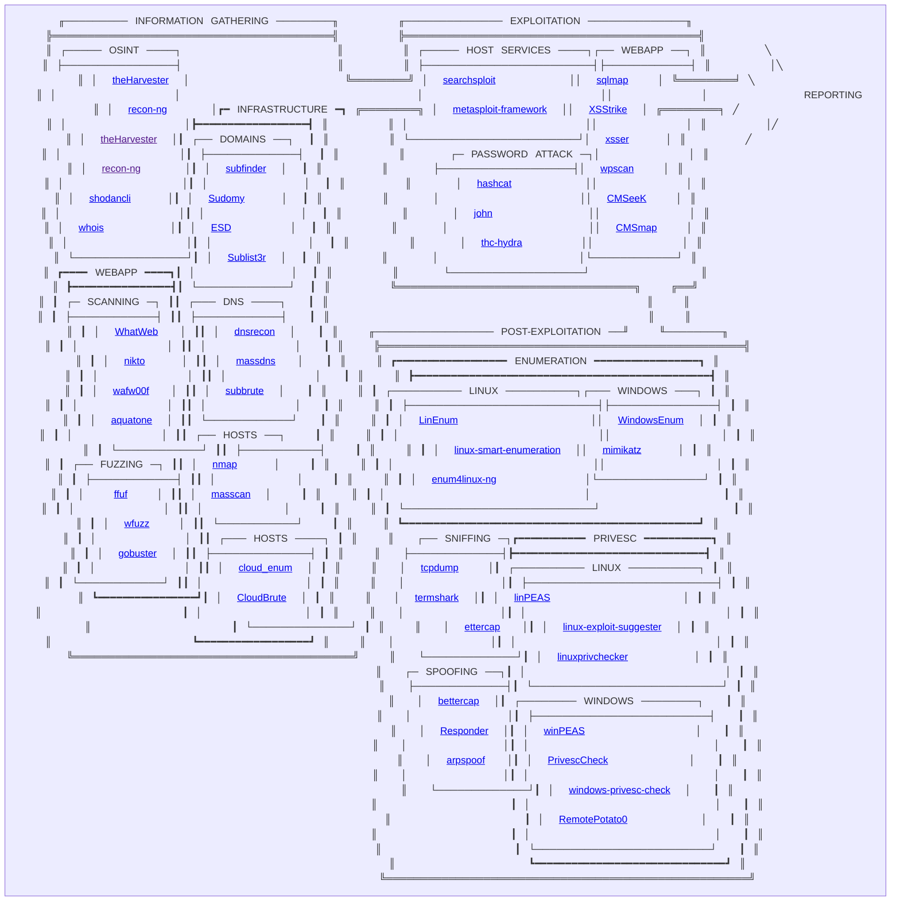

```mermaid
graph TD
main[
⠀╓─────────⠀INFORMATION⠀GATHERING⠀────────╖⠀⠀⠀⠀⠀⠀⠀⠀╓──────────────⠀EXPLOITATION⠀──────────────╖⠀⠀⠀⠀⠀⠀⠀⠀⠀⠀⠀⠀⠀⠀⠀⠀⠀⠀⠀⠀
⠀╠════════════════════════════════════════╣⠀⠀⠀⠀⠀⠀⠀⠀╠══════════════════════════════════════════╣⠀⠀⠀⠀⠀⠀⠀⠀⠀⠀⠀⠀⠀⠀⠀⠀⠀⠀⠀⠀
⠀║⠀┌─────⠀OSINT⠀────┐⠀⠀⠀⠀⠀⠀⠀⠀⠀⠀⠀⠀⠀⠀⠀⠀⠀⠀⠀⠀⠀║⠀⠀⠀⠀⠀⠀⠀⠀║⠀┌─────⠀HOST⠀SERVICES⠀────┐┌──⠀WEBAPP⠀──┐⠀║⠀⠀⠀⠀⠀⠀⠀⠀╲⠀⠀⠀⠀⠀⠀⠀⠀⠀⠀⠀
⠀║⠀├────────────────┤⠀⠀⠀⠀⠀⠀⠀⠀⠀⠀⠀⠀⠀⠀⠀⠀⠀⠀⠀⠀⠀║⠀⠀⠀⠀⠀⠀⠀⠀║⠀├────────────────────────┤├────────────┤⠀║⠀⠀⠀⠀⠀⠀⠀⠀│╲⠀⠀⠀⠀⠀⠀⠀⠀⠀⠀
⠀║⠀│⠀⠀<a href='https://github.com/laramies/theHarvester'>theHarvester</a>⠀⠀│⠀⠀⠀⠀⠀⠀⠀⠀⠀⠀⠀⠀⠀⠀⠀⠀⠀⠀⠀⠀⠀╚════════╝⠀│⠀⠀<a href='https://gitlab.com/exploit-database/exploitdb'>searchsploit</a>⠀⠀⠀⠀⠀⠀⠀⠀⠀⠀││⠀⠀<a href='https://github.com/sqlmapproject/sqlmap'>sqlmap</a>⠀⠀⠀⠀│⠀╚════════╛⠀╲⠀⠀⠀⠀⠀⠀⠀⠀⠀
⠀║⠀│⠀⠀⠀⠀⠀⠀⠀⠀⠀⠀⠀⠀⠀⠀⠀⠀│⠀⠀⠀⠀⠀⠀⠀⠀⠀⠀⠀⠀⠀⠀⠀⠀⠀⠀⠀⠀⠀⠀⠀⠀⠀⠀⠀⠀⠀⠀⠀⠀│⠀⠀⠀⠀⠀⠀⠀⠀⠀⠀⠀⠀⠀⠀⠀⠀⠀⠀⠀⠀⠀⠀⠀⠀││⠀⠀⠀⠀⠀⠀⠀⠀⠀⠀⠀⠀│⠀⠀⠀⠀⠀⠀⠀⠀⠀⠀⠀⠀⠀REPORTING
⠀║⠀│⠀⠀<a href='https://github.com/lanmaster53/recon-ng'>recon-ng</a>⠀⠀⠀⠀⠀⠀│┏━⠀INFRASTRUCTURE⠀━┓⠀╔════════╗⠀│⠀⠀<a href='https://github.com/rapid7/metasploit-framework'>metasploit-framework</a>⠀⠀││⠀⠀<a href='https://github.com/s0md3v/XSStrike'>XSStrike</a>⠀⠀│⠀╔════════╕⠀╱⠀⠀⠀⠀⠀⠀⠀⠀⠀
⠀║⠀│⠀⠀⠀⠀⠀⠀⠀⠀⠀⠀⠀⠀⠀⠀⠀⠀│┣━━━━━━━━━━━━━━━━━━┫⠀║⠀⠀⠀⠀⠀⠀⠀⠀║⠀│⠀⠀⠀⠀⠀⠀⠀⠀⠀⠀⠀⠀⠀⠀⠀⠀⠀⠀⠀⠀⠀⠀⠀⠀││⠀⠀⠀⠀⠀⠀⠀⠀⠀⠀⠀⠀│⠀║⠀⠀⠀⠀⠀⠀⠀⠀│╱⠀⠀⠀⠀⠀⠀⠀⠀⠀⠀
⠀║⠀│⠀⠀<a href=''>theHarvester</a>⠀⠀│┃⠀┌──⠀DOMAINS⠀──┐⠀⠀┃⠀║⠀⠀⠀⠀⠀⠀⠀⠀║⠀└────────────────────────┘│⠀⠀<a href='https://github.com/epsylon/xsser'>xsser</a>⠀⠀⠀⠀⠀│⠀║⠀⠀⠀⠀⠀⠀⠀⠀╱⠀⠀⠀⠀⠀⠀⠀⠀⠀⠀⠀
⠀║⠀│⠀⠀⠀⠀⠀⠀⠀⠀⠀⠀⠀⠀⠀⠀⠀⠀│┃⠀├─────────────┤⠀⠀┃⠀║⠀⠀⠀⠀⠀⠀⠀⠀║⠀⠀⠀⠀⠀⠀┌─⠀PASSWORD⠀ATTACK⠀─┐│⠀⠀⠀⠀⠀⠀⠀⠀⠀⠀⠀⠀│⠀║⠀⠀⠀⠀⠀⠀⠀⠀⠀⠀⠀⠀⠀⠀⠀⠀⠀⠀⠀⠀
⠀║⠀│⠀⠀<a href=''>recon-ng</a>⠀⠀⠀⠀⠀⠀│┃⠀│⠀⠀<a href='https://github.com/projectdiscovery/subfinder'>subfinder</a>⠀⠀│⠀⠀┃⠀║⠀⠀⠀⠀⠀⠀⠀⠀║⠀⠀⠀⠀⠀⠀├───────────────────┤│⠀⠀<a href='https://github.com/wpscanteam/wpscan'>wpscan</a>⠀⠀⠀⠀│⠀║⠀⠀⠀⠀⠀⠀⠀⠀⠀⠀⠀⠀⠀⠀⠀⠀⠀⠀⠀⠀
⠀║⠀│⠀⠀⠀⠀⠀⠀⠀⠀⠀⠀⠀⠀⠀⠀⠀⠀│┃⠀│⠀⠀⠀⠀⠀⠀⠀⠀⠀⠀⠀⠀⠀│⠀⠀┃⠀║⠀⠀⠀⠀⠀⠀⠀⠀║⠀⠀⠀⠀⠀⠀│⠀⠀<a href='https://github.com/hashcat/hashcat'>hashcat</a>⠀⠀⠀⠀⠀⠀⠀⠀⠀⠀││⠀⠀⠀⠀⠀⠀⠀⠀⠀⠀⠀⠀│⠀║⠀⠀⠀⠀⠀⠀⠀⠀⠀⠀⠀⠀⠀⠀⠀⠀⠀⠀⠀⠀
⠀║⠀│⠀⠀<a href='https://github.com/malinkinsa/shodancli'>shodancli</a>⠀⠀⠀⠀⠀│┃⠀│⠀⠀<a href='https://github.com/screetsec/Sudomy'>Sudomy</a>⠀⠀⠀⠀⠀│⠀⠀┃⠀║⠀⠀⠀⠀⠀⠀⠀⠀║⠀⠀⠀⠀⠀⠀│⠀⠀⠀⠀⠀⠀⠀⠀⠀⠀⠀⠀⠀⠀⠀⠀⠀⠀⠀││⠀⠀<a href='https://github.com/Tuhinshubhra/CMSeeK'>CMSeeK</a>⠀⠀⠀⠀│⠀║⠀⠀⠀⠀⠀⠀⠀⠀⠀⠀⠀⠀⠀⠀⠀⠀⠀⠀⠀⠀
⠀║⠀│⠀⠀⠀⠀⠀⠀⠀⠀⠀⠀⠀⠀⠀⠀⠀⠀│┃⠀│⠀⠀⠀⠀⠀⠀⠀⠀⠀⠀⠀⠀⠀│⠀⠀┃⠀║⠀⠀⠀⠀⠀⠀⠀⠀║⠀⠀⠀⠀⠀⠀│⠀⠀<a href='https://github.com/openwall/john'>john</a>⠀⠀⠀⠀⠀⠀⠀⠀⠀⠀⠀⠀⠀││⠀⠀⠀⠀⠀⠀⠀⠀⠀⠀⠀⠀│⠀║⠀⠀⠀⠀⠀⠀⠀⠀⠀⠀⠀⠀⠀⠀⠀⠀⠀⠀⠀⠀
⠀║⠀│⠀⠀<a href='https://github.com/weppos/whois'>whois</a>⠀⠀⠀⠀⠀⠀⠀⠀⠀│┃⠀│⠀⠀<a href='https://github.com/FeeiCN/ESD'>ESD</a>⠀⠀⠀⠀⠀⠀⠀⠀│⠀⠀┃⠀║⠀⠀⠀⠀⠀⠀⠀⠀║⠀⠀⠀⠀⠀⠀│⠀⠀⠀⠀⠀⠀⠀⠀⠀⠀⠀⠀⠀⠀⠀⠀⠀⠀⠀││⠀⠀<a href='https://github.com/dionach/CMSmap'>CMSmap</a>⠀⠀⠀⠀│⠀║⠀⠀⠀⠀⠀⠀⠀⠀⠀⠀⠀⠀⠀⠀⠀⠀⠀⠀⠀⠀
⠀║⠀│⠀⠀⠀⠀⠀⠀⠀⠀⠀⠀⠀⠀⠀⠀⠀⠀│┃⠀│⠀⠀⠀⠀⠀⠀⠀⠀⠀⠀⠀⠀⠀│⠀⠀┃⠀║⠀⠀⠀⠀⠀⠀⠀⠀║⠀⠀⠀⠀⠀⠀│⠀⠀<a href='https://github.com/vanhauser-thc/thc-hydra'>thc-hydra</a>⠀⠀⠀⠀⠀⠀⠀⠀││⠀⠀⠀⠀⠀⠀⠀⠀⠀⠀⠀⠀│⠀║⠀⠀⠀⠀⠀⠀⠀⠀⠀⠀⠀⠀⠀⠀⠀⠀⠀⠀⠀⠀
⠀║⠀└────────────────┘┃⠀│⠀⠀<a href='https://github.com/aboul3la/Sublist3r'>Sublist3r</a>⠀⠀│⠀⠀┃⠀║⠀⠀⠀⠀⠀⠀⠀⠀║⠀⠀⠀⠀⠀⠀│⠀⠀⠀⠀⠀⠀⠀⠀⠀⠀⠀⠀⠀⠀⠀⠀⠀⠀⠀│└────────────┘⠀║⠀⠀⠀⠀⠀⠀⠀⠀⠀⠀⠀⠀⠀⠀⠀⠀⠀⠀⠀⠀
⠀║⠀┏━━━━⠀WEBAPP⠀━━━━┓┃⠀│⠀⠀⠀⠀⠀⠀⠀⠀⠀⠀⠀⠀⠀│⠀⠀┃⠀║⠀⠀⠀⠀⠀⠀⠀⠀║⠀⠀⠀⠀⠀⠀└───────────────────┘⠀⠀⠀⠀⠀⠀⠀⠀⠀⠀⠀⠀⠀⠀⠀║⠀⠀⠀⠀⠀⠀⠀⠀⠀⠀⠀⠀⠀⠀⠀⠀⠀⠀⠀⠀
⠀║⠀┣━━━━━━━━━━━━━━━━┫┃⠀└─────────────┘⠀⠀┃⠀║⠀⠀⠀⠀⠀⠀⠀⠀╚══════════════════════════════════╗⠀⠀⠀⠀╔══╝⠀⠀⠀⠀⠀⠀⠀⠀⠀⠀⠀⠀⠀⠀⠀⠀⠀⠀⠀⠀
⠀║⠀┃⠀┌─⠀SCANNING⠀─┐⠀┃┃⠀┌───⠀DNS⠀────┐⠀⠀⠀┃⠀║⠀⠀⠀⠀⠀⠀⠀⠀⠀⠀⠀⠀⠀⠀⠀⠀⠀⠀⠀⠀⠀⠀⠀⠀⠀⠀⠀⠀⠀⠀⠀⠀⠀⠀⠀⠀⠀⠀⠀⠀⠀⠀⠀║⠀⠀⠀⠀║⠀⠀⠀⠀⠀⠀⠀⠀⠀⠀⠀⠀⠀⠀⠀⠀⠀⠀⠀⠀⠀⠀⠀
⠀║⠀┃⠀├────────────┤⠀┃┃⠀├────────────┤⠀⠀⠀┃⠀║⠀⠀⠀⠀⠀⠀⠀⠀⠀⠀⠀⠀⠀⠀⠀⠀⠀⠀⠀⠀⠀⠀⠀⠀⠀⠀⠀⠀⠀⠀⠀⠀⠀⠀⠀⠀⠀⠀⠀⠀⠀⠀⠀║⠀⠀⠀⠀║⠀⠀⠀⠀⠀⠀⠀⠀⠀⠀⠀⠀⠀⠀⠀⠀⠀⠀⠀⠀⠀⠀⠀
⠀║⠀┃⠀│⠀⠀<a href='https://github.com/urbanadventurer/WhatWeb'>WhatWeb</a>⠀⠀⠀│⠀┃┃⠀│⠀⠀<a href='https://github.com/darkoperator/dnsrecon'>dnsrecon</a>⠀⠀│⠀⠀⠀┃⠀║⠀⠀⠀⠀╓─────────────────⠀POST-EXPLOITATION⠀──╜⠀⠀⠀⠀╙────────╖⠀⠀⠀⠀⠀⠀⠀⠀⠀⠀⠀⠀⠀⠀
⠀║⠀┃⠀│⠀⠀⠀⠀⠀⠀⠀⠀⠀⠀⠀⠀│⠀┃┃⠀│⠀⠀⠀⠀⠀⠀⠀⠀⠀⠀⠀⠀│⠀⠀⠀┃⠀║⠀⠀⠀⠀╠════════════════════════════════════════════════════╣⠀⠀⠀⠀⠀⠀⠀⠀⠀⠀⠀⠀⠀⠀
⠀║⠀┃⠀│⠀⠀<a href='https://github.com/sullo/nikto'>nikto</a>⠀⠀⠀⠀⠀│⠀┃┃⠀│⠀⠀<a href='https://github.com/blechschmidt/massdns'>massdns</a>⠀⠀⠀│⠀⠀⠀┃⠀║⠀⠀⠀⠀║⠀┏━━━━━━━━━━━━━━━━━━⠀ENUMERATION⠀━━━━━━━━━━━━━━━━━┓⠀║⠀⠀⠀⠀⠀⠀⠀⠀⠀⠀⠀⠀⠀⠀
⠀║⠀┃⠀│⠀⠀⠀⠀⠀⠀⠀⠀⠀⠀⠀⠀│⠀┃┃⠀│⠀⠀⠀⠀⠀⠀⠀⠀⠀⠀⠀⠀│⠀⠀⠀┃⠀║⠀⠀⠀⠀║⠀┣━━━━━━━━━━━━━━━━━━━━━━━━━━━━━━━━━━━━━━━━━━━━━━━━┫⠀║⠀⠀⠀⠀⠀⠀⠀⠀⠀⠀⠀⠀⠀⠀
⠀║⠀┃⠀│⠀⠀<a href='https://github.com/EnableSecurity/wafw00f'>wafw00f</a>⠀⠀⠀│⠀┃┃⠀│⠀⠀<a href='https://github.com/TheRook/subbrute'>subbrute</a>⠀⠀│⠀⠀⠀┃⠀║⠀⠀⠀⠀║⠀┃⠀┌──────────⠀LINUX⠀──────────┐┌───⠀WINDOWS⠀───┐⠀┃⠀║⠀⠀⠀⠀⠀⠀⠀⠀⠀⠀⠀⠀⠀⠀
⠀║⠀┃⠀│⠀⠀⠀⠀⠀⠀⠀⠀⠀⠀⠀⠀│⠀┃┃⠀│⠀⠀⠀⠀⠀⠀⠀⠀⠀⠀⠀⠀│⠀⠀⠀┃⠀║⠀⠀⠀⠀║⠀┃⠀├───────────────────────────┤├───────────────┤⠀┃⠀║⠀⠀⠀⠀⠀⠀⠀⠀⠀⠀⠀⠀⠀⠀
⠀║⠀┃⠀│⠀⠀<a href='https://github.com/michenriksen/aquatone'>aquatone</a>⠀⠀│⠀┃┃⠀└────────────┘⠀⠀⠀┃⠀║⠀⠀⠀⠀║⠀┃⠀│⠀⠀<a href='https://github.com/rebootuser/LinEnum'>LinEnum</a>⠀⠀⠀⠀⠀⠀⠀⠀⠀⠀⠀⠀⠀⠀⠀⠀⠀⠀││⠀⠀<a href='https://github.com/absolomb/WindowsEnum'>WindowsEnum</a>⠀⠀│⠀┃⠀║⠀⠀⠀⠀⠀⠀⠀⠀⠀⠀⠀⠀⠀⠀
⠀║⠀┃⠀│⠀⠀⠀⠀⠀⠀⠀⠀⠀⠀⠀⠀│⠀┃┃⠀┌──⠀HOSTS⠀──┐⠀⠀⠀⠀┃⠀║⠀⠀⠀⠀║⠀┃⠀│⠀⠀⠀⠀⠀⠀⠀⠀⠀⠀⠀⠀⠀⠀⠀⠀⠀⠀⠀⠀⠀⠀⠀⠀⠀⠀⠀││⠀⠀⠀⠀⠀⠀⠀⠀⠀⠀⠀⠀⠀⠀⠀│⠀┃⠀║⠀⠀⠀⠀⠀⠀⠀⠀⠀⠀⠀⠀⠀⠀
⠀║⠀┃⠀└────────────┘⠀┃┃⠀├───────────┤⠀⠀⠀⠀┃⠀║⠀⠀⠀⠀║⠀┃⠀│⠀⠀<a href='https://github.com/diego-treitos/linux-smart-enumeration'>linux-smart-enumeration</a>⠀⠀││⠀⠀<a href='https://github.com/gentilkiwi/mimikatz'>mimikatz</a>⠀⠀⠀⠀⠀│⠀┃⠀║⠀⠀⠀⠀⠀⠀⠀⠀⠀⠀⠀⠀⠀⠀
⠀║⠀┃⠀┌──⠀FUZZING⠀─┐⠀┃┃⠀│⠀⠀<a href='https://github.com/nmap/nmap'>nmap</a>⠀⠀⠀⠀⠀│⠀⠀⠀⠀┃⠀║⠀⠀⠀⠀║⠀┃⠀│⠀⠀⠀⠀⠀⠀⠀⠀⠀⠀⠀⠀⠀⠀⠀⠀⠀⠀⠀⠀⠀⠀⠀⠀⠀⠀⠀││⠀⠀⠀⠀⠀⠀⠀⠀⠀⠀⠀⠀⠀⠀⠀│⠀┃⠀║⠀⠀⠀⠀⠀⠀⠀⠀⠀⠀⠀⠀⠀⠀
⠀║⠀┃⠀├────────────┤⠀┃┃⠀│⠀⠀⠀⠀⠀⠀⠀⠀⠀⠀⠀│⠀⠀⠀⠀┃⠀║⠀⠀⠀⠀║⠀┃⠀│⠀⠀<a href='https://github.com/cddmp/enum4linux-ng'>enum4linux-ng</a>⠀⠀⠀⠀⠀⠀⠀⠀⠀⠀⠀⠀│└───────────────┘⠀┃⠀║⠀⠀⠀⠀⠀⠀⠀⠀⠀⠀⠀⠀⠀⠀
⠀║⠀┃⠀│⠀⠀⠀⠀<a href='https://github.com/ffuf/ffuf'>ffuf</a>⠀⠀⠀⠀│⠀┃┃⠀│⠀⠀<a href='https://github.com/robertdavidgraham/masscan'>masscan</a>⠀⠀│⠀⠀⠀⠀┃⠀║⠀⠀⠀⠀║⠀┃⠀│⠀⠀⠀⠀⠀⠀⠀⠀⠀⠀⠀⠀⠀⠀⠀⠀⠀⠀⠀⠀⠀⠀⠀⠀⠀⠀⠀│⠀⠀⠀⠀⠀⠀⠀⠀⠀⠀⠀⠀⠀⠀⠀⠀⠀⠀┃⠀║⠀⠀⠀⠀⠀⠀⠀⠀⠀⠀⠀⠀⠀⠀
⠀║⠀┃⠀│⠀⠀⠀⠀⠀⠀⠀⠀⠀⠀⠀⠀│⠀┃┃⠀│⠀⠀⠀⠀⠀⠀⠀⠀⠀⠀⠀│⠀⠀⠀⠀┃⠀║⠀⠀⠀⠀║⠀┃⠀└───────────────────────────┘⠀⠀⠀⠀⠀⠀⠀⠀⠀⠀⠀⠀⠀⠀⠀⠀⠀⠀┃⠀║⠀⠀⠀⠀⠀⠀⠀⠀⠀⠀⠀⠀⠀⠀
⠀║⠀┃⠀│⠀⠀<a href='https://github.com/xmendez/wfuzz'>wfuzz</a>⠀⠀⠀⠀│⠀┃┃⠀└───────────┘⠀⠀⠀⠀┃⠀║⠀⠀⠀⠀║⠀┗━━━━━━━━━━━━━━━━━━━━━━━━━━━━━━━━━━━━━━━━━━━━━━━━┛⠀║⠀⠀⠀⠀⠀⠀⠀⠀⠀⠀⠀⠀⠀⠀
⠀║⠀┃⠀│⠀⠀⠀⠀⠀⠀⠀⠀⠀⠀⠀⠀│⠀┃┃⠀┌───⠀HOSTS⠀────┐⠀┃⠀║⠀⠀⠀⠀║⠀⠀⠀┌──⠀SNIFFING⠀─┐┏━━━━━━━━━━━⠀PRIVESC⠀━━━━━━━━━━━┓⠀║⠀⠀⠀⠀⠀⠀⠀⠀⠀⠀⠀⠀⠀⠀
⠀║⠀┃⠀│⠀⠀<a href='https://github.com/OJ/gobuster'>gobuster</a>⠀⠀│⠀┃┃⠀├──────────────┤⠀┃⠀║⠀⠀⠀⠀║⠀⠀⠀├─────────────┤┣━━━━━━━━━━━━━━━━━━━━━━━━━━━━━━━┫⠀║⠀⠀⠀⠀⠀⠀⠀⠀⠀⠀⠀⠀⠀⠀
⠀║⠀┃⠀│⠀⠀⠀⠀⠀⠀⠀⠀⠀⠀⠀⠀│⠀┃┃⠀│⠀⠀<a href='https://github.com/initstring/cloud_enum'>cloud_enum</a>⠀⠀│⠀┃⠀║⠀⠀⠀⠀║⠀⠀⠀│⠀⠀<a href='https://github.com/the-tcpdump-group/tcpdump'>tcpdump</a>⠀⠀⠀⠀│┃⠀┌──────────⠀LINUX⠀──────────┐⠀┃⠀║⠀⠀⠀⠀⠀⠀⠀⠀⠀⠀⠀⠀⠀⠀
⠀║⠀┃⠀└────────────┘⠀┃┃⠀│⠀⠀⠀⠀⠀⠀⠀⠀⠀⠀⠀⠀⠀⠀│⠀┃⠀║⠀⠀⠀⠀║⠀⠀⠀│⠀⠀⠀⠀⠀⠀⠀⠀⠀⠀⠀⠀⠀│┃⠀├───────────────────────────┤⠀┃⠀║⠀⠀⠀⠀⠀⠀⠀⠀⠀⠀⠀⠀⠀⠀
⠀║⠀┗━━━━━━━━━━━━━━━━┛┃⠀│⠀⠀<a href='https://github.com/0xsha/CloudBrute'>CloudBrute</a>⠀⠀│⠀┃⠀║⠀⠀⠀⠀║⠀⠀⠀│⠀⠀<a href='https://github.com/gcla/termshark'>termshark</a>⠀⠀│┃⠀│⠀⠀<a href='https://github.com/peass-ng/PEASS-ng/tree/master/linPEAS'>linPEAS</a>⠀⠀⠀⠀⠀⠀⠀⠀⠀⠀⠀⠀⠀⠀⠀⠀⠀⠀│⠀┃⠀║⠀⠀⠀⠀⠀⠀⠀⠀⠀⠀⠀⠀⠀⠀
⠀║⠀⠀⠀⠀⠀⠀⠀⠀⠀⠀⠀⠀⠀⠀⠀⠀⠀⠀⠀┃⠀│⠀⠀⠀⠀⠀⠀⠀⠀⠀⠀⠀⠀⠀⠀│⠀┃⠀║⠀⠀⠀⠀║⠀⠀⠀│⠀⠀⠀⠀⠀⠀⠀⠀⠀⠀⠀⠀⠀│┃⠀│⠀⠀⠀⠀⠀⠀⠀⠀⠀⠀⠀⠀⠀⠀⠀⠀⠀⠀⠀⠀⠀⠀⠀⠀⠀⠀⠀│⠀┃⠀║⠀⠀⠀⠀⠀⠀⠀⠀⠀⠀⠀⠀⠀⠀
⠀║⠀⠀⠀⠀⠀⠀⠀⠀⠀⠀⠀⠀⠀⠀⠀⠀⠀⠀⠀┃⠀└──────────────┘⠀┃⠀║⠀⠀⠀⠀║⠀⠀⠀│⠀⠀<a href='https://github.com/Ettercap/ettercap'>ettercap</a>⠀⠀⠀│┃⠀│⠀⠀<a href='https://github.com/The-Z-Labs/linux-exploit-suggester'>linux-exploit-suggester</a>⠀⠀│⠀┃⠀║⠀⠀⠀⠀⠀⠀⠀⠀⠀⠀⠀⠀⠀⠀
⠀║⠀⠀⠀⠀⠀⠀⠀⠀⠀⠀⠀⠀⠀⠀⠀⠀⠀⠀⠀┗━━━━━━━━━━━━━━━━━━┛⠀║⠀⠀⠀⠀║⠀⠀⠀│⠀⠀⠀⠀⠀⠀⠀⠀⠀⠀⠀⠀⠀│┃⠀│⠀⠀⠀⠀⠀⠀⠀⠀⠀⠀⠀⠀⠀⠀⠀⠀⠀⠀⠀⠀⠀⠀⠀⠀⠀⠀⠀│⠀┃⠀║⠀⠀⠀⠀⠀⠀⠀⠀⠀⠀⠀⠀⠀⠀
⠀╚════════════════════════════════════════╝⠀⠀⠀⠀║⠀⠀⠀└─────────────┘┃⠀│⠀⠀<a href='https://github.com/sleventyeleven/linuxprivchecker'>linuxprivchecker</a>⠀⠀⠀⠀⠀⠀⠀⠀⠀│⠀┃⠀║⠀⠀⠀⠀⠀⠀⠀⠀⠀⠀⠀⠀⠀⠀
⠀⠀⠀⠀⠀⠀⠀⠀⠀⠀⠀⠀⠀⠀⠀⠀⠀⠀⠀⠀⠀⠀⠀⠀⠀⠀⠀⠀⠀⠀⠀⠀⠀⠀⠀⠀⠀⠀⠀⠀⠀⠀⠀⠀⠀⠀⠀║⠀⠀⠀┌─⠀SPOOFING⠀──┐┃⠀│⠀⠀⠀⠀⠀⠀⠀⠀⠀⠀⠀⠀⠀⠀⠀⠀⠀⠀⠀⠀⠀⠀⠀⠀⠀⠀⠀│⠀┃⠀║⠀⠀⠀⠀⠀⠀⠀⠀⠀⠀⠀⠀⠀⠀
⠀⠀⠀⠀⠀⠀⠀⠀⠀⠀⠀⠀⠀⠀⠀⠀⠀⠀⠀⠀⠀⠀⠀⠀⠀⠀⠀⠀⠀⠀⠀⠀⠀⠀⠀⠀⠀⠀⠀⠀⠀⠀⠀⠀⠀⠀⠀║⠀⠀⠀├─────────────┤┃⠀└───────────────────────────┘⠀┃⠀║⠀⠀⠀⠀⠀⠀⠀⠀⠀⠀⠀⠀⠀⠀
⠀⠀⠀⠀⠀⠀⠀⠀⠀⠀⠀⠀⠀⠀⠀⠀⠀⠀⠀⠀⠀⠀⠀⠀⠀⠀⠀⠀⠀⠀⠀⠀⠀⠀⠀⠀⠀⠀⠀⠀⠀⠀⠀⠀⠀⠀⠀║⠀⠀⠀│⠀⠀<a href='https://github.com/bettercap/bettercap'>bettercap</a>⠀⠀│┃⠀┌────────⠀WINDOWS⠀────────┐⠀⠀⠀┃⠀║⠀⠀⠀⠀⠀⠀⠀⠀⠀⠀⠀⠀⠀⠀
⠀⠀⠀⠀⠀⠀⠀⠀⠀⠀⠀⠀⠀⠀⠀⠀⠀⠀⠀⠀⠀⠀⠀⠀⠀⠀⠀⠀⠀⠀⠀⠀⠀⠀⠀⠀⠀⠀⠀⠀⠀⠀⠀⠀⠀⠀⠀║⠀⠀⠀│⠀⠀⠀⠀⠀⠀⠀⠀⠀⠀⠀⠀⠀│┃⠀├─────────────────────────┤⠀⠀⠀┃⠀║⠀⠀⠀⠀⠀⠀⠀⠀⠀⠀⠀⠀⠀⠀
⠀⠀⠀⠀⠀⠀⠀⠀⠀⠀⠀⠀⠀⠀⠀⠀⠀⠀⠀⠀⠀⠀⠀⠀⠀⠀⠀⠀⠀⠀⠀⠀⠀⠀⠀⠀⠀⠀⠀⠀⠀⠀⠀⠀⠀⠀⠀║⠀⠀⠀│⠀⠀<a href='https://github.com/SpiderLabs/Responder'>Responder</a>⠀⠀│┃⠀│⠀⠀<a href='https://github.com/peass-ng/PEASS-ng/tree/master/winPEAS'>winPEAS</a>⠀⠀⠀⠀⠀⠀⠀⠀⠀⠀⠀⠀⠀⠀⠀│⠀⠀⠀┃⠀║⠀⠀⠀⠀⠀⠀⠀⠀⠀⠀⠀⠀⠀⠀
⠀⠀⠀⠀⠀⠀⠀⠀⠀⠀⠀⠀⠀⠀⠀⠀⠀⠀⠀⠀⠀⠀⠀⠀⠀⠀⠀⠀⠀⠀⠀⠀⠀⠀⠀⠀⠀⠀⠀⠀⠀⠀⠀⠀⠀⠀⠀║⠀⠀⠀│⠀⠀⠀⠀⠀⠀⠀⠀⠀⠀⠀⠀⠀│┃⠀│⠀⠀⠀⠀⠀⠀⠀⠀⠀⠀⠀⠀⠀⠀⠀⠀⠀⠀⠀⠀⠀⠀⠀⠀⠀│⠀⠀⠀┃⠀║⠀⠀⠀⠀⠀⠀⠀⠀⠀⠀⠀⠀⠀⠀
⠀⠀⠀⠀⠀⠀⠀⠀⠀⠀⠀⠀⠀⠀⠀⠀⠀⠀⠀⠀⠀⠀⠀⠀⠀⠀⠀⠀⠀⠀⠀⠀⠀⠀⠀⠀⠀⠀⠀⠀⠀⠀⠀⠀⠀⠀⠀║⠀⠀⠀│⠀⠀<a href='https://github.com/alandau/arpspoof'>arpspoof</a>⠀⠀⠀│┃⠀│⠀⠀<a href='https://github.com/itm4n/PrivescCheck'>PrivescCheck</a>⠀⠀⠀⠀⠀⠀⠀⠀⠀⠀⠀│⠀⠀⠀┃⠀║⠀⠀⠀⠀⠀⠀⠀⠀⠀⠀⠀⠀⠀⠀
⠀⠀⠀⠀⠀⠀⠀⠀⠀⠀⠀⠀⠀⠀⠀⠀⠀⠀⠀⠀⠀⠀⠀⠀⠀⠀⠀⠀⠀⠀⠀⠀⠀⠀⠀⠀⠀⠀⠀⠀⠀⠀⠀⠀⠀⠀⠀║⠀⠀⠀│⠀⠀⠀⠀⠀⠀⠀⠀⠀⠀⠀⠀⠀│┃⠀│⠀⠀⠀⠀⠀⠀⠀⠀⠀⠀⠀⠀⠀⠀⠀⠀⠀⠀⠀⠀⠀⠀⠀⠀⠀│⠀⠀⠀┃⠀║⠀⠀⠀⠀⠀⠀⠀⠀⠀⠀⠀⠀⠀⠀
⠀⠀⠀⠀⠀⠀⠀⠀⠀⠀⠀⠀⠀⠀⠀⠀⠀⠀⠀⠀⠀⠀⠀⠀⠀⠀⠀⠀⠀⠀⠀⠀⠀⠀⠀⠀⠀⠀⠀⠀⠀⠀⠀⠀⠀⠀⠀║⠀⠀⠀└─────────────┘┃⠀│⠀⠀<a href='https://github.com/pentestmonkey/windows-privesc-check'>windows-privesc-check</a>⠀⠀│⠀⠀⠀┃⠀║⠀⠀⠀⠀⠀⠀⠀⠀⠀⠀⠀⠀⠀⠀
⠀⠀⠀⠀⠀⠀⠀⠀⠀⠀⠀⠀⠀⠀⠀⠀⠀⠀⠀⠀⠀⠀⠀⠀⠀⠀⠀⠀⠀⠀⠀⠀⠀⠀⠀⠀⠀⠀⠀⠀⠀⠀⠀⠀⠀⠀⠀║⠀⠀⠀⠀⠀⠀⠀⠀⠀⠀⠀⠀⠀⠀⠀⠀⠀⠀┃⠀│⠀⠀⠀⠀⠀⠀⠀⠀⠀⠀⠀⠀⠀⠀⠀⠀⠀⠀⠀⠀⠀⠀⠀⠀⠀│⠀⠀⠀┃⠀║⠀⠀⠀⠀⠀⠀⠀⠀⠀⠀⠀⠀⠀⠀
⠀⠀⠀⠀⠀⠀⠀⠀⠀⠀⠀⠀⠀⠀⠀⠀⠀⠀⠀⠀⠀⠀⠀⠀⠀⠀⠀⠀⠀⠀⠀⠀⠀⠀⠀⠀⠀⠀⠀⠀⠀⠀⠀⠀⠀⠀⠀║⠀⠀⠀⠀⠀⠀⠀⠀⠀⠀⠀⠀⠀⠀⠀⠀⠀⠀┃⠀│⠀⠀<a href='https://github.com/antonioCoco/RemotePotato0'>RemotePotato0</a>⠀⠀⠀⠀⠀⠀⠀⠀⠀⠀│⠀⠀⠀┃⠀║⠀⠀⠀⠀⠀⠀⠀⠀⠀⠀⠀⠀⠀⠀
⠀⠀⠀⠀⠀⠀⠀⠀⠀⠀⠀⠀⠀⠀⠀⠀⠀⠀⠀⠀⠀⠀⠀⠀⠀⠀⠀⠀⠀⠀⠀⠀⠀⠀⠀⠀⠀⠀⠀⠀⠀⠀⠀⠀⠀⠀⠀║⠀⠀⠀⠀⠀⠀⠀⠀⠀⠀⠀⠀⠀⠀⠀⠀⠀⠀┃⠀│⠀⠀⠀⠀⠀⠀⠀⠀⠀⠀⠀⠀⠀⠀⠀⠀⠀⠀⠀⠀⠀⠀⠀⠀⠀│⠀⠀⠀┃⠀║⠀⠀⠀⠀⠀⠀⠀⠀⠀⠀⠀⠀⠀⠀
⠀⠀⠀⠀⠀⠀⠀⠀⠀⠀⠀⠀⠀⠀⠀⠀⠀⠀⠀⠀⠀⠀⠀⠀⠀⠀⠀⠀⠀⠀⠀⠀⠀⠀⠀⠀⠀⠀⠀⠀⠀⠀⠀⠀⠀⠀⠀║⠀⠀⠀⠀⠀⠀⠀⠀⠀⠀⠀⠀⠀⠀⠀⠀⠀⠀┃⠀└─────────────────────────┘⠀⠀⠀┃⠀║⠀⠀⠀⠀⠀⠀⠀⠀⠀⠀⠀⠀⠀⠀
⠀⠀⠀⠀⠀⠀⠀⠀⠀⠀⠀⠀⠀⠀⠀⠀⠀⠀⠀⠀⠀⠀⠀⠀⠀⠀⠀⠀⠀⠀⠀⠀⠀⠀⠀⠀⠀⠀⠀⠀⠀⠀⠀⠀⠀⠀⠀║⠀⠀⠀⠀⠀⠀⠀⠀⠀⠀⠀⠀⠀⠀⠀⠀⠀⠀┗━━━━━━━━━━━━━━━━━━━━━━━━━━━━━━━┛⠀║⠀⠀⠀⠀⠀⠀⠀⠀⠀⠀⠀⠀⠀⠀
⠀⠀⠀⠀⠀⠀⠀⠀⠀⠀⠀⠀⠀⠀⠀⠀⠀⠀⠀⠀⠀⠀⠀⠀⠀⠀⠀⠀⠀⠀⠀⠀⠀⠀⠀⠀⠀⠀⠀⠀⠀⠀⠀⠀⠀⠀⠀╚════════════════════════════════════════════════════╝⠀⠀⠀⠀⠀⠀⠀⠀⠀⠀⠀⠀⠀⠀
]
```
