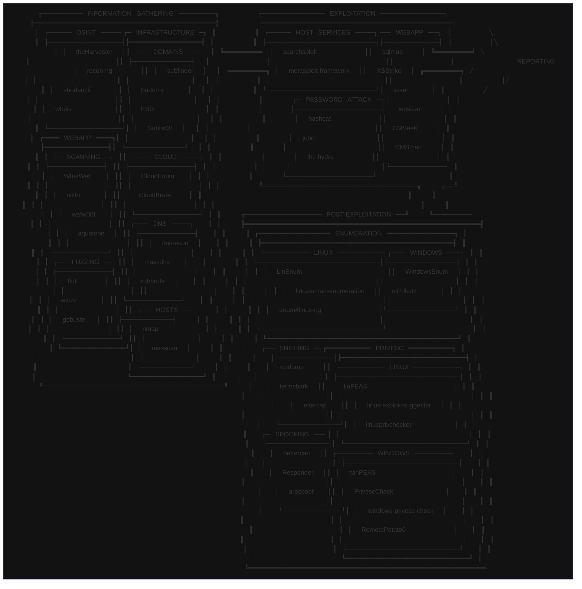

```mermaid
graph TD
main[
⠀╓─────────⠀INFORMATION⠀GATHERING⠀────────╖⠀⠀⠀⠀⠀⠀⠀⠀╓──────────────⠀EXPLOITATION⠀──────────────╖⠀⠀⠀⠀⠀⠀⠀⠀⠀⠀⠀⠀⠀⠀⠀⠀⠀⠀⠀⠀
⠀╠════════════════════════════════════════╣⠀⠀⠀⠀⠀⠀⠀⠀╠══════════════════════════════════════════╣⠀⠀⠀⠀⠀⠀⠀⠀⠀⠀⠀⠀⠀⠀⠀⠀⠀⠀⠀⠀
⠀║⠀┌─────⠀OSINT⠀────┐┏━⠀INFRASTRUCTURE⠀━┓⠀║⠀⠀⠀⠀⠀⠀⠀⠀║⠀┌─────⠀HOST⠀SERVICES⠀────┐┌──⠀WEBAPP⠀──┐⠀║⠀⠀⠀⠀⠀⠀⠀⠀╲⠀⠀⠀⠀⠀⠀⠀⠀⠀⠀⠀
⠀║⠀├────────────────┤┣━━━━━━━━━━━━━━━━━━┫⠀║⠀⠀⠀⠀⠀⠀⠀⠀║⠀├────────────────────────┤├────────────┤⠀║⠀⠀⠀⠀⠀⠀⠀⠀│╲⠀⠀⠀⠀⠀⠀⠀⠀⠀⠀
⠀║⠀│⠀⠀theHarvester⠀⠀│┃⠀┌──⠀DOMAINS⠀──┐⠀⠀┃⠀╚════════╝⠀│⠀⠀searchsploit⠀⠀⠀⠀⠀⠀⠀⠀⠀⠀││⠀⠀sqlmap⠀⠀⠀⠀│⠀╚════════╛⠀╲⠀⠀⠀⠀⠀⠀⠀⠀⠀
⠀║⠀│⠀⠀⠀⠀⠀⠀⠀⠀⠀⠀⠀⠀⠀⠀⠀⠀│┃⠀├─────────────┤⠀⠀┃⠀⠀⠀⠀⠀⠀⠀⠀⠀⠀⠀⠀│⠀⠀⠀⠀⠀⠀⠀⠀⠀⠀⠀⠀⠀⠀⠀⠀⠀⠀⠀⠀⠀⠀⠀⠀││⠀⠀⠀⠀⠀⠀⠀⠀⠀⠀⠀⠀│⠀⠀⠀⠀⠀⠀⠀⠀⠀⠀⠀⠀⠀REPORTING
⠀║⠀│⠀⠀recon-ng⠀⠀⠀⠀⠀⠀│┃⠀│⠀⠀subfinder⠀⠀│⠀⠀┃⠀╔════════╗⠀│⠀⠀metasploit-framework⠀⠀││⠀⠀XSStrike⠀⠀│⠀╔════════╕⠀╱⠀⠀⠀⠀⠀⠀⠀⠀⠀
⠀║⠀│⠀⠀⠀⠀⠀⠀⠀⠀⠀⠀⠀⠀⠀⠀⠀⠀│┃⠀│⠀⠀⠀⠀⠀⠀⠀⠀⠀⠀⠀⠀⠀│⠀⠀┃⠀║⠀⠀⠀⠀⠀⠀⠀⠀║⠀│⠀⠀⠀⠀⠀⠀⠀⠀⠀⠀⠀⠀⠀⠀⠀⠀⠀⠀⠀⠀⠀⠀⠀⠀││⠀⠀⠀⠀⠀⠀⠀⠀⠀⠀⠀⠀│⠀║⠀⠀⠀⠀⠀⠀⠀⠀│╱⠀⠀⠀⠀⠀⠀⠀⠀⠀⠀
⠀║⠀│⠀⠀shodancli⠀⠀⠀⠀⠀│┃⠀│⠀⠀Sudomy⠀⠀⠀⠀⠀│⠀⠀┃⠀║⠀⠀⠀⠀⠀⠀⠀⠀║⠀└────────────────────────┘│⠀⠀xsser⠀⠀⠀⠀⠀│⠀║⠀⠀⠀⠀⠀⠀⠀⠀╱⠀⠀⠀⠀⠀⠀⠀⠀⠀⠀⠀
⠀║⠀│⠀⠀⠀⠀⠀⠀⠀⠀⠀⠀⠀⠀⠀⠀⠀⠀│┃⠀│⠀⠀⠀⠀⠀⠀⠀⠀⠀⠀⠀⠀⠀│⠀⠀┃⠀║⠀⠀⠀⠀⠀⠀⠀⠀║⠀⠀⠀⠀⠀⠀┌─⠀PASSWORD⠀ATTACK⠀─┐│⠀⠀⠀⠀⠀⠀⠀⠀⠀⠀⠀⠀│⠀║⠀⠀⠀⠀⠀⠀⠀⠀⠀⠀⠀⠀⠀⠀⠀⠀⠀⠀⠀⠀
⠀║⠀│⠀⠀whois⠀⠀⠀⠀⠀⠀⠀⠀⠀│┃⠀│⠀⠀ESD⠀⠀⠀⠀⠀⠀⠀⠀│⠀⠀┃⠀║⠀⠀⠀⠀⠀⠀⠀⠀║⠀⠀⠀⠀⠀⠀├───────────────────┤│⠀⠀wpscan⠀⠀⠀⠀│⠀║⠀⠀⠀⠀⠀⠀⠀⠀⠀⠀⠀⠀⠀⠀⠀⠀⠀⠀⠀⠀
⠀║⠀│⠀⠀⠀⠀⠀⠀⠀⠀⠀⠀⠀⠀⠀⠀⠀⠀│┃⠀│⠀⠀⠀⠀⠀⠀⠀⠀⠀⠀⠀⠀⠀│⠀⠀┃⠀║⠀⠀⠀⠀⠀⠀⠀⠀║⠀⠀⠀⠀⠀⠀│⠀⠀hashcat⠀⠀⠀⠀⠀⠀⠀⠀⠀⠀││⠀⠀⠀⠀⠀⠀⠀⠀⠀⠀⠀⠀│⠀║⠀⠀⠀⠀⠀⠀⠀⠀⠀⠀⠀⠀⠀⠀⠀⠀⠀⠀⠀⠀
⠀║⠀└────────────────┘┃⠀│⠀⠀Sublist3r⠀⠀│⠀⠀┃⠀║⠀⠀⠀⠀⠀⠀⠀⠀║⠀⠀⠀⠀⠀⠀│⠀⠀⠀⠀⠀⠀⠀⠀⠀⠀⠀⠀⠀⠀⠀⠀⠀⠀⠀││⠀⠀CMSeeK⠀⠀⠀⠀│⠀║⠀⠀⠀⠀⠀⠀⠀⠀⠀⠀⠀⠀⠀⠀⠀⠀⠀⠀⠀⠀
⠀║⠀┏━━━━⠀WEBAPP⠀━━━━┓┃⠀│⠀⠀⠀⠀⠀⠀⠀⠀⠀⠀⠀⠀⠀│⠀⠀┃⠀║⠀⠀⠀⠀⠀⠀⠀⠀║⠀⠀⠀⠀⠀⠀│⠀⠀john⠀⠀⠀⠀⠀⠀⠀⠀⠀⠀⠀⠀⠀││⠀⠀⠀⠀⠀⠀⠀⠀⠀⠀⠀⠀│⠀║⠀⠀⠀⠀⠀⠀⠀⠀⠀⠀⠀⠀⠀⠀⠀⠀⠀⠀⠀⠀
⠀║⠀┣━━━━━━━━━━━━━━━━┫┃⠀└─────────────┘⠀⠀┃⠀║⠀⠀⠀⠀⠀⠀⠀⠀║⠀⠀⠀⠀⠀⠀│⠀⠀⠀⠀⠀⠀⠀⠀⠀⠀⠀⠀⠀⠀⠀⠀⠀⠀⠀││⠀⠀CMSmap⠀⠀⠀⠀│⠀║⠀⠀⠀⠀⠀⠀⠀⠀⠀⠀⠀⠀⠀⠀⠀⠀⠀⠀⠀⠀
⠀║⠀┃⠀┌─⠀SCANNING⠀─┐⠀┃┃⠀┌───⠀CLOUD⠀────┐⠀┃⠀║⠀⠀⠀⠀⠀⠀⠀⠀║⠀⠀⠀⠀⠀⠀│⠀⠀thc-hydra⠀⠀⠀⠀⠀⠀⠀⠀││⠀⠀⠀⠀⠀⠀⠀⠀⠀⠀⠀⠀│⠀║⠀⠀⠀⠀⠀⠀⠀⠀⠀⠀⠀⠀⠀⠀⠀⠀⠀⠀⠀⠀
⠀║⠀┃⠀├────────────┤⠀┃┃⠀├──────────────┤⠀┃⠀║⠀⠀⠀⠀⠀⠀⠀⠀║⠀⠀⠀⠀⠀⠀│⠀⠀⠀⠀⠀⠀⠀⠀⠀⠀⠀⠀⠀⠀⠀⠀⠀⠀⠀│└────────────┘⠀║⠀⠀⠀⠀⠀⠀⠀⠀⠀⠀⠀⠀⠀⠀⠀⠀⠀⠀⠀⠀
⠀║⠀┃⠀│⠀⠀WhatWeb⠀⠀⠀│⠀┃┃⠀│⠀⠀CloudEnum⠀⠀⠀│⠀┃⠀║⠀⠀⠀⠀⠀⠀⠀⠀║⠀⠀⠀⠀⠀⠀└───────────────────┘⠀⠀⠀⠀⠀⠀⠀⠀⠀⠀⠀⠀⠀⠀⠀║⠀⠀⠀⠀⠀⠀⠀⠀⠀⠀⠀⠀⠀⠀⠀⠀⠀⠀⠀⠀
⠀║⠀┃⠀│⠀⠀⠀⠀⠀⠀⠀⠀⠀⠀⠀⠀│⠀┃┃⠀│⠀⠀⠀⠀⠀⠀⠀⠀⠀⠀⠀⠀⠀⠀│⠀┃⠀║⠀⠀⠀⠀⠀⠀⠀⠀╚══════════════════════════════════╗⠀⠀⠀⠀╔══╝⠀⠀⠀⠀⠀⠀⠀⠀⠀⠀⠀⠀⠀⠀⠀⠀⠀⠀⠀⠀
⠀║⠀┃⠀│⠀⠀nikto⠀⠀⠀⠀⠀│⠀┃┃⠀│⠀⠀CloudBrute⠀⠀│⠀┃⠀║⠀⠀⠀⠀⠀⠀⠀⠀⠀⠀⠀⠀⠀⠀⠀⠀⠀⠀⠀⠀⠀⠀⠀⠀⠀⠀⠀⠀⠀⠀⠀⠀⠀⠀⠀⠀⠀⠀⠀⠀⠀⠀⠀║⠀⠀⠀⠀║⠀⠀⠀⠀⠀⠀⠀⠀⠀⠀⠀⠀⠀⠀⠀⠀⠀⠀⠀⠀⠀⠀⠀
⠀║⠀┃⠀│⠀⠀⠀⠀⠀⠀⠀⠀⠀⠀⠀⠀│⠀┃┃⠀│⠀⠀⠀⠀⠀⠀⠀⠀⠀⠀⠀⠀⠀⠀│⠀┃⠀║⠀⠀⠀⠀⠀⠀⠀⠀⠀⠀⠀⠀⠀⠀⠀⠀⠀⠀⠀⠀⠀⠀⠀⠀⠀⠀⠀⠀⠀⠀⠀⠀⠀⠀⠀⠀⠀⠀⠀⠀⠀⠀⠀║⠀⠀⠀⠀║⠀⠀⠀⠀⠀⠀⠀⠀⠀⠀⠀⠀⠀⠀⠀⠀⠀⠀⠀⠀⠀⠀⠀
⠀║⠀┃⠀│⠀⠀wafw00f⠀⠀⠀│⠀┃┃⠀└──────────────┘⠀┃⠀║⠀⠀⠀⠀╓─────────────────⠀POST-EXPLOITATION⠀──╜⠀⠀⠀⠀╙────────╖⠀⠀⠀⠀⠀⠀⠀⠀⠀⠀⠀⠀⠀⠀
⠀║⠀┃⠀│⠀⠀⠀⠀⠀⠀⠀⠀⠀⠀⠀⠀│⠀┃┃⠀┌───⠀DNS⠀────┐⠀⠀⠀┃⠀║⠀⠀⠀⠀╠════════════════════════════════════════════════════╣⠀⠀⠀⠀⠀⠀⠀⠀⠀⠀⠀⠀⠀⠀
⠀║⠀┃⠀│⠀⠀aquatone⠀⠀│⠀┃┃⠀├────────────┤⠀⠀⠀┃⠀║⠀⠀⠀⠀║⠀┏━━━━━━━━━━━━━━━━━━⠀ENUMERATION⠀━━━━━━━━━━━━━━━━━┓⠀║⠀⠀⠀⠀⠀⠀⠀⠀⠀⠀⠀⠀⠀⠀
⠀║⠀┃⠀│⠀⠀⠀⠀⠀⠀⠀⠀⠀⠀⠀⠀│⠀┃┃⠀│⠀⠀dnsrecon⠀⠀│⠀⠀⠀┃⠀║⠀⠀⠀⠀║⠀┣━━━━━━━━━━━━━━━━━━━━━━━━━━━━━━━━━━━━━━━━━━━━━━━━┫⠀║⠀⠀⠀⠀⠀⠀⠀⠀⠀⠀⠀⠀⠀⠀
⠀║⠀┃⠀└────────────┘⠀┃┃⠀│⠀⠀⠀⠀⠀⠀⠀⠀⠀⠀⠀⠀│⠀⠀⠀┃⠀║⠀⠀⠀⠀║⠀┃⠀┌──────────⠀LINUX⠀──────────┐┌───⠀WINDOWS⠀───┐⠀┃⠀║⠀⠀⠀⠀⠀⠀⠀⠀⠀⠀⠀⠀⠀⠀
⠀║⠀┃⠀┌──⠀FUZZING⠀─┐⠀┃┃⠀│⠀⠀massdns⠀⠀⠀│⠀⠀⠀┃⠀║⠀⠀⠀⠀║⠀┃⠀├───────────────────────────┤├───────────────┤⠀┃⠀║⠀⠀⠀⠀⠀⠀⠀⠀⠀⠀⠀⠀⠀⠀
⠀║⠀┃⠀├────────────┤⠀┃┃⠀│⠀⠀⠀⠀⠀⠀⠀⠀⠀⠀⠀⠀│⠀⠀⠀┃⠀║⠀⠀⠀⠀║⠀┃⠀│⠀⠀LinEnum⠀⠀⠀⠀⠀⠀⠀⠀⠀⠀⠀⠀⠀⠀⠀⠀⠀⠀││⠀⠀WindowsEnum⠀⠀│⠀┃⠀║⠀⠀⠀⠀⠀⠀⠀⠀⠀⠀⠀⠀⠀⠀
⠀║⠀┃⠀│⠀⠀ffuf⠀⠀⠀⠀⠀⠀│⠀┃┃⠀│⠀⠀subbrute⠀⠀│⠀⠀⠀┃⠀║⠀⠀⠀⠀║⠀┃⠀│⠀⠀⠀⠀⠀⠀⠀⠀⠀⠀⠀⠀⠀⠀⠀⠀⠀⠀⠀⠀⠀⠀⠀⠀⠀⠀⠀││⠀⠀⠀⠀⠀⠀⠀⠀⠀⠀⠀⠀⠀⠀⠀│⠀┃⠀║⠀⠀⠀⠀⠀⠀⠀⠀⠀⠀⠀⠀⠀⠀
⠀║⠀┃⠀│⠀⠀⠀⠀⠀⠀⠀⠀⠀⠀⠀⠀│⠀┃┃⠀│⠀⠀⠀⠀⠀⠀⠀⠀⠀⠀⠀⠀│⠀⠀⠀┃⠀║⠀⠀⠀⠀║⠀┃⠀│⠀⠀linux-smart-enumeration⠀⠀││⠀⠀mimikatz⠀⠀⠀⠀⠀│⠀┃⠀║⠀⠀⠀⠀⠀⠀⠀⠀⠀⠀⠀⠀⠀⠀
⠀║⠀┃⠀│⠀⠀wfuzz⠀⠀⠀⠀⠀│⠀┃┃⠀└────────────┘⠀⠀⠀┃⠀║⠀⠀⠀⠀║⠀┃⠀│⠀⠀⠀⠀⠀⠀⠀⠀⠀⠀⠀⠀⠀⠀⠀⠀⠀⠀⠀⠀⠀⠀⠀⠀⠀⠀⠀││⠀⠀⠀⠀⠀⠀⠀⠀⠀⠀⠀⠀⠀⠀⠀│⠀┃⠀║⠀⠀⠀⠀⠀⠀⠀⠀⠀⠀⠀⠀⠀⠀
⠀║⠀┃⠀│⠀⠀⠀⠀⠀⠀⠀⠀⠀⠀⠀⠀│⠀┃┃⠀┌──⠀HOSTS⠀──┐⠀⠀⠀⠀┃⠀║⠀⠀⠀⠀║⠀┃⠀│⠀⠀enum4linux-ng⠀⠀⠀⠀⠀⠀⠀⠀⠀⠀⠀⠀│└───────────────┘⠀┃⠀║⠀⠀⠀⠀⠀⠀⠀⠀⠀⠀⠀⠀⠀⠀
⠀║⠀┃⠀│⠀⠀gobuster⠀⠀│⠀┃┃⠀├───────────┤⠀⠀⠀⠀┃⠀║⠀⠀⠀⠀║⠀┃⠀│⠀⠀⠀⠀⠀⠀⠀⠀⠀⠀⠀⠀⠀⠀⠀⠀⠀⠀⠀⠀⠀⠀⠀⠀⠀⠀⠀│⠀⠀⠀⠀⠀⠀⠀⠀⠀⠀⠀⠀⠀⠀⠀⠀⠀⠀┃⠀║⠀⠀⠀⠀⠀⠀⠀⠀⠀⠀⠀⠀⠀⠀
⠀║⠀┃⠀│⠀⠀⠀⠀⠀⠀⠀⠀⠀⠀⠀⠀│⠀┃┃⠀│⠀⠀nmap⠀⠀⠀⠀⠀│⠀⠀⠀⠀┃⠀║⠀⠀⠀⠀║⠀┃⠀└───────────────────────────┘⠀⠀⠀⠀⠀⠀⠀⠀⠀⠀⠀⠀⠀⠀⠀⠀⠀⠀┃⠀║⠀⠀⠀⠀⠀⠀⠀⠀⠀⠀⠀⠀⠀⠀
⠀║⠀┃⠀└────────────┘⠀┃┃⠀│⠀⠀⠀⠀⠀⠀⠀⠀⠀⠀⠀│⠀⠀⠀⠀┃⠀║⠀⠀⠀⠀║⠀┗━━━━━━━━━━━━━━━━━━━━━━━━━━━━━━━━━━━━━━━━━━━━━━━━┛⠀║⠀⠀⠀⠀⠀⠀⠀⠀⠀⠀⠀⠀⠀⠀
⠀║⠀┗━━━━━━━━━━━━━━━━┛┃⠀│⠀⠀masscan⠀⠀│⠀⠀⠀⠀┃⠀║⠀⠀⠀⠀║⠀⠀⠀┌──⠀SNIFFING⠀─┐┏━━━━━━━━━━━⠀PRIVESC⠀━━━━━━━━━━━┓⠀║⠀⠀⠀⠀⠀⠀⠀⠀⠀⠀⠀⠀⠀⠀
⠀║⠀⠀⠀⠀⠀⠀⠀⠀⠀⠀⠀⠀⠀⠀⠀⠀⠀⠀⠀┃⠀│⠀⠀⠀⠀⠀⠀⠀⠀⠀⠀⠀│⠀⠀⠀⠀┃⠀║⠀⠀⠀⠀║⠀⠀⠀├─────────────┤┣━━━━━━━━━━━━━━━━━━━━━━━━━━━━━━━┫⠀║⠀⠀⠀⠀⠀⠀⠀⠀⠀⠀⠀⠀⠀⠀
⠀║⠀⠀⠀⠀⠀⠀⠀⠀⠀⠀⠀⠀⠀⠀⠀⠀⠀⠀⠀┃⠀└───────────┘⠀⠀⠀⠀┃⠀║⠀⠀⠀⠀║⠀⠀⠀│⠀⠀tcpdump⠀⠀⠀⠀│┃⠀┌──────────⠀LINUX⠀──────────┐⠀┃⠀║⠀⠀⠀⠀⠀⠀⠀⠀⠀⠀⠀⠀⠀⠀
⠀║⠀⠀⠀⠀⠀⠀⠀⠀⠀⠀⠀⠀⠀⠀⠀⠀⠀⠀⠀┗━━━━━━━━━━━━━━━━━━┛⠀║⠀⠀⠀⠀║⠀⠀⠀│⠀⠀⠀⠀⠀⠀⠀⠀⠀⠀⠀⠀⠀│┃⠀├───────────────────────────┤⠀┃⠀║⠀⠀⠀⠀⠀⠀⠀⠀⠀⠀⠀⠀⠀⠀
⠀╚════════════════════════════════════════╝⠀⠀⠀⠀║⠀⠀⠀│⠀⠀termshark⠀⠀│┃⠀│⠀⠀linPEAS⠀⠀⠀⠀⠀⠀⠀⠀⠀⠀⠀⠀⠀⠀⠀⠀⠀⠀│⠀┃⠀║⠀⠀⠀⠀⠀⠀⠀⠀⠀⠀⠀⠀⠀⠀
⠀⠀⠀⠀⠀⠀⠀⠀⠀⠀⠀⠀⠀⠀⠀⠀⠀⠀⠀⠀⠀⠀⠀⠀⠀⠀⠀⠀⠀⠀⠀⠀⠀⠀⠀⠀⠀⠀⠀⠀⠀⠀⠀⠀⠀⠀⠀║⠀⠀⠀│⠀⠀⠀⠀⠀⠀⠀⠀⠀⠀⠀⠀⠀│┃⠀│⠀⠀⠀⠀⠀⠀⠀⠀⠀⠀⠀⠀⠀⠀⠀⠀⠀⠀⠀⠀⠀⠀⠀⠀⠀⠀⠀│⠀┃⠀║⠀⠀⠀⠀⠀⠀⠀⠀⠀⠀⠀⠀⠀⠀
⠀⠀⠀⠀⠀⠀⠀⠀⠀⠀⠀⠀⠀⠀⠀⠀⠀⠀⠀⠀⠀⠀⠀⠀⠀⠀⠀⠀⠀⠀⠀⠀⠀⠀⠀⠀⠀⠀⠀⠀⠀⠀⠀⠀⠀⠀⠀║⠀⠀⠀│⠀⠀ettercap⠀⠀⠀│┃⠀│⠀⠀linux-exploit-suggester⠀⠀│⠀┃⠀║⠀⠀⠀⠀⠀⠀⠀⠀⠀⠀⠀⠀⠀⠀
⠀⠀⠀⠀⠀⠀⠀⠀⠀⠀⠀⠀⠀⠀⠀⠀⠀⠀⠀⠀⠀⠀⠀⠀⠀⠀⠀⠀⠀⠀⠀⠀⠀⠀⠀⠀⠀⠀⠀⠀⠀⠀⠀⠀⠀⠀⠀║⠀⠀⠀│⠀⠀⠀⠀⠀⠀⠀⠀⠀⠀⠀⠀⠀│┃⠀│⠀⠀⠀⠀⠀⠀⠀⠀⠀⠀⠀⠀⠀⠀⠀⠀⠀⠀⠀⠀⠀⠀⠀⠀⠀⠀⠀│⠀┃⠀║⠀⠀⠀⠀⠀⠀⠀⠀⠀⠀⠀⠀⠀⠀
⠀⠀⠀⠀⠀⠀⠀⠀⠀⠀⠀⠀⠀⠀⠀⠀⠀⠀⠀⠀⠀⠀⠀⠀⠀⠀⠀⠀⠀⠀⠀⠀⠀⠀⠀⠀⠀⠀⠀⠀⠀⠀⠀⠀⠀⠀⠀║⠀⠀⠀└─────────────┘┃⠀│⠀⠀linuxprivchecker⠀⠀⠀⠀⠀⠀⠀⠀⠀│⠀┃⠀║⠀⠀⠀⠀⠀⠀⠀⠀⠀⠀⠀⠀⠀⠀
⠀⠀⠀⠀⠀⠀⠀⠀⠀⠀⠀⠀⠀⠀⠀⠀⠀⠀⠀⠀⠀⠀⠀⠀⠀⠀⠀⠀⠀⠀⠀⠀⠀⠀⠀⠀⠀⠀⠀⠀⠀⠀⠀⠀⠀⠀⠀║⠀⠀⠀┌─⠀SPOOFING⠀──┐┃⠀│⠀⠀⠀⠀⠀⠀⠀⠀⠀⠀⠀⠀⠀⠀⠀⠀⠀⠀⠀⠀⠀⠀⠀⠀⠀⠀⠀│⠀┃⠀║⠀⠀⠀⠀⠀⠀⠀⠀⠀⠀⠀⠀⠀⠀
⠀⠀⠀⠀⠀⠀⠀⠀⠀⠀⠀⠀⠀⠀⠀⠀⠀⠀⠀⠀⠀⠀⠀⠀⠀⠀⠀⠀⠀⠀⠀⠀⠀⠀⠀⠀⠀⠀⠀⠀⠀⠀⠀⠀⠀⠀⠀║⠀⠀⠀├─────────────┤┃⠀└───────────────────────────┘⠀┃⠀║⠀⠀⠀⠀⠀⠀⠀⠀⠀⠀⠀⠀⠀⠀
⠀⠀⠀⠀⠀⠀⠀⠀⠀⠀⠀⠀⠀⠀⠀⠀⠀⠀⠀⠀⠀⠀⠀⠀⠀⠀⠀⠀⠀⠀⠀⠀⠀⠀⠀⠀⠀⠀⠀⠀⠀⠀⠀⠀⠀⠀⠀║⠀⠀⠀│⠀⠀bettercap⠀⠀│┃⠀┌────────⠀WINDOWS⠀────────┐⠀⠀⠀┃⠀║⠀⠀⠀⠀⠀⠀⠀⠀⠀⠀⠀⠀⠀⠀
⠀⠀⠀⠀⠀⠀⠀⠀⠀⠀⠀⠀⠀⠀⠀⠀⠀⠀⠀⠀⠀⠀⠀⠀⠀⠀⠀⠀⠀⠀⠀⠀⠀⠀⠀⠀⠀⠀⠀⠀⠀⠀⠀⠀⠀⠀⠀║⠀⠀⠀│⠀⠀⠀⠀⠀⠀⠀⠀⠀⠀⠀⠀⠀│┃⠀├─────────────────────────┤⠀⠀⠀┃⠀║⠀⠀⠀⠀⠀⠀⠀⠀⠀⠀⠀⠀⠀⠀
⠀⠀⠀⠀⠀⠀⠀⠀⠀⠀⠀⠀⠀⠀⠀⠀⠀⠀⠀⠀⠀⠀⠀⠀⠀⠀⠀⠀⠀⠀⠀⠀⠀⠀⠀⠀⠀⠀⠀⠀⠀⠀⠀⠀⠀⠀⠀║⠀⠀⠀│⠀⠀Responder⠀⠀│┃⠀│⠀⠀winPEAS⠀⠀⠀⠀⠀⠀⠀⠀⠀⠀⠀⠀⠀⠀⠀⠀│⠀⠀⠀┃⠀║⠀⠀⠀⠀⠀⠀⠀⠀⠀⠀⠀⠀⠀⠀
⠀⠀⠀⠀⠀⠀⠀⠀⠀⠀⠀⠀⠀⠀⠀⠀⠀⠀⠀⠀⠀⠀⠀⠀⠀⠀⠀⠀⠀⠀⠀⠀⠀⠀⠀⠀⠀⠀⠀⠀⠀⠀⠀⠀⠀⠀⠀║⠀⠀⠀│⠀⠀⠀⠀⠀⠀⠀⠀⠀⠀⠀⠀⠀│┃⠀│⠀⠀⠀⠀⠀⠀⠀⠀⠀⠀⠀⠀⠀⠀⠀⠀⠀⠀⠀⠀⠀⠀⠀⠀⠀│⠀⠀⠀┃⠀║⠀⠀⠀⠀⠀⠀⠀⠀⠀⠀⠀⠀⠀⠀
⠀⠀⠀⠀⠀⠀⠀⠀⠀⠀⠀⠀⠀⠀⠀⠀⠀⠀⠀⠀⠀⠀⠀⠀⠀⠀⠀⠀⠀⠀⠀⠀⠀⠀⠀⠀⠀⠀⠀⠀⠀⠀⠀⠀⠀⠀⠀║⠀⠀⠀│⠀⠀arpspoof⠀⠀⠀│┃⠀│⠀⠀PrivescCheck⠀⠀⠀⠀⠀⠀⠀⠀⠀⠀⠀│⠀⠀⠀┃⠀║⠀⠀⠀⠀⠀⠀⠀⠀⠀⠀⠀⠀⠀⠀
⠀⠀⠀⠀⠀⠀⠀⠀⠀⠀⠀⠀⠀⠀⠀⠀⠀⠀⠀⠀⠀⠀⠀⠀⠀⠀⠀⠀⠀⠀⠀⠀⠀⠀⠀⠀⠀⠀⠀⠀⠀⠀⠀⠀⠀⠀⠀║⠀⠀⠀│⠀⠀⠀⠀⠀⠀⠀⠀⠀⠀⠀⠀⠀│┃⠀│⠀⠀⠀⠀⠀⠀⠀⠀⠀⠀⠀⠀⠀⠀⠀⠀⠀⠀⠀⠀⠀⠀⠀⠀⠀│⠀⠀⠀┃⠀║⠀⠀⠀⠀⠀⠀⠀⠀⠀⠀⠀⠀⠀⠀
⠀⠀⠀⠀⠀⠀⠀⠀⠀⠀⠀⠀⠀⠀⠀⠀⠀⠀⠀⠀⠀⠀⠀⠀⠀⠀⠀⠀⠀⠀⠀⠀⠀⠀⠀⠀⠀⠀⠀⠀⠀⠀⠀⠀⠀⠀⠀║⠀⠀⠀└─────────────┘┃⠀│⠀⠀windows-privesc-check⠀⠀│⠀⠀⠀┃⠀║⠀⠀⠀⠀⠀⠀⠀⠀⠀⠀⠀⠀⠀⠀
⠀⠀⠀⠀⠀⠀⠀⠀⠀⠀⠀⠀⠀⠀⠀⠀⠀⠀⠀⠀⠀⠀⠀⠀⠀⠀⠀⠀⠀⠀⠀⠀⠀⠀⠀⠀⠀⠀⠀⠀⠀⠀⠀⠀⠀⠀⠀║⠀⠀⠀⠀⠀⠀⠀⠀⠀⠀⠀⠀⠀⠀⠀⠀⠀⠀┃⠀│⠀⠀⠀⠀⠀⠀⠀⠀⠀⠀⠀⠀⠀⠀⠀⠀⠀⠀⠀⠀⠀⠀⠀⠀⠀│⠀⠀⠀┃⠀║⠀⠀⠀⠀⠀⠀⠀⠀⠀⠀⠀⠀⠀⠀
⠀⠀⠀⠀⠀⠀⠀⠀⠀⠀⠀⠀⠀⠀⠀⠀⠀⠀⠀⠀⠀⠀⠀⠀⠀⠀⠀⠀⠀⠀⠀⠀⠀⠀⠀⠀⠀⠀⠀⠀⠀⠀⠀⠀⠀⠀⠀║⠀⠀⠀⠀⠀⠀⠀⠀⠀⠀⠀⠀⠀⠀⠀⠀⠀⠀┃⠀│⠀⠀RemotePotato0⠀⠀⠀⠀⠀⠀⠀⠀⠀⠀│⠀⠀⠀┃⠀║⠀⠀⠀⠀⠀⠀⠀⠀⠀⠀⠀⠀⠀⠀
⠀⠀⠀⠀⠀⠀⠀⠀⠀⠀⠀⠀⠀⠀⠀⠀⠀⠀⠀⠀⠀⠀⠀⠀⠀⠀⠀⠀⠀⠀⠀⠀⠀⠀⠀⠀⠀⠀⠀⠀⠀⠀⠀⠀⠀⠀⠀║⠀⠀⠀⠀⠀⠀⠀⠀⠀⠀⠀⠀⠀⠀⠀⠀⠀⠀┃⠀│⠀⠀⠀⠀⠀⠀⠀⠀⠀⠀⠀⠀⠀⠀⠀⠀⠀⠀⠀⠀⠀⠀⠀⠀⠀│⠀⠀⠀┃⠀║⠀⠀⠀⠀⠀⠀⠀⠀⠀⠀⠀⠀⠀⠀
⠀⠀⠀⠀⠀⠀⠀⠀⠀⠀⠀⠀⠀⠀⠀⠀⠀⠀⠀⠀⠀⠀⠀⠀⠀⠀⠀⠀⠀⠀⠀⠀⠀⠀⠀⠀⠀⠀⠀⠀⠀⠀⠀⠀⠀⠀⠀║⠀⠀⠀⠀⠀⠀⠀⠀⠀⠀⠀⠀⠀⠀⠀⠀⠀⠀┃⠀└─────────────────────────┘⠀⠀⠀┃⠀║⠀⠀⠀⠀⠀⠀⠀⠀⠀⠀⠀⠀⠀⠀
⠀⠀⠀⠀⠀⠀⠀⠀⠀⠀⠀⠀⠀⠀⠀⠀⠀⠀⠀⠀⠀⠀⠀⠀⠀⠀⠀⠀⠀⠀⠀⠀⠀⠀⠀⠀⠀⠀⠀⠀⠀⠀⠀⠀⠀⠀⠀║⠀⠀⠀⠀⠀⠀⠀⠀⠀⠀⠀⠀⠀⠀⠀⠀⠀⠀┗━━━━━━━━━━━━━━━━━━━━━━━━━━━━━━━┛⠀║⠀⠀⠀⠀⠀⠀⠀⠀⠀⠀⠀⠀⠀⠀
⠀⠀⠀⠀⠀⠀⠀⠀⠀⠀⠀⠀⠀⠀⠀⠀⠀⠀⠀⠀⠀⠀⠀⠀⠀⠀⠀⠀⠀⠀⠀⠀⠀⠀⠀⠀⠀⠀⠀⠀⠀⠀⠀⠀⠀⠀⠀╚════════════════════════════════════════════════════╝⠀⠀⠀⠀⠀⠀⠀⠀⠀⠀⠀⠀⠀⠀
]
style main fill:#121212
```

