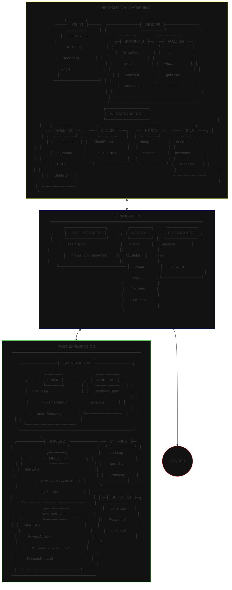

```mermaid
graph TD
information-gathering[
⠀⠀⠀⠀⠀⠀⠀⠀⠀⠀⠀⠀⠀⠀⠀⠀⠀⠀⠀⠀⠀⠀⠀INFORMATION⠀GATHERING⠀⠀⠀⠀⠀⠀⠀⠀⠀⠀⠀⠀⠀⠀⠀⠀⠀⠀⠀⠀⠀⠀⠀⠀
════════════════════════════════════════════════════════════════════
⠀⠀⠀⠀⠀⠀⠀⠀⠀⠀⠀┌───────┐⠀⠀⠀⠀⠀⠀⠀⠀⠀⠀⠀⠀⠀⠀⠀⠀⠀⠀⠀┌────────┐⠀⠀⠀⠀⠀⠀⠀⠀⠀⠀⠀⠀⠀⠀⠀⠀⠀⠀⠀
⠀⠀⠀⠀⠀⠀┌────┤⠀OSINT⠀├────┐⠀┌────────────┤⠀WEBAPP⠀├────────────┐⠀⠀⠀⠀⠀⠀
⠀⠀⠀⠀⠀⠀│⠀⠀⠀⠀└───────┘⠀⠀⠀⠀│⠀│⠀⠀⠀⠀⠀⠀⠀⠀⠀⠀⠀⠀└────────┘⠀⠀⠀⠀⠀⠀⠀⠀⠀⠀⠀⠀│⠀⠀⠀⠀⠀⠀
⠀⠀⠀⠀⠀⠀│⠀⠀theHarvester⠀⠀⠀│⠀│⠀⠀⠀┌╌╌╌╌╌╌╌╌╌╌┐⠀⠀⠀⠀⠀┌╌╌╌╌╌╌╌╌╌┐⠀⠀⠀│⠀⠀⠀⠀⠀⠀
⠀⠀⠀⠀⠀⠀│⠀⠀⠀⠀⠀⠀⠀⠀⠀⠀⠀⠀⠀⠀⠀⠀⠀│⠀│⠀┌╌┤⠀SCANNING⠀├╌┐⠀┌╌┤⠀FUZZING⠀├╌┐⠀│⠀⠀⠀⠀⠀⠀
⠀⠀⠀⠀⠀⠀│⠀⠀recon-ng⠀⠀⠀⠀⠀⠀⠀│⠀│⠀┆⠀└╌╌╌╌╌╌╌╌╌╌┘⠀┆⠀┆⠀└╌╌╌╌╌╌╌╌╌┘⠀┆⠀│⠀⠀⠀⠀⠀⠀
⠀⠀⠀⠀⠀⠀│⠀⠀⠀⠀⠀⠀⠀⠀⠀⠀⠀⠀⠀⠀⠀⠀⠀│⠀│⠀┆⠀⠀WhatWeb⠀⠀⠀⠀⠀┆⠀┆⠀⠀ffuf⠀⠀⠀⠀⠀⠀⠀┆⠀│⠀⠀⠀⠀⠀⠀
⠀⠀⠀⠀⠀⠀│⠀⠀shodancli⠀⠀⠀⠀⠀⠀│⠀│⠀┆⠀⠀⠀⠀⠀⠀⠀⠀⠀⠀⠀⠀⠀⠀┆⠀┆⠀⠀⠀⠀⠀⠀⠀⠀⠀⠀⠀⠀⠀┆⠀│⠀⠀⠀⠀⠀⠀
⠀⠀⠀⠀⠀⠀│⠀⠀⠀⠀⠀⠀⠀⠀⠀⠀⠀⠀⠀⠀⠀⠀⠀│⠀│⠀┆⠀⠀nikto⠀⠀⠀⠀⠀⠀⠀┆⠀┆⠀⠀wfuzz⠀⠀⠀⠀⠀⠀┆⠀│⠀⠀⠀⠀⠀⠀
⠀⠀⠀⠀⠀⠀│⠀⠀whois⠀⠀⠀⠀⠀⠀⠀⠀⠀⠀│⠀│⠀┆⠀⠀⠀⠀⠀⠀⠀⠀⠀⠀⠀⠀⠀⠀┆⠀┆⠀⠀⠀⠀⠀⠀⠀⠀⠀⠀⠀⠀⠀┆⠀│⠀⠀⠀⠀⠀⠀
⠀⠀⠀⠀⠀⠀│⠀⠀⠀⠀⠀⠀⠀⠀⠀⠀⠀⠀⠀⠀⠀⠀⠀│⠀│⠀┆⠀⠀wafw00f⠀⠀⠀⠀⠀┆⠀┆⠀⠀gobuster⠀⠀⠀┆⠀│⠀⠀⠀⠀⠀⠀
⠀⠀⠀⠀⠀⠀└─────────────────┘⠀│⠀┆⠀⠀⠀⠀⠀⠀⠀⠀⠀⠀⠀⠀⠀⠀┆⠀┆⠀⠀⠀⠀⠀⠀⠀⠀⠀⠀⠀⠀⠀┆⠀│⠀⠀⠀⠀⠀⠀
⠀⠀⠀⠀⠀⠀⠀⠀⠀⠀⠀⠀⠀⠀⠀⠀⠀⠀⠀⠀⠀⠀⠀⠀⠀⠀│⠀┆⠀⠀aquatone⠀⠀⠀⠀┆⠀└╌╌╌╌╌╌╌╌╌╌╌╌╌┘⠀│⠀⠀⠀⠀⠀⠀
⠀⠀⠀⠀⠀⠀⠀⠀⠀⠀⠀⠀⠀⠀⠀⠀⠀⠀⠀⠀⠀⠀⠀⠀⠀⠀│⠀┆⠀⠀⠀⠀⠀⠀⠀⠀⠀⠀⠀⠀⠀⠀┆⠀⠀⠀⠀⠀⠀⠀⠀⠀⠀⠀⠀⠀⠀⠀⠀⠀│⠀⠀⠀⠀⠀⠀
⠀⠀⠀⠀⠀⠀⠀⠀⠀⠀⠀⠀⠀⠀⠀⠀⠀⠀⠀⠀⠀⠀⠀⠀⠀⠀│⠀└╌╌╌╌╌╌╌╌╌╌╌╌╌╌┘⠀⠀⠀⠀⠀⠀⠀⠀⠀⠀⠀⠀⠀⠀⠀⠀⠀│⠀⠀⠀⠀⠀⠀
⠀⠀⠀⠀⠀⠀⠀⠀⠀⠀⠀⠀⠀⠀⠀⠀⠀⠀⠀⠀⠀⠀⠀⠀⠀⠀└──────────────────────────────────┘⠀⠀⠀⠀⠀⠀
⠀⠀⠀⠀⠀⠀⠀⠀⠀⠀⠀⠀⠀⠀⠀⠀⠀⠀⠀⠀⠀⠀⠀⠀⠀┌────────────────┐⠀⠀⠀⠀⠀⠀⠀⠀⠀⠀⠀⠀⠀⠀⠀⠀⠀⠀⠀⠀⠀⠀⠀⠀⠀
┌────────────────────────┤⠀INFRASTRUCTURE⠀├────────────────────────┐
│⠀⠀⠀⠀⠀⠀⠀⠀⠀⠀⠀⠀⠀⠀⠀⠀⠀⠀⠀⠀⠀⠀⠀⠀└────────────────┘⠀⠀⠀⠀⠀⠀⠀⠀⠀⠀⠀⠀⠀⠀⠀⠀⠀⠀⠀⠀⠀⠀⠀⠀│
│⠀⠀⠀┌╌╌╌╌╌╌╌╌╌┐⠀⠀⠀⠀⠀⠀⠀┌╌╌╌╌╌╌╌┐⠀⠀⠀⠀⠀⠀⠀⠀┌╌╌╌╌╌╌╌┐⠀⠀⠀⠀⠀⠀⠀┌╌╌╌╌╌┐⠀⠀⠀⠀⠀│
│⠀┌╌┤⠀DOMAINS⠀├╌┐⠀┌╌╌╌┤⠀CLOUD⠀├╌╌╌┐⠀⠀┌╌┤⠀HOSTS⠀├╌┐⠀┌╌╌╌┤⠀DNS⠀├╌╌╌┐⠀│
│⠀┆⠀└╌╌╌╌╌╌╌╌╌┘⠀┆⠀┆⠀⠀⠀└╌╌╌╌╌╌╌┘⠀⠀⠀┆⠀⠀┆⠀└╌╌╌╌╌╌╌┘⠀┆⠀┆⠀⠀⠀└╌╌╌╌╌┘⠀⠀⠀┆⠀│
│⠀┆⠀⠀subfinder⠀⠀┆⠀┆⠀⠀CloudEnum⠀⠀⠀⠀┆⠀⠀┆⠀⠀nmap⠀⠀⠀⠀⠀┆⠀┆⠀⠀dnsrecon⠀⠀⠀┆⠀│
│⠀┆⠀⠀⠀⠀⠀⠀⠀⠀⠀⠀⠀⠀⠀┆⠀┆⠀⠀⠀⠀⠀⠀⠀⠀⠀⠀⠀⠀⠀⠀⠀┆⠀⠀┆⠀⠀⠀⠀⠀⠀⠀⠀⠀⠀⠀┆⠀┆⠀⠀⠀⠀⠀⠀⠀⠀⠀⠀⠀⠀⠀┆⠀│
│⠀┆⠀⠀Sudomy⠀⠀⠀⠀⠀┆⠀┆⠀⠀CloudBrute⠀⠀⠀┆⠀⠀┆⠀⠀masscan⠀⠀┆⠀┆⠀⠀massdns⠀⠀⠀⠀┆⠀│
│⠀┆⠀⠀⠀⠀⠀⠀⠀⠀⠀⠀⠀⠀⠀┆⠀┆⠀⠀⠀⠀⠀⠀⠀⠀⠀⠀⠀⠀⠀⠀⠀┆⠀⠀┆⠀⠀⠀⠀⠀⠀⠀⠀⠀⠀⠀┆⠀┆⠀⠀⠀⠀⠀⠀⠀⠀⠀⠀⠀⠀⠀┆⠀│
│⠀┆⠀⠀ESD⠀⠀⠀⠀⠀⠀⠀⠀┆⠀└╌╌╌╌╌╌╌╌╌╌╌╌╌╌╌┘⠀⠀└╌╌╌╌╌╌╌╌╌╌╌┘⠀┆⠀⠀subbrute⠀⠀⠀┆⠀│
│⠀┆⠀⠀⠀⠀⠀⠀⠀⠀⠀⠀⠀⠀⠀┆⠀⠀⠀⠀⠀⠀⠀⠀⠀⠀⠀⠀⠀⠀⠀⠀⠀⠀⠀⠀⠀⠀⠀⠀⠀⠀⠀⠀⠀⠀⠀⠀⠀⠀┆⠀⠀⠀⠀⠀⠀⠀⠀⠀⠀⠀⠀⠀┆⠀│
│⠀┆⠀⠀Sublist3r⠀⠀┆⠀⠀⠀⠀⠀⠀⠀⠀⠀⠀⠀⠀⠀⠀⠀⠀⠀⠀⠀⠀⠀⠀⠀⠀⠀⠀⠀⠀⠀⠀⠀⠀⠀⠀└╌╌╌╌╌╌╌╌╌╌╌╌╌┘⠀│
│⠀┆⠀⠀⠀⠀⠀⠀⠀⠀⠀⠀⠀⠀⠀┆⠀⠀⠀⠀⠀⠀⠀⠀⠀⠀⠀⠀⠀⠀⠀⠀⠀⠀⠀⠀⠀⠀⠀⠀⠀⠀⠀⠀⠀⠀⠀⠀⠀⠀⠀⠀⠀⠀⠀⠀⠀⠀⠀⠀⠀⠀⠀⠀⠀⠀│
│⠀└╌╌╌╌╌╌╌╌╌╌╌╌╌┘⠀⠀⠀⠀⠀⠀⠀⠀⠀⠀⠀⠀⠀⠀⠀⠀⠀⠀⠀⠀⠀⠀⠀⠀⠀⠀⠀⠀⠀⠀⠀⠀⠀⠀⠀⠀⠀⠀⠀⠀⠀⠀⠀⠀⠀⠀⠀⠀⠀⠀│
└──────────────────────────────────────────────────────────────────┘
]
exploitation[
⠀⠀⠀⠀⠀⠀⠀⠀⠀⠀⠀⠀⠀⠀⠀⠀⠀⠀⠀⠀⠀⠀⠀EXPLOITATION⠀⠀⠀⠀⠀⠀⠀⠀⠀⠀⠀⠀⠀⠀⠀⠀⠀⠀⠀⠀⠀⠀⠀
══════════════════════════════════════════════════════════
⠀⠀⠀⠀⠀┌───────────────┐⠀⠀⠀⠀⠀⠀⠀┌────────┐⠀⠀⠀⠀┌───────────┐⠀⠀
┌────┤⠀HOST⠀SERVICES⠀├────┐┌─┤⠀WEBAPP⠀├─┐┌─┤⠀PASSWORDS⠀├─┐
│⠀⠀⠀⠀└───────────────┘⠀⠀⠀⠀││⠀└────────┘⠀││⠀└───────────┘⠀│
│⠀⠀searchsploit⠀⠀⠀⠀⠀⠀⠀⠀⠀⠀⠀││⠀⠀sqlmap⠀⠀⠀⠀││⠀⠀hashcat⠀⠀⠀⠀⠀⠀│
│⠀⠀⠀⠀⠀⠀⠀⠀⠀⠀⠀⠀⠀⠀⠀⠀⠀⠀⠀⠀⠀⠀⠀⠀⠀││⠀⠀⠀⠀⠀⠀⠀⠀⠀⠀⠀⠀││⠀⠀⠀⠀⠀⠀⠀⠀⠀⠀⠀⠀⠀⠀⠀│
│⠀⠀metasploit-framework⠀⠀⠀││⠀⠀XSStrike⠀⠀││⠀⠀john⠀⠀⠀⠀⠀⠀⠀⠀⠀│
│⠀⠀⠀⠀⠀⠀⠀⠀⠀⠀⠀⠀⠀⠀⠀⠀⠀⠀⠀⠀⠀⠀⠀⠀⠀││⠀⠀⠀⠀⠀⠀⠀⠀⠀⠀⠀⠀││⠀⠀⠀⠀⠀⠀⠀⠀⠀⠀⠀⠀⠀⠀⠀│
└─────────────────────────┘│⠀⠀xsser⠀⠀⠀⠀⠀││⠀⠀thc-hydra⠀⠀⠀⠀│
⠀⠀⠀⠀⠀⠀⠀⠀⠀⠀⠀⠀⠀⠀⠀⠀⠀⠀⠀⠀⠀⠀⠀⠀⠀⠀⠀│⠀⠀⠀⠀⠀⠀⠀⠀⠀⠀⠀⠀││⠀⠀⠀⠀⠀⠀⠀⠀⠀⠀⠀⠀⠀⠀⠀│
⠀⠀⠀⠀⠀⠀⠀⠀⠀⠀⠀⠀⠀⠀⠀⠀⠀⠀⠀⠀⠀⠀⠀⠀⠀⠀⠀│⠀⠀wpscan⠀⠀⠀⠀│└───────────────┘
⠀⠀⠀⠀⠀⠀⠀⠀⠀⠀⠀⠀⠀⠀⠀⠀⠀⠀⠀⠀⠀⠀⠀⠀⠀⠀⠀│⠀⠀⠀⠀⠀⠀⠀⠀⠀⠀⠀⠀│⠀⠀⠀⠀⠀⠀⠀⠀⠀⠀⠀⠀⠀⠀⠀⠀⠀
⠀⠀⠀⠀⠀⠀⠀⠀⠀⠀⠀⠀⠀⠀⠀⠀⠀⠀⠀⠀⠀⠀⠀⠀⠀⠀⠀│⠀⠀CMSeeK⠀⠀⠀⠀│⠀⠀⠀⠀⠀⠀⠀⠀⠀⠀⠀⠀⠀⠀⠀⠀⠀
⠀⠀⠀⠀⠀⠀⠀⠀⠀⠀⠀⠀⠀⠀⠀⠀⠀⠀⠀⠀⠀⠀⠀⠀⠀⠀⠀│⠀⠀⠀⠀⠀⠀⠀⠀⠀⠀⠀⠀│⠀⠀⠀⠀⠀⠀⠀⠀⠀⠀⠀⠀⠀⠀⠀⠀⠀
⠀⠀⠀⠀⠀⠀⠀⠀⠀⠀⠀⠀⠀⠀⠀⠀⠀⠀⠀⠀⠀⠀⠀⠀⠀⠀⠀│⠀⠀CMSmap⠀⠀⠀⠀│⠀⠀⠀⠀⠀⠀⠀⠀⠀⠀⠀⠀⠀⠀⠀⠀⠀
⠀⠀⠀⠀⠀⠀⠀⠀⠀⠀⠀⠀⠀⠀⠀⠀⠀⠀⠀⠀⠀⠀⠀⠀⠀⠀⠀│⠀⠀⠀⠀⠀⠀⠀⠀⠀⠀⠀⠀│⠀⠀⠀⠀⠀⠀⠀⠀⠀⠀⠀⠀⠀⠀⠀⠀⠀
⠀⠀⠀⠀⠀⠀⠀⠀⠀⠀⠀⠀⠀⠀⠀⠀⠀⠀⠀⠀⠀⠀⠀⠀⠀⠀⠀└────────────┘⠀⠀⠀⠀⠀⠀⠀⠀⠀⠀⠀⠀⠀⠀⠀⠀⠀
⠀⠀⠀⠀⠀⠀⠀⠀⠀⠀⠀⠀⠀⠀⠀⠀⠀⠀⠀⠀⠀⠀⠀⠀⠀⠀⠀⠀⠀⠀⠀⠀⠀⠀⠀⠀⠀⠀⠀⠀⠀⠀⠀⠀⠀⠀⠀⠀⠀⠀⠀⠀⠀⠀⠀⠀⠀⠀
⠀⠀⠀⠀⠀⠀⠀⠀⠀⠀⠀⠀⠀⠀⠀⠀⠀⠀⠀⠀⠀⠀⠀⠀⠀⠀⠀⠀⠀⠀⠀⠀⠀⠀⠀⠀⠀⠀⠀⠀⠀⠀⠀⠀⠀⠀⠀⠀⠀⠀⠀⠀⠀⠀⠀⠀⠀⠀
]
post-exploitation[
⠀⠀⠀⠀⠀⠀⠀⠀⠀⠀⠀⠀⠀⠀⠀⠀POST-EXPLOITATION⠀⠀⠀⠀⠀⠀⠀⠀⠀⠀⠀⠀⠀⠀⠀⠀
═════════════════════════════════════════════════
⠀⠀⠀⠀⠀⠀⠀⠀⠀⠀⠀⠀⠀⠀⠀⠀⠀┌─────────────┐⠀⠀⠀⠀⠀⠀⠀⠀⠀⠀⠀⠀⠀⠀⠀⠀⠀
⠀⠀┌──────────────┤⠀ENUMERATION⠀├──────────────┐⠀⠀
⠀⠀│⠀⠀⠀⠀⠀⠀⠀⠀⠀⠀⠀⠀⠀⠀└─────────────┘⠀⠀⠀⠀⠀⠀⠀⠀⠀⠀⠀⠀⠀⠀│⠀⠀
⠀⠀│⠀⠀⠀⠀⠀⠀⠀⠀┌╌╌╌╌╌╌╌┐⠀⠀⠀⠀⠀⠀⠀⠀⠀⠀⠀┌╌╌╌╌╌╌╌╌╌┐⠀⠀⠀⠀│⠀⠀
⠀⠀│⠀┌╌╌╌╌╌╌┤⠀LINUX⠀├╌╌╌╌╌╌┐⠀┌╌╌┤⠀WINDOWS⠀├╌╌┐⠀│⠀⠀
⠀⠀│⠀┆⠀⠀⠀⠀⠀⠀└╌╌╌╌╌╌╌┘⠀⠀⠀⠀⠀⠀┆⠀┆⠀⠀└╌╌╌╌╌╌╌╌╌┘⠀⠀┆⠀│⠀⠀
⠀⠀│⠀┆⠀⠀LinEnum⠀⠀⠀⠀⠀⠀⠀⠀⠀⠀⠀⠀┆⠀┆⠀⠀WindowsEnum⠀⠀┆⠀│⠀⠀
⠀⠀│⠀┆⠀⠀⠀⠀⠀⠀⠀⠀⠀⠀⠀⠀⠀⠀⠀⠀⠀⠀⠀⠀⠀┆⠀┆⠀⠀⠀⠀⠀⠀⠀⠀⠀⠀⠀⠀⠀⠀⠀┆⠀│⠀⠀
⠀⠀│⠀┆⠀⠀linux-smart-enum⠀⠀⠀┆⠀┆⠀⠀mimikatz⠀⠀⠀⠀⠀┆⠀│⠀⠀
⠀⠀│⠀┆⠀⠀⠀⠀⠀⠀⠀⠀⠀⠀⠀⠀⠀⠀⠀⠀⠀⠀⠀⠀⠀┆⠀┆⠀⠀⠀⠀⠀⠀⠀⠀⠀⠀⠀⠀⠀⠀⠀┆⠀│⠀⠀
⠀⠀│⠀┆⠀⠀enum4linux-ng⠀⠀⠀⠀⠀⠀┆⠀└╌╌╌╌╌╌╌╌╌╌╌╌╌╌╌┘⠀│⠀⠀
⠀⠀│⠀┆⠀⠀⠀⠀⠀⠀⠀⠀⠀⠀⠀⠀⠀⠀⠀⠀⠀⠀⠀⠀⠀┆⠀⠀⠀⠀⠀⠀⠀⠀⠀⠀⠀⠀⠀⠀⠀⠀⠀⠀⠀│⠀⠀
⠀⠀│⠀└╌╌╌╌╌╌╌╌╌╌╌╌╌╌╌╌╌╌╌╌╌┘⠀⠀⠀⠀⠀⠀⠀⠀⠀⠀⠀⠀⠀⠀⠀⠀⠀⠀⠀│⠀⠀
⠀⠀└───────────────────────────────────────────┘⠀⠀
⠀⠀⠀⠀⠀⠀⠀⠀⠀⠀⠀┌─────────┐⠀⠀⠀⠀⠀⠀⠀⠀⠀⠀⠀⠀⠀┌──────────┐⠀⠀
┌──────────┤⠀PRIVESC⠀├──────────┐┌─┤⠀SNIFFING⠀├─┐
│⠀⠀⠀⠀⠀⠀⠀⠀⠀⠀└─────────┘⠀⠀⠀⠀⠀⠀⠀⠀⠀⠀││⠀└──────────┘⠀│
│⠀⠀⠀⠀⠀⠀⠀⠀⠀⠀⠀┌╌╌╌╌╌╌╌┐⠀⠀⠀⠀⠀⠀⠀⠀⠀⠀⠀││⠀⠀tcpdump⠀⠀⠀⠀⠀│
│⠀┌╌╌╌╌╌╌╌╌╌┤⠀LINUX⠀├╌╌╌╌╌╌╌╌╌┐⠀││⠀⠀⠀⠀⠀⠀⠀⠀⠀⠀⠀⠀⠀⠀│
│⠀┆⠀⠀⠀⠀⠀⠀⠀⠀⠀└╌╌╌╌╌╌╌┘⠀⠀⠀⠀⠀⠀⠀⠀⠀┆⠀││⠀⠀termshark⠀⠀⠀│
│⠀┆⠀⠀linPEAS⠀⠀⠀⠀⠀⠀⠀⠀⠀⠀⠀⠀⠀⠀⠀⠀⠀⠀┆⠀││⠀⠀⠀⠀⠀⠀⠀⠀⠀⠀⠀⠀⠀⠀│
│⠀┆⠀⠀⠀⠀⠀⠀⠀⠀⠀⠀⠀⠀⠀⠀⠀⠀⠀⠀⠀⠀⠀⠀⠀⠀⠀⠀⠀┆⠀││⠀⠀ettercap⠀⠀⠀⠀│
│⠀┆⠀⠀linux-exploit-suggester⠀⠀┆⠀││⠀⠀⠀⠀⠀⠀⠀⠀⠀⠀⠀⠀⠀⠀│
│⠀┆⠀⠀⠀⠀⠀⠀⠀⠀⠀⠀⠀⠀⠀⠀⠀⠀⠀⠀⠀⠀⠀⠀⠀⠀⠀⠀⠀┆⠀│└──────────────┘
│⠀┆⠀⠀linuxprivchecker⠀⠀⠀⠀⠀⠀⠀⠀⠀┆⠀│⠀⠀┌──────────┐⠀⠀
│⠀┆⠀⠀⠀⠀⠀⠀⠀⠀⠀⠀⠀⠀⠀⠀⠀⠀⠀⠀⠀⠀⠀⠀⠀⠀⠀⠀⠀┆⠀│┌─┤⠀SPOOFING⠀├─┐
│⠀└╌╌╌╌╌╌╌╌╌╌╌╌╌╌╌╌╌╌╌╌╌╌╌╌╌╌╌┘⠀││⠀└──────────┘⠀│
│⠀⠀⠀⠀⠀⠀⠀⠀⠀┌╌╌╌╌╌╌╌╌╌┐⠀⠀⠀⠀⠀⠀⠀⠀⠀⠀⠀││⠀⠀bettercap⠀⠀⠀│
│⠀┌╌╌╌╌╌╌╌┤⠀WINDOWS⠀├╌╌╌╌╌╌╌┐⠀⠀⠀││⠀⠀⠀⠀⠀⠀⠀⠀⠀⠀⠀⠀⠀⠀│
│⠀┆⠀⠀⠀⠀⠀⠀⠀└╌╌╌╌╌╌╌╌╌┘⠀⠀⠀⠀⠀⠀⠀┆⠀⠀⠀││⠀⠀Responder⠀⠀⠀│
│⠀┆⠀⠀winPEAS⠀⠀⠀⠀⠀⠀⠀⠀⠀⠀⠀⠀⠀⠀⠀⠀┆⠀⠀⠀││⠀⠀⠀⠀⠀⠀⠀⠀⠀⠀⠀⠀⠀⠀│
│⠀┆⠀⠀⠀⠀⠀⠀⠀⠀⠀⠀⠀⠀⠀⠀⠀⠀⠀⠀⠀⠀⠀⠀⠀⠀⠀┆⠀⠀⠀││⠀⠀arpspoof⠀⠀⠀⠀│
│⠀┆⠀⠀PrivescCheck⠀⠀⠀⠀⠀⠀⠀⠀⠀⠀⠀┆⠀⠀⠀││⠀⠀⠀⠀⠀⠀⠀⠀⠀⠀⠀⠀⠀⠀│
│⠀┆⠀⠀⠀⠀⠀⠀⠀⠀⠀⠀⠀⠀⠀⠀⠀⠀⠀⠀⠀⠀⠀⠀⠀⠀⠀┆⠀⠀⠀│└──────────────┘
│⠀┆⠀⠀windows-privesc-check⠀⠀┆⠀⠀⠀│⠀⠀⠀⠀⠀⠀⠀⠀⠀⠀⠀⠀⠀⠀⠀⠀
│⠀┆⠀⠀⠀⠀⠀⠀⠀⠀⠀⠀⠀⠀⠀⠀⠀⠀⠀⠀⠀⠀⠀⠀⠀⠀⠀┆⠀⠀⠀│⠀⠀⠀⠀⠀⠀⠀⠀⠀⠀⠀⠀⠀⠀⠀⠀
│⠀┆⠀⠀RemotePotato0⠀⠀⠀⠀⠀⠀⠀⠀⠀⠀┆⠀⠀⠀│⠀⠀⠀⠀⠀⠀⠀⠀⠀⠀⠀⠀⠀⠀⠀⠀
│⠀┆⠀⠀⠀⠀⠀⠀⠀⠀⠀⠀⠀⠀⠀⠀⠀⠀⠀⠀⠀⠀⠀⠀⠀⠀⠀┆⠀⠀⠀│⠀⠀⠀⠀⠀⠀⠀⠀⠀⠀⠀⠀⠀⠀⠀⠀
│⠀└╌╌╌╌╌╌╌╌╌╌╌╌╌╌╌╌╌╌╌╌╌╌╌╌╌┘⠀⠀⠀│⠀⠀⠀⠀⠀⠀⠀⠀⠀⠀⠀⠀⠀⠀⠀⠀
└───────────────────────────────┘⠀⠀⠀⠀⠀⠀⠀⠀⠀⠀⠀⠀⠀⠀⠀⠀
]
render((
⠀⠀RENDER⠀⠀
))
style information-gathering fill:#121212,stroke:#ffff00
style exploitation fill:#121212,stroke:#0000ff
style post-exploitation fill:#121212,stroke:#00ff00
style render fill:#121212,stroke:#ff0000
information-gathering <--> exploitation
exploitation <--> post-exploitation
exploitation --> render
```

