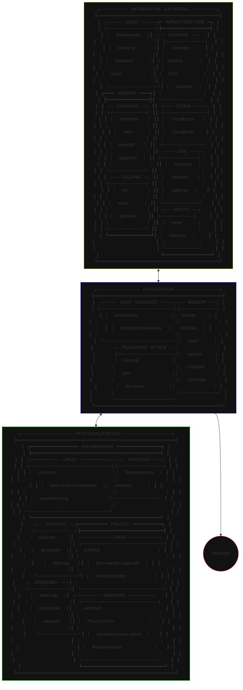

```mermaid
graph TD
information-gathering[
╓─────────⠀INFORMATION⠀GATHERING⠀────────╖
╠════════════════════════════════════════╣
║⠀┌─────⠀OSINT⠀────┐┏━⠀INFRASTRUCTURE⠀━┓⠀║
║⠀├────────────────┤┣━━━━━━━━━━━━━━━━━━┫⠀║
║⠀│⠀⠀theHarvester⠀⠀│┃⠀┌──⠀DOMAINS⠀──┐⠀⠀┃⠀║
║⠀│⠀⠀⠀⠀⠀⠀⠀⠀⠀⠀⠀⠀⠀⠀⠀⠀│┃⠀├─────────────┤⠀⠀┃⠀║
║⠀│⠀⠀recon-ng⠀⠀⠀⠀⠀⠀│┃⠀│⠀⠀subfinder⠀⠀│⠀⠀┃⠀║
║⠀│⠀⠀⠀⠀⠀⠀⠀⠀⠀⠀⠀⠀⠀⠀⠀⠀│┃⠀│⠀⠀⠀⠀⠀⠀⠀⠀⠀⠀⠀⠀⠀│⠀⠀┃⠀║
║⠀│⠀⠀shodancli⠀⠀⠀⠀⠀│┃⠀│⠀⠀Sudomy⠀⠀⠀⠀⠀│⠀⠀┃⠀║
║⠀│⠀⠀⠀⠀⠀⠀⠀⠀⠀⠀⠀⠀⠀⠀⠀⠀│┃⠀│⠀⠀⠀⠀⠀⠀⠀⠀⠀⠀⠀⠀⠀│⠀⠀┃⠀║
║⠀│⠀⠀whois⠀⠀⠀⠀⠀⠀⠀⠀⠀│┃⠀│⠀⠀ESD⠀⠀⠀⠀⠀⠀⠀⠀│⠀⠀┃⠀║
║⠀│⠀⠀⠀⠀⠀⠀⠀⠀⠀⠀⠀⠀⠀⠀⠀⠀│┃⠀│⠀⠀⠀⠀⠀⠀⠀⠀⠀⠀⠀⠀⠀│⠀⠀┃⠀║
║⠀└────────────────┘┃⠀│⠀⠀Sublist3r⠀⠀│⠀⠀┃⠀║
║⠀┏━━━━⠀WEBAPP⠀━━━━┓┃⠀│⠀⠀⠀⠀⠀⠀⠀⠀⠀⠀⠀⠀⠀│⠀⠀┃⠀║
║⠀┣━━━━━━━━━━━━━━━━┫┃⠀└─────────────┘⠀⠀┃⠀║
║⠀┃⠀┌─⠀SCANNING⠀─┐⠀┃┃⠀┌───⠀CLOUD⠀────┐⠀┃⠀║
║⠀┃⠀├────────────┤⠀┃┃⠀├──────────────┤⠀┃⠀║
║⠀┃⠀│⠀⠀WhatWeb⠀⠀⠀│⠀┃┃⠀│⠀⠀CloudEnum⠀⠀⠀│⠀┃⠀║
║⠀┃⠀│⠀⠀⠀⠀⠀⠀⠀⠀⠀⠀⠀⠀│⠀┃┃⠀│⠀⠀⠀⠀⠀⠀⠀⠀⠀⠀⠀⠀⠀⠀│⠀┃⠀║
║⠀┃⠀│⠀⠀nikto⠀⠀⠀⠀⠀│⠀┃┃⠀│⠀⠀CloudBrute⠀⠀│⠀┃⠀║
║⠀┃⠀│⠀⠀⠀⠀⠀⠀⠀⠀⠀⠀⠀⠀│⠀┃┃⠀│⠀⠀⠀⠀⠀⠀⠀⠀⠀⠀⠀⠀⠀⠀│⠀┃⠀║
║⠀┃⠀│⠀⠀wafw00f⠀⠀⠀│⠀┃┃⠀└──────────────┘⠀┃⠀║
║⠀┃⠀│⠀⠀⠀⠀⠀⠀⠀⠀⠀⠀⠀⠀│⠀┃┃⠀┌───⠀DNS⠀────┐⠀⠀⠀┃⠀║
║⠀┃⠀│⠀⠀aquatone⠀⠀│⠀┃┃⠀├────────────┤⠀⠀⠀┃⠀║
║⠀┃⠀│⠀⠀⠀⠀⠀⠀⠀⠀⠀⠀⠀⠀│⠀┃┃⠀│⠀⠀dnsrecon⠀⠀│⠀⠀⠀┃⠀║
║⠀┃⠀└────────────┘⠀┃┃⠀│⠀⠀⠀⠀⠀⠀⠀⠀⠀⠀⠀⠀│⠀⠀⠀┃⠀║
║⠀┃⠀┌──⠀FUZZING⠀─┐⠀┃┃⠀│⠀⠀massdns⠀⠀⠀│⠀⠀⠀┃⠀║
║⠀┃⠀├────────────┤⠀┃┃⠀│⠀⠀⠀⠀⠀⠀⠀⠀⠀⠀⠀⠀│⠀⠀⠀┃⠀║
║⠀┃⠀│⠀⠀ffuf⠀⠀⠀⠀⠀⠀│⠀┃┃⠀│⠀⠀subbrute⠀⠀│⠀⠀⠀┃⠀║
║⠀┃⠀│⠀⠀⠀⠀⠀⠀⠀⠀⠀⠀⠀⠀│⠀┃┃⠀│⠀⠀⠀⠀⠀⠀⠀⠀⠀⠀⠀⠀│⠀⠀⠀┃⠀║
║⠀┃⠀│⠀⠀wfuzz⠀⠀⠀⠀⠀│⠀┃┃⠀└────────────┘⠀⠀⠀┃⠀║
║⠀┃⠀│⠀⠀⠀⠀⠀⠀⠀⠀⠀⠀⠀⠀│⠀┃┃⠀┌──⠀HOSTS⠀──┐⠀⠀⠀⠀┃⠀║
║⠀┃⠀│⠀⠀gobuster⠀⠀│⠀┃┃⠀├───────────┤⠀⠀⠀⠀┃⠀║
║⠀┃⠀│⠀⠀⠀⠀⠀⠀⠀⠀⠀⠀⠀⠀│⠀┃┃⠀│⠀⠀nmap⠀⠀⠀⠀⠀│⠀⠀⠀⠀┃⠀║
║⠀┃⠀└────────────┘⠀┃┃⠀│⠀⠀⠀⠀⠀⠀⠀⠀⠀⠀⠀│⠀⠀⠀⠀┃⠀║
║⠀┗━━━━━━━━━━━━━━━━┛┃⠀│⠀⠀masscan⠀⠀│⠀⠀⠀⠀┃⠀║
║⠀⠀⠀⠀⠀⠀⠀⠀⠀⠀⠀⠀⠀⠀⠀⠀⠀⠀⠀┃⠀│⠀⠀⠀⠀⠀⠀⠀⠀⠀⠀⠀│⠀⠀⠀⠀┃⠀║
║⠀⠀⠀⠀⠀⠀⠀⠀⠀⠀⠀⠀⠀⠀⠀⠀⠀⠀⠀┃⠀└───────────┘⠀⠀⠀⠀┃⠀║
║⠀⠀⠀⠀⠀⠀⠀⠀⠀⠀⠀⠀⠀⠀⠀⠀⠀⠀⠀┗━━━━━━━━━━━━━━━━━━┛⠀║
╚════════════════════════════════════════╝
]
exploitation[
╓──────────────⠀EXPLOITATION⠀──────────────╖
╠══════════════════════════════════════════╣
║⠀┌─────⠀HOST⠀SERVICES⠀────┐┌──⠀WEBAPP⠀──┐⠀║
║⠀├────────────────────────┤├────────────┤⠀║
║⠀│⠀⠀searchsploit⠀⠀⠀⠀⠀⠀⠀⠀⠀⠀││⠀⠀sqlmap⠀⠀⠀⠀│⠀║
║⠀│⠀⠀⠀⠀⠀⠀⠀⠀⠀⠀⠀⠀⠀⠀⠀⠀⠀⠀⠀⠀⠀⠀⠀⠀││⠀⠀⠀⠀⠀⠀⠀⠀⠀⠀⠀⠀│⠀║
║⠀│⠀⠀metasploit-framework⠀⠀││⠀⠀XSStrike⠀⠀│⠀║
║⠀│⠀⠀⠀⠀⠀⠀⠀⠀⠀⠀⠀⠀⠀⠀⠀⠀⠀⠀⠀⠀⠀⠀⠀⠀││⠀⠀⠀⠀⠀⠀⠀⠀⠀⠀⠀⠀│⠀║
║⠀└────────────────────────┘│⠀⠀xsser⠀⠀⠀⠀⠀│⠀║
║⠀⠀⠀⠀⠀⠀┌─⠀PASSWORD⠀ATTACK⠀─┐│⠀⠀⠀⠀⠀⠀⠀⠀⠀⠀⠀⠀│⠀║
║⠀⠀⠀⠀⠀⠀├───────────────────┤│⠀⠀wpscan⠀⠀⠀⠀│⠀║
║⠀⠀⠀⠀⠀⠀│⠀⠀hashcat⠀⠀⠀⠀⠀⠀⠀⠀⠀⠀││⠀⠀⠀⠀⠀⠀⠀⠀⠀⠀⠀⠀│⠀║
║⠀⠀⠀⠀⠀⠀│⠀⠀⠀⠀⠀⠀⠀⠀⠀⠀⠀⠀⠀⠀⠀⠀⠀⠀⠀││⠀⠀CMSeeK⠀⠀⠀⠀│⠀║
║⠀⠀⠀⠀⠀⠀│⠀⠀john⠀⠀⠀⠀⠀⠀⠀⠀⠀⠀⠀⠀⠀││⠀⠀⠀⠀⠀⠀⠀⠀⠀⠀⠀⠀│⠀║
║⠀⠀⠀⠀⠀⠀│⠀⠀⠀⠀⠀⠀⠀⠀⠀⠀⠀⠀⠀⠀⠀⠀⠀⠀⠀││⠀⠀CMSmap⠀⠀⠀⠀│⠀║
║⠀⠀⠀⠀⠀⠀│⠀⠀thc-hydra⠀⠀⠀⠀⠀⠀⠀⠀││⠀⠀⠀⠀⠀⠀⠀⠀⠀⠀⠀⠀│⠀║
║⠀⠀⠀⠀⠀⠀│⠀⠀⠀⠀⠀⠀⠀⠀⠀⠀⠀⠀⠀⠀⠀⠀⠀⠀⠀│└────────────┘⠀║
║⠀⠀⠀⠀⠀⠀└───────────────────┘⠀⠀⠀⠀⠀⠀⠀⠀⠀⠀⠀⠀⠀⠀⠀║
╚══════════════════════════════════════════╝
]
post-exploitation[
╓─────────────────⠀POST-EXPLOITATION⠀────────────────╖
╠════════════════════════════════════════════════════╣
║⠀┏━━━━━━━━━━━━━━━━━━⠀ENUMERATION⠀━━━━━━━━━━━━━━━━━┓⠀║
║⠀┣━━━━━━━━━━━━━━━━━━━━━━━━━━━━━━━━━━━━━━━━━━━━━━━━┫⠀║
║⠀┃⠀┌──────────⠀LINUX⠀──────────┐┌───⠀WINDOWS⠀───┐⠀┃⠀║
║⠀┃⠀├───────────────────────────┤├───────────────┤⠀┃⠀║
║⠀┃⠀│⠀⠀LinEnum⠀⠀⠀⠀⠀⠀⠀⠀⠀⠀⠀⠀⠀⠀⠀⠀⠀⠀││⠀⠀WindowsEnum⠀⠀│⠀┃⠀║
║⠀┃⠀│⠀⠀⠀⠀⠀⠀⠀⠀⠀⠀⠀⠀⠀⠀⠀⠀⠀⠀⠀⠀⠀⠀⠀⠀⠀⠀⠀││⠀⠀⠀⠀⠀⠀⠀⠀⠀⠀⠀⠀⠀⠀⠀│⠀┃⠀║
║⠀┃⠀│⠀⠀linux-smart-enumeration⠀⠀││⠀⠀mimikatz⠀⠀⠀⠀⠀│⠀┃⠀║
║⠀┃⠀│⠀⠀⠀⠀⠀⠀⠀⠀⠀⠀⠀⠀⠀⠀⠀⠀⠀⠀⠀⠀⠀⠀⠀⠀⠀⠀⠀││⠀⠀⠀⠀⠀⠀⠀⠀⠀⠀⠀⠀⠀⠀⠀│⠀┃⠀║
║⠀┃⠀│⠀⠀enum4linux-ng⠀⠀⠀⠀⠀⠀⠀⠀⠀⠀⠀⠀│└───────────────┘⠀┃⠀║
║⠀┃⠀│⠀⠀⠀⠀⠀⠀⠀⠀⠀⠀⠀⠀⠀⠀⠀⠀⠀⠀⠀⠀⠀⠀⠀⠀⠀⠀⠀│⠀⠀⠀⠀⠀⠀⠀⠀⠀⠀⠀⠀⠀⠀⠀⠀⠀⠀┃⠀║
║⠀┃⠀└───────────────────────────┘⠀⠀⠀⠀⠀⠀⠀⠀⠀⠀⠀⠀⠀⠀⠀⠀⠀⠀┃⠀║
║⠀┗━━━━━━━━━━━━━━━━━━━━━━━━━━━━━━━━━━━━━━━━━━━━━━━━┛⠀║
║⠀⠀⠀┌──⠀SNIFFING⠀─┐┏━━━━━━━━━━━⠀PRIVESC⠀━━━━━━━━━━━┓⠀║
║⠀⠀⠀├─────────────┤┣━━━━━━━━━━━━━━━━━━━━━━━━━━━━━━━┫⠀║
║⠀⠀⠀│⠀⠀tcpdump⠀⠀⠀⠀│┃⠀┌──────────⠀LINUX⠀──────────┐⠀┃⠀║
║⠀⠀⠀│⠀⠀⠀⠀⠀⠀⠀⠀⠀⠀⠀⠀⠀│┃⠀├───────────────────────────┤⠀┃⠀║
║⠀⠀⠀│⠀⠀termshark⠀⠀│┃⠀│⠀⠀linPEAS⠀⠀⠀⠀⠀⠀⠀⠀⠀⠀⠀⠀⠀⠀⠀⠀⠀⠀│⠀┃⠀║
║⠀⠀⠀│⠀⠀⠀⠀⠀⠀⠀⠀⠀⠀⠀⠀⠀│┃⠀│⠀⠀⠀⠀⠀⠀⠀⠀⠀⠀⠀⠀⠀⠀⠀⠀⠀⠀⠀⠀⠀⠀⠀⠀⠀⠀⠀│⠀┃⠀║
║⠀⠀⠀│⠀⠀ettercap⠀⠀⠀│┃⠀│⠀⠀linux-exploit-suggester⠀⠀│⠀┃⠀║
║⠀⠀⠀│⠀⠀⠀⠀⠀⠀⠀⠀⠀⠀⠀⠀⠀│┃⠀│⠀⠀⠀⠀⠀⠀⠀⠀⠀⠀⠀⠀⠀⠀⠀⠀⠀⠀⠀⠀⠀⠀⠀⠀⠀⠀⠀│⠀┃⠀║
║⠀⠀⠀└─────────────┘┃⠀│⠀⠀linuxprivchecker⠀⠀⠀⠀⠀⠀⠀⠀⠀│⠀┃⠀║
║⠀⠀⠀┌─⠀SPOOFING⠀──┐┃⠀│⠀⠀⠀⠀⠀⠀⠀⠀⠀⠀⠀⠀⠀⠀⠀⠀⠀⠀⠀⠀⠀⠀⠀⠀⠀⠀⠀│⠀┃⠀║
║⠀⠀⠀├─────────────┤┃⠀└───────────────────────────┘⠀┃⠀║
║⠀⠀⠀│⠀⠀bettercap⠀⠀│┃⠀┌────────⠀WINDOWS⠀────────┐⠀⠀⠀┃⠀║
║⠀⠀⠀│⠀⠀⠀⠀⠀⠀⠀⠀⠀⠀⠀⠀⠀│┃⠀├─────────────────────────┤⠀⠀⠀┃⠀║
║⠀⠀⠀│⠀⠀Responder⠀⠀│┃⠀│⠀⠀winPEAS⠀⠀⠀⠀⠀⠀⠀⠀⠀⠀⠀⠀⠀⠀⠀⠀│⠀⠀⠀┃⠀║
║⠀⠀⠀│⠀⠀⠀⠀⠀⠀⠀⠀⠀⠀⠀⠀⠀│┃⠀│⠀⠀⠀⠀⠀⠀⠀⠀⠀⠀⠀⠀⠀⠀⠀⠀⠀⠀⠀⠀⠀⠀⠀⠀⠀│⠀⠀⠀┃⠀║
║⠀⠀⠀│⠀⠀arpspoof⠀⠀⠀│┃⠀│⠀⠀PrivescCheck⠀⠀⠀⠀⠀⠀⠀⠀⠀⠀⠀│⠀⠀⠀┃⠀║
║⠀⠀⠀│⠀⠀⠀⠀⠀⠀⠀⠀⠀⠀⠀⠀⠀│┃⠀│⠀⠀⠀⠀⠀⠀⠀⠀⠀⠀⠀⠀⠀⠀⠀⠀⠀⠀⠀⠀⠀⠀⠀⠀⠀│⠀⠀⠀┃⠀║
║⠀⠀⠀└─────────────┘┃⠀│⠀⠀windows-privesc-check⠀⠀│⠀⠀⠀┃⠀║
║⠀⠀⠀⠀⠀⠀⠀⠀⠀⠀⠀⠀⠀⠀⠀⠀⠀⠀┃⠀│⠀⠀⠀⠀⠀⠀⠀⠀⠀⠀⠀⠀⠀⠀⠀⠀⠀⠀⠀⠀⠀⠀⠀⠀⠀│⠀⠀⠀┃⠀║
║⠀⠀⠀⠀⠀⠀⠀⠀⠀⠀⠀⠀⠀⠀⠀⠀⠀⠀┃⠀│⠀⠀RemotePotato0⠀⠀⠀⠀⠀⠀⠀⠀⠀⠀│⠀⠀⠀┃⠀║
║⠀⠀⠀⠀⠀⠀⠀⠀⠀⠀⠀⠀⠀⠀⠀⠀⠀⠀┃⠀│⠀⠀⠀⠀⠀⠀⠀⠀⠀⠀⠀⠀⠀⠀⠀⠀⠀⠀⠀⠀⠀⠀⠀⠀⠀│⠀⠀⠀┃⠀║
║⠀⠀⠀⠀⠀⠀⠀⠀⠀⠀⠀⠀⠀⠀⠀⠀⠀⠀┃⠀└─────────────────────────┘⠀⠀⠀┃⠀║
║⠀⠀⠀⠀⠀⠀⠀⠀⠀⠀⠀⠀⠀⠀⠀⠀⠀⠀┗━━━━━━━━━━━━━━━━━━━━━━━━━━━━━━━┛⠀║
╚════════════════════════════════════════════════════╝
]
render((
⠀⠀RENDER⠀⠀
))
style information-gathering fill:#121212,stroke:#ffff00
style exploitation fill:#121212,stroke:#0000ff
style post-exploitation fill:#121212,stroke:#00ff00
style render fill:#121212,stroke:#ff0000
information-gathering <--> exploitation
exploitation <--> post-exploitation
exploitation --> render
```

